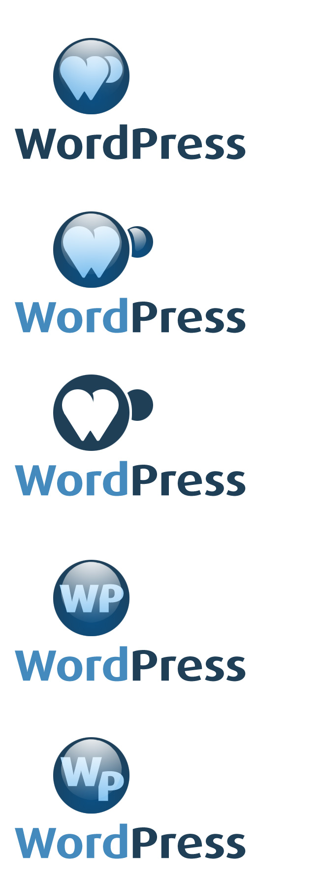
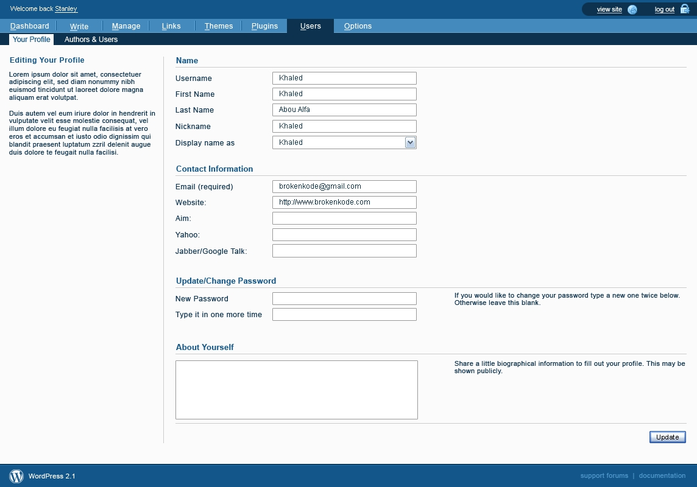

**WordPress should be the Mercedes of Blogging software**

Introduction on the challenges of design in an open source environment.

In early 2005, a mailing list was set up at [wp-design](http://lists.automattic.com/pipermail/wp-design/). The group, called the Shuttle group, comprised Michael Heilemann ([michael](http://profiles.wordpress.org/michael), Khaled Abou Alfa ([khaled](http://profiles.wordpress.org/khaled), Joen Asmussen ([joen](http://profiles.wordpress.org/joen)), Chris Davis ([chrisjdavis](http://profiles.wordpress.org/chrisjdavis), Joshua Sigar ([alphaoide](http://profiles.wordpress.org/alphaoide)], and Matt. They were joined later on in the process by Bryan Veloso ([Syni](http://profiles.wordpress.org/syni)). The aim of the group was to create a coherent brand for WordPress with a view to redesigning the admin. 

In the beginning however, much of the discussion was focused on WordPress' new logo. In its first few years, the WordPress logo was some simple blue and black serif text. 

 

With some variations for seasonal and other events:

 

 

 

 

And it was agreed that it could do with being updated.

Suggestions for the new logo were solicited from the community. A mixed set of results came back and Matt shared these with the wp-design group for feedback.

The [first suggestions](http://lists.automattic.com/pipermail/wp-design/2005-March/000163.html) were from Andreas Kwiatkowski

 

A [second batch were sent](http://lists.automattic.com/pipermail/wp-design/2005-March/000171.html) by Denis Radenkovic:

 

 

 

Some of the feedback for the logos was lukewarm, though both [Joen](http://lists.automattic.com/pipermail/wp-design/2005-April/000175.html) and [Michael](http://lists.automattic.com/pipermail/wp-design/2005-March/000173.html) did both like Radenkovic's heart logos, describing them as "instantly recognisable" . 

Joen even submitted his own versions of the logo based on Denis Radenkovic's heart design: 

 

And he produced a version of the admin screen with the design in situ:

 

But it wasn't just community members who were working on the logo. In March, Matt met [Jason Santa Maria](http://jasonsantamaria.com/) at South by South West and asked him to have a go at redesigning the WordPress logo.  In April, [he shared some of the early versions](http://lists.automattic.com/pipermail/wp-design/2005-April/000182.html) with the wp-design group:

 

Reaction to the logos was mixed, with some feedback suggesting that the logos felt ["a little too aristocratic"](http://lists.automattic.com/pipermail/wp-design/2005-April/000194.html) for WordPress. Some of the designers [felt that the design by Denis Radenkovic](http://lists.automattic.com/pipermail/wp-design/2005-April/000185.html) was more in line with WordPress' brand. 

More designs were posted to the group, but the responses weren't much better.

 

 

 

While the logo discussion continued, Khaled spoke to Matt off-list about it. Speaking to Matt helped to clarify for him the direction Matt wanted to go with the branding and feel of WordPress. He [reported back](http://lists.automattic.com/pipermail/wp-design/2005-April/000192.html):

> WordPress is meant to be the Jaguar or Astin Martin of Blogging tools. [...] that line sets the stage for what the design of the branding should be. Elegance, polished, and impecably [sic] designed is where we should be aiming. 

On May 15th, Matt sent an email to the mailing list with the subject "I think this is it". It contained just one image:

 

Discussion about the logo rumbled on but this wasn't the primary focus of the group. Their main purpose was to come up with a reimagined and modernised WordPress admin. The work was intended to be an aesthetic refresh, as opposed to a functional refresh -i.e. focusing on changing the design elements rather than adding any new functionality. The group was set up just prior to the release of WordPress 1.5, which came out with a set of admin screens in need of some love. 

 

Unlike most of WordPress' development, the Shuttle group carried out their work on a private mailing list. This was open to other members but the list archives weren't public. To provide feedback on Shuttle and get involved, a person had to ask if they could be added to the group, and the group had to agree on adding a new member. This highlighted one of the tensions in designing in an open source environment. A free software project by its nature is open for anyone to get involved.

Linus's Law ([as outlined by Eric Raymond](http://www.catb.org/esr/writings/homesteading/cathedral-bazaar/ar01s04.html)) says that "given enough eyeballs, all bugs are shallow." The idea is that if there is a problem, get lots of eyes on it as it will be transparent to someone. This works when the thing in question is a bug or a coding problem with a clear answer.

Design, however, is much more subjective, and all of the designers involved with the Shuttle project felt that opening up the design process to anyone would lead to a case of "too many cooks". "A mailing list like that," recalls Chris Davis now, "would become so much noise and so little signal so quickly that there would be no way we could move forward." 

To try and avoid a scenario in which there were too many people involved, the group was kept small, with three main designers (Michael, Joen, and Khaled) and a number of coders responsible for realising the vision. The group worked from a set of PSDs and sent designs around amongst themselves, providing feedback on each other's work and iterating on the design. Much of the discussion focused on design specific elements, with Matt occasionally implementing design ideas along the way in WordPress itself. 

The focused mainly on the Post writing screen (post.php) and over the coming year they sent 28 different versions to the mailing list. 

Version 8

 

Verion 14

 

Version 21

 

Version 26

 
 
As work on Shuttle progressed, community members who weren't involved with the development were frustrated that it was being carried out behind closed door. There didn't appear to be any clarity about what the Shuttle group was and what they were responsible for. Some people were convinced that the Shuttle group was redesigning the admin while the rest of the community were cut out of it, whereas [Matt's opinion was](http://lists.automattic.com/pipermail/wp-hackers/2005-June/001417.html) "Shuttle is a few designers who throw photoshop comps back and forth to each other."

The foremost person who was annoyed about the process was WordPress co-founder Mike Little. In June 2005, [Matt checked in](https://core.trac.wordpress.org/changeset/2639) changes to the write screen that implemented the new pods functionality, enabling users to collapse and expand meta boxes on the screen. The changes weren't discussed ahead of time on wp-hackers or IRC, just on the closed wp-design mailing list. This precipitated a long discussion on wp-hackers about [openness in the project](http://lists.automattic.com/pipermail/wp-hackers/2005-June/001403.html). While Matt intended the commit to be a discussion point, it was perceived to be a wholesale change made without discussion. Many people in the community felt that discussion should have happened ahead of the commit, or that the community should have at least been informed that the user interface design had been delegated to the Shuttle group. That was, after all, how an open source project should work. The issue was discussed in the [WordPress IRC chat room](http://codex.wordpress.org/IRC_Meetups/2005/June/June29RawLog) and as a result both Mark Jaquith and Sean Evans (morydd) were made bug gardeners on trac. 

As the design process continued, elements of Shuttle were implemented in WordPress. One of the earliest Shuttle designs increased the size of the title field in the post.php edit screen.

In WordPress 1.5:

 

In Shuttle:

 

WordPress 2.0:

 

Another change suggested by the Shuttle team was the implementation of collapsable pods in the Write screen so that elements such as post status, categories, and author, could be collapsed.

In WordPress 1.5:

In version 8 of Shuttle:

In WordPress 2.0

However, feedback on the elements of Shuttle that were included wasn't always positive. WordPress 2.0 shipped with a number of elements from Shuttle. On her blog, [Molly Hollschwag wrote that](https://web.archive.org/web/20060203042213/http://www.molly.com/2006/01/05/wordpress-20-and-akismet/) "what WP2.0 has gained in interface appeal it's lost in some practicality too." For the Shuttle team, the problem was the [piecemeal implementation of their vision](http://lists.automattic.com/pipermail/wp-design/2006-January/000559.html).

The project was also beset by other problems. Despite having a closed mailing list to avoid the "too many cooks" problem, they had that problem anyway. The setup of the group meant that no one had responsibility for the overall vision of the projects. Ideas were discussed and sent around, and while the team all got on well, formed friendships, and enjoyed working together, when one reads back the mailing list now it feels like a design-focused discussion forum rather than a team with a clear task.  No one had sole responsibility for the vision of the group and no one stepped up to take that role on. As the group discovered, having a group of designers, each with their own ideas and vision, can cause as many problems as opening a design list up to a bunch of hackers.

The other issue was the length of time it took for the group to get work done. A lot of time was spent discussing minor elements of the design such as rounded corners and gradients, rather than asking fundamental questions about WordPress users, what they needed and what they wanted. "I don’t know if we were cooperating enough on getting a unified feel and a unified understanding of everything before we were trying to actually apply our ideas to the problem," says Michael now. Besides that, all of the contributors had jobs that took up a lot of their time, so work happened in fits and starts. While the original intention was to complete the admin redesign within a period of around three months, by mid-April, this was pushed to September. Then the team [missed the deadline for WordPress 2.0](http://lists.automattic.com/pipermail/wp-design/2005-November/000502.html) in late 2005. The next deadline given to them was the end of January (for inclusion in WordPress 2.1, which itself never materialised), but a complete set of mockups was never produced until March 2006.

At the start of March 2006, Khaled sent round a complete set of screenshots that was his vision for the new WordPress admin:

 

 

 

 

The rest of the group loved the designs and the work was delegated to the developers on the team for coding. As with the rest of the project, the developers took a long time to work on the code. In mid-April, [Michael Heilemann withdrew from the project](http://lists.automattic.com/pipermail/wp-design/2006-April/000721.html), saying that he had to prioritise his other commitments. The same month, [Khaled asked](http://lists.automattic.com/pipermail/wp-design/2006-April/000723.html) whether Matt or Ryan would ever get around to implementing it themselves. [Matt's response](http://lists.automattic.com/pipermail/wp-design/2006-April/000730.html) was that the redesign was a medium-priority and that changes would be made iteratively. 

On May 14th 2006, [Khaled posted the designs to his blog](https://web.archive.org/web/20061105004935/http://www.brokenkode.com/archives/shuttle-launched/), finally sharing the complete set of designs with the WordPress community, and bringing the Shuttle project to a close. He was still, however, under the impression that the mockups would be implemented in due course. In August 2006, Byran Veloso, who by that time had joined Automattic as an employee, posted on his blog about his [own implementation of the Shuttle project](https://web.archive.org/web/20061109234833/http://avalonstar.com/2006/08/09/wordpress-ywmc-the-post-screen/). For Khaled, this simply demonstrated that his own designs would never be implemented and that Bryan, as part of his role at Automattic, was taking on the role of redesigning the dashboard. [He used his blog as an outlet for his anger.](https://web.archive.org/web/20061112181001/http://www.brokenkode.com/archives/contributing-to-open-source/). He felt that he had put considerable work and thought into something that was ultimately being dismissed. 

He wasn't the only person to feel disenfranchised and the other members of the group slowly drifted away from the community. Chris Davis and Michael Heilemann made the switch from WordPress to the Habari project (which was conceived in September 2006), and Bryan Veloso became more enmeshed within his work at Automattic.

The biggest failure around the Shuttle project, wasn't the designs, nor even the implementation of the designs, but the process itself. To solve one problem, the group closed itself off from the rest of the community but in doing so caused even more. Cut off from the rest of the community they lost touch with the actual development process. Since it was closed, when life took over and there was little activity on the project there was no opportunity for another enthusiastic party to take the project on. The wider community had diverging feelings about the project - its secret nature gave it a sense of mystery, hype grew around the project with the expectation that it would be a spectacular redesign of the admin. But for others there was growing resentment that a blessed group of designers was working on something that everyone had a stake in.

In one of the final emails on the wp-design mailing list, [Matt outlined](http://lists.automattic.com/pipermail/wp-design/2006-May/000732.html) some of the things that he learned about design-oriented open source projects:

> * Work should not be done in private
> * Design by committee doesn't work, better to break up tasks and let individual people focus on one section
> * Focus on lots of incremental changes, rather than giant redesigns (you end up in the same place, and probably sooner)
> * Document the process and decisions along the way
> * Code concurrently with the designs (and iterate)
> * Don't hype it, expectations get out of control
> * Avoid scope creep of features into designs
> * Set a deadline and stick to it

In November 2007, there were still questions being asked about whether the Shuttle project, but by that point, [Matt had employed the services](http://lists.automattic.com/pipermail/wp-hackers/2007-November/016123.html) of design studio Happy Cog to carry out a total redesign of the admin. The founder of Happy Cog, Jeffrey Zeldman, led the project with WordPress's logo designer Jason Santa Maria, and designer Liz Danzico making up the rest of the team.

Whereas Shuttle was primarily focused on aesthetics, 

Admin feedback: http://lists.automattic.com/pipermail/wp-hackers/2008-February/017849.html

When the[ mockups were finally revealed on the WordPress.org blog](http://wordpress.org/news/2008/03/25-sneak-peek/), [the feedback was overwhelmingly negative](http://weblogtoolscollection.com/archives/2008/01/02/wordpress-24-admin-preview/#comments). [Matt pointed out](http://weblogtoolscollection.com/archives/2008/01/02/wordpress-24-admin-preview/#comment-1207162) that the designs were only 10 - 20% complete, but this did nothing to quell the outpouring. Many of the comments made comparisons with Shuttle, with community members emphatically requesting that Shuttle be the new interface. 

Liz Danzico presentation 2007: http://wordpress.tv/2008/10/28/how-not-to-get-noticed-usability-analysis-of-wordpress-slides/

Liz Danzico & Jane Wells presentation 2008: http://wordpress.tv/2008/10/27/riding-the-crazyhorse-slides/

Feedback:

http://astheria.com/design/evaluating-the-wordpress25-interface

http://www.mikeindustries.com/blog/archive/2008/03/mike-industries-now-powered-by-wordpress

http://www.neatorama.com/2008/04/21/wordpress-25-admin-backend-category-shenanigans-and-how-to-fix-it/

http://blog.gonchuki.com/archives/wordpress-25-good-idea-bad-idea/

On open source design: http://factoryjoe.com/blog/2008/01/03/the-problem-with-open-source-design/

Crazyhorse

MP6

 
