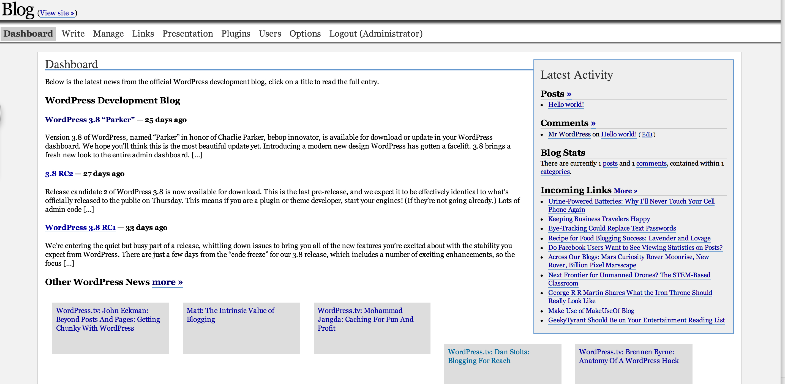
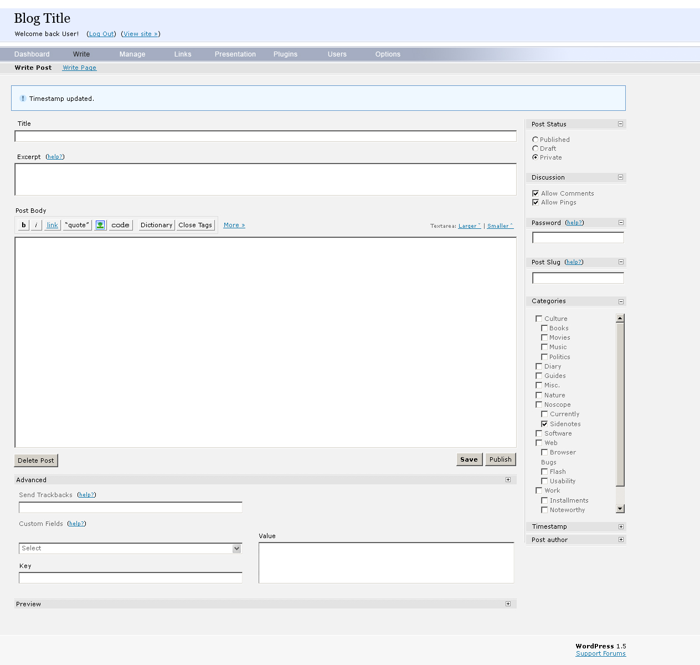
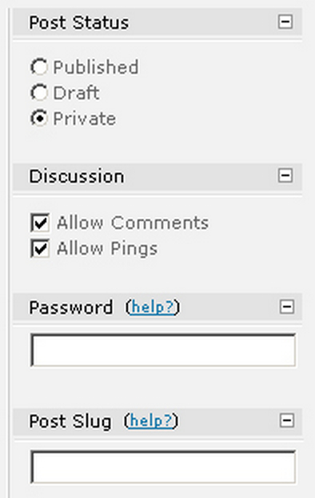
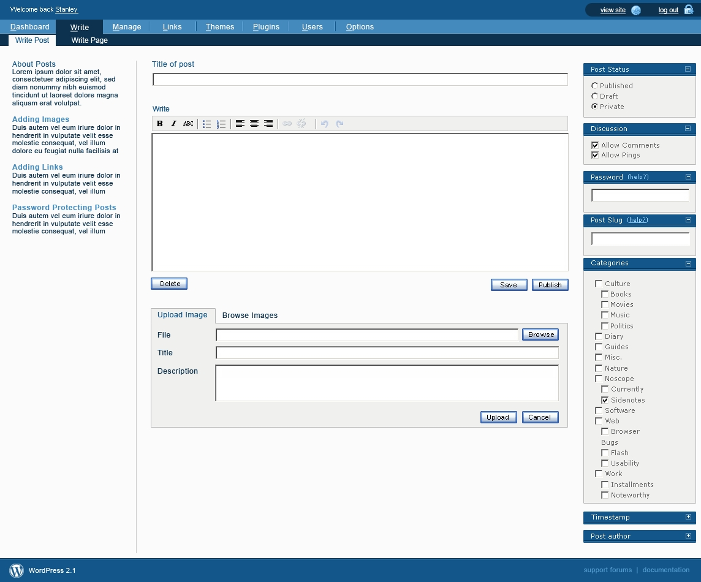

Designing in an open source world isn't always easy. In fact, it rarely is. Even if they do share the element of creativity, designing and writing code are different. A bug fix is a bug fix, a piece of code works or it doesn't. There may be more or less logical or elegant ways or doing things, but it's easy for groups of trained programmers to work on something and iterate on it. Design is much more subjective - not everyone likes the same shade of blue but everyone feels like they have an opinion on it. Trained designers enter into environments where their work is commented on by people who don't know anything about design theory but who just know if they like rounded corners or not. To comment on a piece of code, one must have some level of skill in that code, but anyone can comment on a design.  

In an open source project, things often move forward after discussion, through consensus, and by iteration by large groups of people. Fifty developers can work on a piece of code before it is final and there's nothing abnormal about it. For designers, who have an overall vision, this can be uncomfortable. And this mode of working doesn't necessarily work  as groups fall into the trap of design by committee. 

Over the course of its development, WordPress has seen a number of different design phases, each with its own method of working, each with its own problems and its own achievements. In a world in which free software is often criticised for not being usable, getting the design right while still maintaining the values of the project is a difficult balance to get. And if one looks at the timeline of the project, its not just the design itself but the very design process that has been iterated on.

In early 2005, a mailing list was set up at [wp-design](http://lists.automattic.com/pipermail/wp-design/). The Shuttle group comprised Michael Heilemann ([michael](http://profiles.wordpress.org/michael), Khaled Abou Alfa ([khaled](http://profiles.wordpress.org/khaled), Joen Asmussen ([joen](http://profiles.wordpress.org/joen)), Chris Davis ([chrisjdavis](http://profiles.wordpress.org/chrisjdavis), Joshua Sigar ([alphaoide](http://profiles.wordpress.org/alphaoide)], and Matt. They were joined later on in the process by Bryan Veloso ([Syni](http://profiles.wordpress.org/syni)). The aim of the group was to create a coherent brand for WordPress with a view to redesigning the admin. 

In the beginning however, much of the discussion was focused on WordPress' new logo. In its first few years, the WordPress logo was some simple blue and black serif text. 

 

With some variations for seasonal and other events:

 

 

 

 

And it was agreed that it could do with being updated.

Suggestions for the new logo were solicited from the community. A mixed set of results came back and Matt shared these with the wp-design group for feedback.

The [first suggestions](http://lists.automattic.com/pipermail/wp-design/2005-March/000163.html) were from Andreas Kwiatkowski

 

A [second batch were sent](http://lists.automattic.com/pipermail/wp-design/2005-March/000171.html) by Denis Radenkovic:

 

Some of the feedback for the logos was lukewarm, though both [Joen](http://lists.automattic.com/pipermail/wp-design/2005-April/000175.html) and [Michael](http://lists.automattic.com/pipermail/wp-design/2005-March/000173.html) did both like Radenkovic's heart logos, describing them as "instantly recognisable" . 

Joen even submitted his own versions of the logo based on Denis Radenkovic's heart design: 

 

And he produced a version of the admin screen with the design in situ:

 

But it wasn't just community members who were working on the logo. In March, Matt met [Jason Santa Maria](http://jasonsantamaria.com/) at South by South West and asked him to have a go at redesigning the WordPress logo. They had a lot of abstract ideas of what they wanted to the logo to be: "the things that kept coming up were not only the idea of publishing but the idea of having a personal journal and a personal thing that might have some sort of tactile overtones," says Jason now.  "We were making links to things like letterpress and journaling and any sort of older representations of what it meant to publish something in a physical form." In April, [Matt shared some of the early versions](http://lists.automattic.com/pipermail/wp-design/2005-April/000182.html) with the wp-design group:

 

Reaction to the logos was mixed, with some feedback suggesting that the logos felt ["a little too aristocratic"](http://lists.automattic.com/pipermail/wp-design/2005-April/000194.html) for WordPress. Some of the designers [felt that the design by Denis Radenkovic](http://lists.automattic.com/pipermail/wp-design/2005-April/000185.html) was more in line with WordPress' brand. 

More designs were posted to the group, but the responses weren't much better.

 

 

While the logo discussion continued, Khaled spoke to Matt off-list about it. Speaking to Matt helped to clarify for him the direction Matt wanted to go with the branding and feel of WordPress. He [reported back](http://lists.automattic.com/pipermail/wp-design/2005-April/000192.html):

> WordPress is meant to be the Jaguar or Aston Martin of Blogging tools. [...] that line sets the stage for what the design of the branding should be. Elegance, polished, and impecably [sic] designed is where we should be aiming. 

On May 15th, Matt sent an email to the mailing list with the subject "I think this is it". It contained just one image:

 

Discussion about the logo rumbled on but this wasn't the primary focus of the group. Their main purpose was to come up with a reimagined and modernised WordPress admin. The work was intended to be an aesthetic refresh, as opposed to a functional refresh -i.e. focusing on changing the design elements rather than adding any new functionality. The group was set up just prior to the release of WordPress 1.5, which came out with a set of admin screens in need of some love. 

 

Unlike most of WordPress' development, the Shuttle group carried out their work on a private mailing list. This was open to other members but the list archives weren't public. To provide feedback on Shuttle and get involved, a person had to ask if they could be added to the group, and the group had to agree on adding a new member. This highlighted one of the tensions in designing in an open source environment. A free software project by its nature is open for anyone to get involved.

Linus's Law ([as outlined by Eric Raymond](http://www.catb.org/esr/writings/homesteading/cathedral-bazaar/ar01s04.html)) says that "given enough eyeballs, all bugs are shallow." The idea is that if there is a problem, get lots of eyes on it as it will be transparent to someone. This works when the thing in question is a bug or a coding problem with a clear answer.

Design, however, is much more subjective, and all of the designers involved with the Shuttle project felt that opening up the design process to anyone would lead to a case of "too many cooks". "A mailing list like that," recalls Chris Davis now, "would become so much noise and so little signal so quickly that there would be no way we could move forward." 

To try and avoid a scenario in which there were too many people involved, the group was kept small, with three main designers (Michael, Joen, and Khaled) and a number of coders responsible for realising the vision. The group worked from a set of PSDs and sent designs around amongst themselves, providing feedback on each other's work and iterating on the design. Much of the discussion focused on design specific elements, with Matt occasionally implementing design ideas along the way in WordPress itself. 

The focus was mainly on the Post writing screen (post.php) and over the coming year they sent 28 different versions to the mailing list. 

Version 8

 

Verion 14

 

Version 21

 

Version 26

 
 
As work on Shuttle progressed, community members who weren't involved with the development were frustrated that it was being carried out behind closed doors. There was no clarity about what the Shuttle group was and what they were responsible for. Some people were convinced that the Shuttle group was redesigning the admin while the rest of the community were cut out of it, whereas [Matt's opinion], on the other hand, was (http://lists.automattic.com/pipermail/wp-hackers/2005-June/001417.html) "Shuttle is a few designers who throw photoshop comps back and forth to each other."

The foremost person who was annoyed about the process was WordPress co-founder Mike Little. In June 2005, [Matt checked in](https://core.trac.wordpress.org/changeset/2639) changes to the write screen that implemented the new pods functionality, enabling users to collapse and expand meta boxes on the screen. The changes weren't discussed ahead of time on wp-hackers or IRC, just on the closed wp-design mailing list. This precipitated a long discussion on wp-hackers about [openness in the project](http://lists.automattic.com/pipermail/wp-hackers/2005-June/001403.html). While Matt intended the commit to be a discussion point, it was perceived to be a wholesale change made without discussion. Many people in the community felt that discussion should have happened ahead of the commit, or that the community should have at least been informed that the user interface design had been delegated to the Shuttle group. That was, after all, how an open source project should work. The issue was discussed in the [WordPress IRC chat room](http://codex.wordpress.org/IRC_Meetups/2005/June/June29RawLog) and as a result both Mark Jaquith and Sean Evans (morydd) were made bug gardeners on trac. 

As the design process continued, elements of Shuttle were implemented in WordPress. One of the earliest Shuttle designs increased the size of the title field in the post.php edit screen.

In WordPress 1.5:

In Shuttle:

WordPress 2.0:

Another change suggested by the Shuttle team was the implementation of collapsable pods in the Write screen so that elements such as post status, categories, and author, could be collapsed.

In WordPress 1.5:

In version 8 of Shuttle:

In WordPress 2.0

However, feedback on the elements of Shuttle that were included wasn't always positive. WordPress 2.0 shipped with a number of elements from Shuttle. On her blog, [Molly Hollschwag wrote that](https://web.archive.org/web/20060203042213/http://www.molly.com/2006/01/05/wordpress-20-and-akismet/) "what WP2.0 has gained in interface appeal it's lost in some practicality too." For the Shuttle team, the problem was the [piecemeal implementation of their vision](http://lists.automattic.com/pipermail/wp-design/2006-January/000559.html).

The project was beset by other problems. Despite having a closed mailing list to avoid the "too many cooks" problem, they had that problem anyway. The setup of the group meant that no one had responsibility for the overall vision of the project. Ideas were discussed and sent around, and while the team all got on well, formed friendships, and enjoyed working together, when one reads back the mailing list now it feels like a design-focused discussion forum rather than a team with a clear task.  No one had sole responsibility for the vision of the group and no one stepped up to take that role on. As the group discovered, having a group of designers, each with their own ideas and vision, can cause as many problems as opening a design list up to a bunch of hackers.

The other issue was the length of time it took for the group to get work done. A lot of time was spent discussing minor elements of the design such as rounded corners and gradients, rather than asking fundamental questions about WordPress users, what they needed and what they wanted. "I don’t know if we were cooperating enough on getting a unified feel and a unified understanding of everything before we were trying to actually apply our ideas to the problem," says Michael now. Besides that, all of the contributors had jobs that took up a lot of their time, so work happened in fits and starts. While the original intention was to complete the admin redesign within a period of around three months, by mid-April, this was pushed to September. Then the team [missed the deadline for WordPress 2.0](http://lists.automattic.com/pipermail/wp-design/2005-November/000502.html) in late 2005. The next deadline given to them was the end of January (for inclusion in WordPress 2.1, which itself never materialised), but a complete set of mockups was never produced until March 2006.

At the start of March 2006, Khaled sent round a complete set of screenshots that was his vision for the new WordPress admin:

 

 

The rest of the group loved the designs and the work was delegated to the developers on the team for coding. As with the rest of the project, the developers took a long time to work on the code. In mid-April, [Michael Heilemann withdrew from the project](http://lists.automattic.com/pipermail/wp-design/2006-April/000721.html), saying that he had to prioritise his other commitments. The same month, [Khaled asked](http://lists.automattic.com/pipermail/wp-design/2006-April/000723.html) whether Matt or Ryan would ever get around to implementing it themselves. [Matt's response](http://lists.automattic.com/pipermail/wp-design/2006-April/000730.html) was that the redesign was a medium-priority and that changes would be made iteratively. 

On May 14th 2006, [Khaled posted the designs to his blog](https://web.archive.org/web/20061105004935/http://www.brokenkode.com/archives/shuttle-launched/), finally sharing the complete set of designs with the WordPress community, and bringing the Shuttle project to a close. He was still, however, under the impression that the mockups would be implemented in due course. In August 2006, Byran Veloso, who by that time had joined Automattic as an employee, posted on his blog about his [own implementation of the Shuttle project](https://web.archive.org/web/20061109234833/http://avalonstar.com/2006/08/09/wordpress-ywmc-the-post-screen/). For Khaled, this simply demonstrated that his own designs would never be implemented and that Bryan, as part of his role at Automattic, was taking on the role of redesigning the dashboard. [He used his blog as an outlet for his anger.](https://web.archive.org/web/20061112181001/http://www.brokenkode.com/archives/contributing-to-open-source/). He felt that he had put considerable work and thought into something that was ultimately being dismissed. 

He wasn't the only person to feel disenfranchised and the other members of the group slowly drifted away from the community. Chris Davis and Michael Heilemann made the switch from WordPress to the Habari project (which was conceived in September 2006), and Bryan Veloso became more enmeshed within his work at Automattic.

The biggest failure around the Shuttle project, wasn't the designs, nor even the implementation of the designs, but the process itself. To solve one problem, the group closed itself off from the community but in doing so caused even more. Cut off from the rest of the community they lost touch with the actual development process. Since it was closed, when life took over and there was little activity on the project there was no opportunity for another enthusiastic party to take the project on. The wider community had diverging feelings about the project - its secret nature gave it a sense of mystery, hype grew around the project with the expectation that it would be a spectacular redesign of the admin. But for others there was growing resentment that a blessed group of designers was working on something that everyone had a stake in.

In one of the final emails on the wp-design mailing list, [Matt outlined](http://lists.automattic.com/pipermail/wp-design/2006-May/000732.html) some of the things that he learned about design-oriented open source projects:

> * Work should not be done in private
> * Design by committee doesn't work, better to break up tasks and let individual people focus on one section
> * Focus on lots of incremental changes, rather than giant redesigns (you end up in the same place, and probably sooner)
> * Document the process and decisions along the way
> * Code concurrently with the designs (and iterate)
> * Don't hype it, expectations get out of control
> * Avoid scope creep of features into designs
> * Set a deadline and stick to it

In November 2007, there were still questions being asked about whether the Shuttle project would be implemented, but by that point, [Matt had employed the services](http://lists.automattic.com/pipermail/wp-hackers/2007-November/016123.html) of design studio Happy Cog to carry out a total redesign of the admin. The founder of Happy Cog, Jeffrey Zeldman, led the project with WordPress's logo designer Jason Santa Maria, and UX designer Liz Danzico making up the rest of the team.

Whereas Shuttle was primarily focused on aesthetics, Happy Cog were brought in to both identify and correct information architecture problems and update and improve WordPress' look and feel. The overall intention was to improve WordPress' usability and to make it easier to use.

In an unusual move for Happy Cog, they would produce the comps while the WordPress project would write the code. The scope of the project included user research and an audit of the current interface to identify WordPress' strengths and weaknesses, followed by a new structural design and a new interface design. 

The other unusual aspect of the project for a traditional design agency was that the client was an open source project. The team at Happy Cog was mostly sheltered from the goings-on of the community, but that didn't mean that they weren't aware that this wasn't a normal client. Jason Santa Maria says now:

> Any other client will have customers and their own community, but you really have to just manage the people inside of a company, whereas when you’re dealing with an open source project, you deal with the people that you’re talking with, but there’s this whole gamut of other people that you will only ever get to talk to a small portion of. I think that that’s really difficult.

> Plus, I think that on an open source project like this, it’s inherently different, not just because it’s more of a CMS than an informational website — the design needs are different — but it’s just a different kind of way to work, knowing that whatever you do probably isn’t going to stick around for very long. It’s going to continue to evolve and continue to be adapted. Usually, in the very near-term as well, not even 3-4 months from now, but next week.

The first stage of the process was an audit and usability review of WordPress. During this stage, Liz Danzico carried out research to produced a 25 page research audit about WordPress. The intention was to create an admin which would get out of the way. She quotes [a post written by Mark Jaquith](http://markjaquith.wordpress.com/2007/02/21/engine-awareness/) in which he says "That’s when I know WordPress is doing its job: when people aren’t even aware they’re using it because they’re so busy using it!"

[Flesh out after Liz Danzico Interview]

As part of their research, Liz spoke to Mark Riley, whose experience in the support forums meant that he had direct access to users' complaints. One of the major problems he highlighted was that the write screen had become cluttered. WordPress 1.2 had been limited to just writing, while WordPress 2.0 had too much going on. Functionality had been added haphazardly and then tucked into modules using the pods introduced by the Shuttle project.

A lot of the discussion focused on the structure of the navigation, both in terms of the labelling, position, and grouping of functionality. Long discussions were had about whether to go with an object-oriented navigation (Posts, Pages, Comments, etc) or an action-oriented navigation (Write, Manage, etc). Liz's first hunch, supported by the newly-launched Tumblr, was that users preferred navigating by nouns. She felt that what was so confusing to users was that WordPress was organised by verbs. When it came to putting together the navigational structure, both a noun version and a verb version was used. In the end, however, and after limited user testing, the team went with a mixture of nouns and verbs - Write, Manage, Design, Comments. This meant that the functionality for different content types was scattered over different menu items - to write a post, for example, the user would go to "Write" but to manage a post they would navigate to "Manage". However, managing a post also meant writing so it was unclear where a user should actually go.

****

When it came to the design stage, Jason Santa Maria was tasked with putting together three designs to present to Matt, who would choose one to move forward. 

[designs from Jason]

The design that Matt chose was the visually lighter one. Jason had taken a lot of the heavy blues introduced by Shuttle and lightened the interface up. The lighter blues were complemented by an orange accent colour.

When the design was finally signed off by Matt, the changes started to appear in WordPress trunk and [not everyone was happy](http://lists.automattic.com/pipermail/wp-hackers/2008-February/017849.html) [with the changes](http://lists.automattic.com/pipermail/wp-hackers/2008-February/017850.html). There were questions about whether the changes were in fact going to make the admin more usable. Among the [most dissatisfied were those who had been involved with Shuttle](https://web.archive.org/web/20071024231530/http://www.brokenkode.com/archives/new-wordpress-admin/). And many of the comments made comparisons with Shuttle, with community members [emphatically requesting that Shuttle be the new interface](http://weblogtoolscollection.com/archives/2008/01/02/wordpress-24-admin-preview/#comment-1207158). 

Just prior to the release of 2.5, Matt [posted a sneak peek on the development blog](http://wordpress.org/development/2008/03/25-sneak-peek/). This spurred WordPress users into installing the release candidate to get a better look. The response was mixed. [One user talked about the things that irked him](http://astheria.com/design/evaluating-the-wordpress25-interface) - moving functionality on the post screen to below the post field, for example, and the precedence of the design tab - things which people who used WordPress every day easily picked up on. For many people, especially experienced bloggers, it was [simply a step backwards in terms of usability](http://www.neatorama.com/2008/04/21/wordpress-25-admin-backend-category-shenanigans-and-how-to-fix-it/#!vG29i). 

When the design finally launched, it still wasn't clear whether people disliked it because they don't like change, or whether there was something inherently wrong with it. Not long after the launch, however, a chance came along to investigate what was really the problem. A friend of Matt's, Jen Mylo, was running a usability testing and design centre at an agency in New York in conjunction with Ball State University. The centre carried out usability studies, including using cutting-edge eye tracking technologies. This was usually for big companies like television networks such as ABC, NBC, and MTV. They happened to have an opening because a TV network didn't have their product ready in time for a test window and Jen was told she could offer it to anyone at cost price. With Automattic having recently received financing from the New York Times and True Ventures, Jen asked Matt if he would be interested in having WordPress tested. 

The usability review consisted of three main stages. First of all, WordPress 2.5 was tested, and some recommendations were drawn up for "low hanging fruit" that would make some improvements to the admin. Following that, the development team created a prototype (Test1515) based on the recommendations to see if they improved users' experience. These two stages constituted Round 1. Finally, based on the Test1515 findings, the Crazyhorse prototype was created and tested in Round 2.

The research team used three main methods for testing:

1. Talk-aloud, in which the participants were asked to think aloud as they carried out tasks.
2. Morae Software recorded screen activity and videoed the participants, and enable researchers to watch remotely.
3. Eye-tracking technology was used to identify granular problems.

The [twelve participants who were involved in the tests](http://en.blog.wordpress.com/2008/05/20/new-york-usability-testing/) carried out a broad range of activities across the WordPress admin. In Round 1, despite finding WordPress generally easy-to-use, the researchers identified a number of problems, including:
1. Verbs vs nouns - users found it difficult to conceptualise their tasks as action-oriented (Write/Manage), instead thinking of their content in a more object-oriented way (Posts, Pages, Comments, etc)
2. Users were not spending time on the Dashboard, often just using it as an entry point for other pages.
3. The Write Post screen caused problems for users. Tags and categories appeared below the fold, and some participants forgot to add categories and tags, having to go back to do it after publishing a post.
4. The comments screen was confusing. Users weren't aware that they had to click a commenter's name to edit a comment, and when they were asked to move a comment to spam they looked in the wrong place.
5. Users were confused by the difference between uploading and embedding media in the media uploader.

On top of this there were a number of minor issues around settings, the media library, link categories, and tag management. Users also demonstrated a desire to have more control over the modules, on the dashboard and the post edit screen, for example.

The usability testing report says the following:

> In addition to a laundry list of small interface issues that presented simple fixes, such as changing comment author links, we were faced with larger issues such as the desire for user-determined hierarchies on long/scrolling screens, ambiguity in the Write/Manage navigation paradigm, and a disconnect between the act of adding media to a post and the ability to manage it.

While minor changes were incorporated into the Test1515 prototype and tested, they were so minor that participants didn't have a strong reaction either way. It was decided to use the results from Round 1 of testing to create a more drastic prototype, with the following guiding principles:
- maximise vertical space
- reduce scrolling
- increase access to navigation to reduce unnecessary screen loads
- enable drag and drop on screens that would most benefit from user control
- redesign management screens to take advantage of natural gaze paths.

Jen and Liz went to work creating a prototype. There was one based on front-end ending, one with accordion panes, one with a top navigation. In the end the version that they picked for the prototype was the simplest - a left hand navigation panel, much like Google Analytics and other web apps were doing.

A branch was made in Subversion and the [developers started to build a prototype](http://lists.automattic.com/pipermail/wp-hackers/2008-June/020652.html) which was [based on a prototype document](http://ma.tt/dropbox/2008/06/wordpress-prototype-1.1.pdf) that outlined the changes and the reasons for them. The focus of the project was on user experience and functional development, so the prototype kept the same visual styles as WordPress 2.5. As with the previous round of testing, the participants carried out a series of tasks and the progress was assessed using talk-aloud, Morae, and eye tracking. The findings were striking.

Most responses demonstrated a preference for Crazyhorse over WordPress 2.5. Every new feature that was tested provided actionable information for the next version of WordPress. 

[perhaps add a screenshot for each of these changes]

For example, participants loved new position of the navigation - at the left hand side of the screen. They also preferred the object-oriented approach to organisation (Posts, Pages, Media, etc). The new Dashboard was considered more useful, and people liked the opportunity to be able to customize it to their own needs. They liked the idea of QuickPress, though they weren't sure if they would use it. With action links now positioned under the comments, users found it easier to edit and act on comments. The new Write screen enabled users to decide which elements to give the best screen real estate (using the drag-and-drop functionality). They also liked having access to post comments and felt that the new media uploader was a huge improvement, and better integrated in the media library.

[get a screenshot of the following]

The only major negative responses were to a bottom bar that contained the functionality previously contained in the Publish module. Users tended to look at the bar a few times before realising that it contained the Publish button, with some users comparing it to a banner ad or the Chrome browser. 

Both Happy Cog and Crazyhorse had undertaken user research, but they ended up with quite different results. For Happy Cog, Liz conducted a series of interviews with community members, while later on she carried out in-person user testing. The crazyhorse project, however, made use of eye tracking technology. This meant that the testers didn't have to rely solely on what participants said; instead they had insight into what the participants were looking at while they were making statements. Not only that, but gaze trails provided insight into the way that users were navigating the screen with their eyes - where were they drawn to first, were they missing important UI elements, did they understand what they were seeing?

With the success of the prototypes, the next stage was to put a design layer on top. When crazyhorse was [first merged with trunk](https://core.trac.wordpress.org/ticket/7552) it was still simply a set of live wireframes. No design changes had been made so that participants in the testing wouldn't be swayed by whether they had a preference for a particular colour or typeface. But by the time of the Automattic meetup in Breckenridge, Colorado, in 2008, Crazyhorse was ready to have some colour added. 

At Automattic meet ups, the company tends to split up into small groups to work on projects which are assigned at the beginning of the week. Everyone was given their assignments, and for Matt Thomas, MT, ([iammattthomas](http://profiles.wordpress.org/iammattthomas)) his assignment was redesigning WordPress. He was given Crazyhorse and free reign to give it the coat of pain it needed. The rest of the week, Jen and MT spent the entire week working on the admin redesign. A number of designers were produced - a heavy blue that harked back to the Shuttle-inspired version of WordPress, a version that used the light blue, greys, and orange of Happy Cog. In the end the two were melded into a grey colour scheme that became a feature of WordPress until 2013.

Effort was put in by Jen to ensure that the community was kept abreast of what was going on with the Crazyhorse project. The testing was carried out as an adjunct to the WordPress project, with little community involvement. This was because part of the reason for the testing was to see if there was an actual usability flaw in the interface or whether people simply didn't like the new design. If it had been simply a matter of users not liking the new colours, the Crazyhorse project would have come to nothing. But when it became obvious that the WordPress interface did need to change, a dialogue was started in the community. The [designs were shared on the development blog](http://wordpress.org/news/2008/10/the-visual-design-of-27/), as was the [usability report](http://wordpress.org/news/2008/10/usability-testing-report-25-and-crazyhorse/), a [survey was carried out about the navigation options](http://wordpress.org/news/2008/09/wordpress-27-navigation-options-survey/), and [issues were discussed on the wp-hackers mailing list](http://lists.automattic.com/pipermail/wp-hackers/2008-October/021944.html). In fact, when WordPress 2.7 was released, the [release post](http://wordpress.org/news/2008/12/coltrane/) lists all of the posts written by Jen and the developers about the process. Up to that point, it was the only iteration of the WordPress admin to have such a trail.

In 2008 alone, the WordPress admin changed drastically, twice. When [screenshots of the changes started making their way onto community blogs](http://weblogtoolscollection.com/archives/2008/09/02/first-look-at-wordpress-27/), the inevitable question was "why are they changing it again?" No time seemed to have been given to allow the WordPress 2.5 design to really settle in before another huge change came about in 2.7. A change in the UI meant that users of varying skill levels needed to completely relearn how to use WordPress. Not only that, but there was a growing community of people who had created tutorials containing screenshots and videos on how to use WordPress. Every screenshot would need to be retaken, every video re-shot. However, when WordPress users started upgrading the [feedback was positive](http://lorelle.wordpress.com/2008/12/10/wordpress-27-available-now/#comments). Unlike with WordPress 2.5, users loved the new interface, finding it easy to use and intuitive, and demonstrating finally that it wasn't change they had been unhappy with just nine months earlier, but the interface itself.

It was four years before there was another redesign of the admin. This time it was helmed by the designer who had put the coat of paint on Crazyhorse - Matt Thomas. The project project started with a change of icons. New icons, designed by Ben Dunkle, were introduced into core in one flat colour, that would enable people to colour the icons using CSS or use vectors or web fonts. The [reaction to the icons in the community was mixed](https://core.trac.wordpress.org/ticket/23333) though mostly negative - people didn't think that they fit with the current design. Having up-to-date icons only served to show how dated the rest of the admin had become.

As a result of the discussions on trac and on the UI blog, Matt opened up a Skype channel which he asked Matt Thomas and Ben Dunkle to join. He asked them to think about how a redesign might work, gave them some parameters, and told them to reimagine the WordPress admin. MT, who'd been involved with Crazyhorse, instinctively felt that the work done as part of that project ought to be respected, and instead focused on carrying out an aesthetic refresh as opposed to a functional one.

The MP6 project learned from each major design effort in WordPress, taking the best aspects and trying to avoid the worst. Both Matt and MT were keenly aware of the issues and challenges that had arisen in each design phase. Shuttle, for example, had fallen into the pitfall of being cut off from the rest of the community - a cloistered group of designers who were throwing around comps while slowly losing touch with "the client". This meant a lack of accountability; there was no one that the Shuttle group had to report back to. This was compounded by the fact that no one person was responsible for leading the group or for the overall vision.

These problems were the result of the group's attempt to solve an initial problem - designing in an open source environment can lead to a poor signal-to-noise ratio. However, by trying to solve one problem, they created another. The MP6 project tried to solve that problem while not becoming cut off from the community. A Skype channel was created for the group so that they could talk in private, but anyone was allowed to join in. "Even though the group worked in private," says MT, "the door into the group we were working on was open, so if anyone said they were interested they could just walk in."

The work was carried out in a plugin hosted in the WordPress plugin directory, which meant that anyone could install the plugin and see the changes in their admin. Every week a release had to be built and released publicly for feedback. Besides this, the group posted a weekly report where anyone could provide feedback. This meant that there were multiple ways for community members to be involved on different levels. It also meant that the group could never steer too far off course. The core team were always aware of what was going on with MP6 and could provide feedback.

There were even more designers involved than there were with Shuttle, with the group eventually growing to around 15 members. But they avoided having the problem of "too many cooks" by having MT lead the team with overall responsibility for the vision of the group. It was accepted within the group that MT had the final say on the design. 

The group was also made aware that while the project would be open to anyone who wanted to contribute the the core team would make a decision on whether it would end up in WordPress. There was no indication made to MT that it would definitely end up in WordPress. "I tried to set the expectations for the group that we have no guarantee that any of this will ever go in," he says, "but that we were building a product that we thought would be appropriate to go in to Core."

What Happy Cog managed to do was to look at WordPress with a fresh set of eyes. Their distance from the product meant that they were able to treat it as a piece of software, not as something that they were devoted to. They stayed in touch with their client, Matt, but what didn't influence their decisions was that Matt was just one WordPress user among many and that their client was in fact the community of WordPress users and all of their diverse thoughts and opinions. MP6 solicited feedback from all of the people with a stake in the project. That did bring its own challenges - whose feedback was the most legitimate? What ought to be listened to? When was someone just complaining for the sake of it? But at least that platform as there for anyone to voice their opinions.

The Crazyhorse project emphasised the importance of in-depth user testing. It's not enough for a designer to make something look pretty - the interface has to be something that users can interact with. If the interface is changed into something people can't use or that they hate, users will abandon the software or they won't update. With all of the testing that had gone into Crazyhorse, MT knew that he didn't want to carry out a structural overhaul which would have required extensive testing and data gathering to make sure a change was actually an improvement as opposed to just a change for the sake of it. 

The MP6 project was [announced in March 2013](http://make.wordpress.org/ui/2013/03/09/as-a-continuation-of-the-work-begun-in/), starting out small but growing over the course of the year. The design process began with MT playing around with the CSS. He started out with a unified black L-shaped bar around the top and the side "that was the idea," he says now, "that the black would feel like a background and the white would feel like the sheet of paper lying on top of it, so it would unify these disparate things." Once the basic visual was put together by MT, the rest of the contributors started refining the design.

Not everything went smoothly. An issue that caused particular controversy was the [inclusion of web fonts from Google Fonts](http://make.wordpress.org/core/2013/11/11/open-sans-bundling-vs-linking/). This meant that Open Sans, the font used in WordPress' admin screens were hosted on Google's servers. Whenever a user logs into their admin the fonts are served from Google. This causes problems for people who don't want to open a connection to Google from their website, and for people in whose countries Google is blocked. Bundling them with WordPress, however, would require a huge amount of specialised work to ensure that they worked across platforms, browsers, and in different languages. In the end, the decision was made to link to Google and a plugin was created to allow people to switch web fonts off. 

Despite minor hitches, the MP6 project went smoothly. Joen Asmussen, who'd been a part of the Shuttle project 8 years earlier says "I would say that MP6 does everything right that Shuttle did wrong." It was included in version 3.8 of WordPress, released in December 2014, demonstrating that open source design, while difficult, is possible. 

The trajectory of WordPress' design tells a story of stops and starts, mistakes and successes. It's a clear example of how what works for code doesn't necessarily work for every single facet of an open source project. There are times when things need to be open: lines of communication for example, discussions in the community, feedback mechanisms, and a way for people to see what is going on. But there are also times when it benefits the project to create spaces where work can be done in private: a designer shares their first searching ideas, or a new contributor has a space where they can speak freely. 

