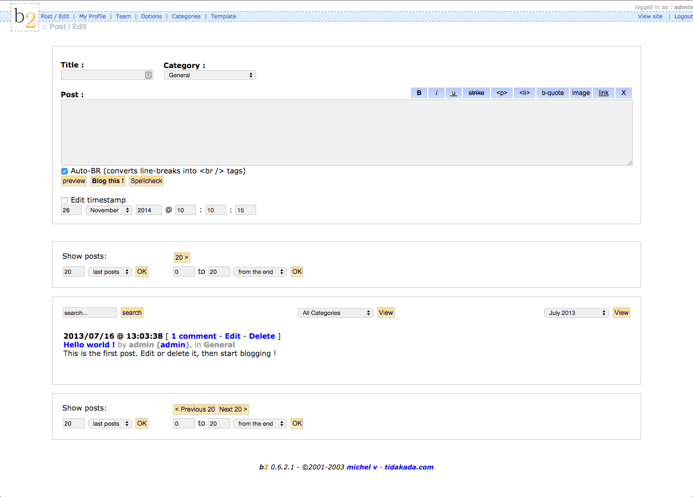

## 2. The Only Blogger In Corsica

It was late 2000, and Michel Valdrighi (<a href="https://profiles.wordpress.org/michelv">michelv</a>) was writing a blog post in his small apartment above a bar in Corsica. The "only blogger in Corsica" used a creaking dial-up AOL connection that disconnected every thirty minutes. He shared his apartment with two cats, <a href="http://zengun.org/weblog/archives/2000/12/post1447/">No Name and Gribouille</a>, who perched on a windowsill overlooking a high drop.

Like many bloggers, Michel experimented with different web publishing platforms, and started out with HTML before moving to Blogger. But he discovered that Blogger wasn’t as fully-featured as he'd wanted. For example, it didn’t have a built-in comment system. This was at a time when bloggers could sign up for external commenting services that were often unreliable and unstable. Michel signed up for two different commenting services -- both of which disappeared, along with all of the comments and discussions. Blogger was also plagued by stability issues, and users sometimes joked that the platform was “sometimes up.”

Michel was learning the server-side scripting language PHP. Unlike a language like Perl, PHP is relatively easy to learn, making it a useful tool for people who want to start hacking on software. One of Michel’s first PHP projects was a Corsican-language dictionary: this experience taught him that he could use PHP to manipulate data, inspiring him to create his own blogging script. In June 2001, <a href="http://zengun.org/weblog/archives/2001/06/post1958/">Michel started developing b2</a>, [^fn-1] a "PHP+MySQL alternative to Blogger and Greymatter." He wrote:
<blockquote>Not much new ideas in it, but it will feature stuff like a built-in comment system, good users management (with complete profile etc), user-avatars (got piccies ?), multiple ways of archiving your blog (even post by post if you like to do a kind of journal) (sic).

The installation will be easy, just edit a config file, upload everything and launch the install script. And there you go, but you’d like an admin control panel? It will be there, packed with options.</blockquote>

The PHP and MySQL combination was a good alternative to other contemporary blogging platforms. PHP is suited to the dynamic nature of a blog, in which an author regularly posts content and readers regularly return to read it. Movable Type used Perl, which rebuilt the page every time someone left a comment or edited the page, often making for slow page-load times. As a result, b2 was touted as an easy-to-use, speedy blogging tool. "You type something and hit 'blog this' and in the next second it's on your page(s)," <a href="http://cafelog.com/">boasts the sidebar of cafelog.com</a>. "Pages are generated dynamically from the MySQL database, so no clumsy 'rebuilding' is involved. It also means faster search/display capabilities, and the ability to serve your news in different 'templates' without any hassle."

These features attracted Matt, Mike, and many other bloggers. But Michel admits to being a novice developer, learning PHP and MySQL while building the precursor to one of the most widely-used blogging and CMS platforms in use today. He <a href="http://wordpress.tv/2012/02/27/les-origines-de-wordpress-la-naissance-de-b2cafelog/">recalls</a> that as a fledgling PHP developer, he didn’t always do things correctly:
<blockquote>When you look at WordPress' code and think 'Wow, that's weird, why did they do that this way?', well often that's because they kept doing things the way they were done in b2, and I sucked at PHP.</blockquote>

Like other early blog software developers, Michel was "scratching his own itch" -- a familiar phrase in free software development. This means creating the tools you need, whether that's a blogging platform, a text editor, or an operating system. In his book, <em>The Cathedral and the Bazaar</em>, Eric Raymond <a href="http://www.catb.org/esr/writings/homesteading/cathedral-bazaar/ar01s02.html">writes</a>, “every good work of software starts by scratching a developer's personal itch.” If a developer has a problem, she can write software to solve that problem, and then distribute it so that others can use it too. Many blogging platforms, including Blogger, b2, Moveable Type, and WordPress, started life in this way.

By being both the software developer and its user, the developer knows whether the tools she creates meet her real needs. When developers write code, they use it just as any user would. They know what works and what doesn't. Scratching an itch gives the developer a closer relationship with the software's users -- it’s grass-roots development that's bottom-up as opposed to top-down.

Michel wanted a blogging tool, not a CMS, so early b2 features were focused on creating a frictionless way to blog. Early enhancements made writing easier. For example, <a href="http://cafelog.com/index.php?p=19&amp;c=1">AutoBR</a> was included to add a <code>&lt;br/&gt;</code> tag to create a new line every time a writer hit enter. As Michel’s, and later the community’s needs changed, <a href="http://cafelog.com/index.php?p=24&amp;c=1">improvements included</a> a basic templating system, an options page, archives, an option to allow users to set their own timezone, and comments.

Michel believed that any layperson should be able to easily publish on their blog with b2. This "making software easy for everyone" ideal permeated the b2 community and would eventually become a core ideal in WordPress’ own philosophy.

By the end of June 2001, Michel was <a href="http://zengun.org/weblog/archives/2001/06/post1909/">ready to say goodbye to Blogger</a> and move his blog to b2. His blog was the first website to run on the code that would become WordPress, grandfather to millions of websites and blogs. A few days later, Michel set up a website called cafelog.com, and <a href="http://cafelog.com/index.php?p=60&amp;c=1">released the first version of b2</a>. The software was quickly picked up. <a href="http://zengun.org/weblog/archives/2001/07/post270/">The second site running b2</a>, <a href="http://web.archive.org/web/20020718211541/http://russell.bustakartoon.com/">the personal weblog of a schoolboy named Russell</a>, was published in July 2001.

*The b2 user interface*

Development didn’t always go smoothly, although solving problems inevitably led to platform refinements. Brigitte Eaton, who ran a site called <a href="http://portal.eatonweb.com/">Eatonweb</a>, was the first prominent b2 user. Eatonweb was a hand-maintained list of blogs, a go-to place for discovering new blogs until the number of blogs exploded and hand-maintained lists became untenable. It was superseded by the ubiquitous blogroll and services like Technorati, which started ranking blogs according to incoming links. Brigitte Eaton published regularly, and when she imported her blog into b2 she found that the more posts she added, the slower the blog loaded. This was because Michel didn't know how to write code for retrieving months of content from the archives. His code parsed every post on the blog to query whether the post had changed and then displayed it. For blogs with many posts, this meant a huge server workload, which quickly slowed the website. Solving this problem meant improvements for all b2 users.

Although b2 did not have an established developer infrastructure, it was open for contributions. The first major code contribution to the project was <a href="http://cafelog.com/index.php?p=490&amp;c=1">pingback functionality</a>, from developer <a href="http://web.archive.org/web/20020921055340/http://mort.mine.nu:8080/b2/">Axis Thoreau</a>, who went by the handle Mort. [^fn-2] Movable Type had a similar linkback feature called trackback; <a href="http://zengun.org/weblog/archives/2002/08/trackback-in-b2/">Michel added a version of it to b2</a>. Trackback is a ping sent from the original author’s site to a site they reference with a link. Unlike pingbacks, trackbacks are manual so the original author has to choose to send the trackback, and can edit the excerpt sent. Trackbacks are much more susceptible to spam than pingbacks; [^fn-3] whereas pingbacks ping back to the original site to verify that it is not spam, trackbacks do not carry out the same checks.

With users and developers frequenting b2's forums, a community quickly formed. The forums were a haven for people who needed help with the software. The most popular were the installation, templating, and how-to discussion forums, but there were also forums just for general chatter about the software and about blogging. Developers helped each other out with hacks for b2, and it was on the forums that the early WordPress developers first met.

Outside the b2 community, the software was criticized. Michel's lack of coding experience showed, especially to experienced developers. Blogger Jim Reverend wrote a post titled, "<a href="https://web.archive.org/web/20030910221739/http://revjim.net/item/3955/">Cafelog: A Look at Bad Code</a>." In it, Jim bemoans poor code quality in publicly released software -- particularly b2 -- and criticizes the software for its lack of features [^fn-4] and poor coding practices.

Michel's lack of PHP experience meant that he wrote inefficient code and used techniques counter-intuitive to a more experienced coder. Rather than taking a modular approach to solve a logic problem, the code grew organically, written as Michel thought about it -- a sort of stream-of-consciousness approach to coding. Code wasn't so much a tool to solve a problem, but a tool to get the newest feature on the screen. This created multiple code interdependencies, which caused problems for developers new to the project. A line of code would change and break something that appeared unrelated. For Reverend, this type of "dirty code" was unforgivable. "What I do have a problem with," he wrote, "is my inability to use his code (without extensive reading and rewriting) to implement my own features." Writing extensible code is a fundamental principle of free software. If code is written in a stream-of-consciousness fashion outside best practices, it becomes difficult for other developers to extend.

It wasn't all bad. <a href="https://web.archive.org/web/20040121234436/http://revjim.net/item/3962/">In a follow-up article</a>, Reverend concedes that there are benefits to poorly written code:

<blockquote>While programmers like myself start convulsing when we have to wade through such code, less experienced programmers actually like it, because it is easier for them to work with. Because the "template functions" are in the global namespace, they work anywhere. Because the data returned by the database is in a global variable, you don’t have to use any tricks to get at it. It makes extending, enhancing, and modifying the code easier for newbies.</blockquote>
Michel's inexperience gave the code a level of simplicity that made it easy for other novice developers to understand. "In a way it was beautiful because it was so simple," <a href="http://archive.wordpress.org/interviews/2013_04_23_King.html#L53">says developer Alex King</a>, (<a href="http://profiles.wordpress.org/alexkingorg/">alexkingorg</a>). "It wasn't elegant but it was straightforward and accessible. For someone who didn't have a lot of development experience coming in -- like me -- it was very comfortable understanding what was going on."

The article also highlights something important: people liked using b2. With b2 they could publish without hassle. "If you are a user of this product," writes Reverend, "please don’t tell me about how cool it is, or about how well it works. If you read a site powered by this engine, please don’t tell me about how easy you find it to use."

But people did find it easy to use. To users, it didn't matter what was going on under the hood. It may have had its problems, but it was a friction-free way to get content online. Where users went, developers followed; even better if those users were novice developers themselves, fumbling at the edges of PHP, learning what they could do with code, which new features they could add to their website and share with other users. Even in these very early days, a schism started to open between developer-focused development and user-focused development. On the one hand, there was a focus on logical, beautifully written code, and on the other, a focus on features users wanted.

Despite having distributed b2, Michel hesistated over his choice of license. The free software movement was relatively young, and many large projects had their own licensing terms (such as Apache, PHP, and X.Org). Until he chose a license, Michel distributed b2 with his copyright.

On the b2 blog, you can follow the events leading to b2’s distribution with a GPL license. In August 2001, Michel made a brief statement on cafelog.com, telling people that they could use his code provided he was given credit for it, stating explicitly that "b2 isn't released under the GPL yet." People were taking notice of b2 and some passed it off as their own. In October 2001, a Norwegian agency claimed to own the copyright to b2 and Michel was forced to contact the Norwegian copyright agency. In the discussion around this incident, Michel made a statement that came as close to a license as he'd had so far:
<blockquote>You can use b2 for free, even if your site is of commercial nature. You're welcomed to buy me items from my Amazon.com wishlist if you're going to make much money from your b2-powered site or if you just like b2.

You can edit b2's source code.

You can re-distribute a modified or original version of b2. In no way your modifications make you author or co-author of the modified version, I'll remain b2's sole author and copyright holder. (sic)

Any help is welcomed. Feel free to submit fixes and enhancements, they might get in b2's code and your name or email address will be there as credit in the source code.

I guess this makes a b2 license for now.</blockquote>

Michel released b2 under this slapdash license until he realized that b2 needed an official license and started looking in earnest. It was important to Michel that b2 remain free, even if he stopped working on the project. He also wanted his code to remain free if other developers took it and used it in their own project. He recalls now that "at the end of that elimination process, GPL remained. It helped that there were already some projects using it, as I didn't want the code to end up abandoned and forgotten because of the choice of an exotic license."

Michel's choice of license was prescient. Under a GPL license, software can be forked, modified, and redistributed. If development stops (as it did with b2), the ability to fork, modify, and redistribute can prevent software from becoming vaporware.

All was going well until May, 2002 when <a href="http://zengun.org/weblog/archives/2002/05/jobless/">Michel lost his job</a>. In the months following, he continued to develop b2, but <a href="http://zengun.org/weblog/archives/2002/08/back/">he wrestled with depression and health issues</a>. His <a href="http://zengun.org/weblog/archives/2002/08/they-cut-my-arms/">electricity was cut off</a>, he <a href="http://zengun.org/weblog/archives/2002/08/its-that-time-of-the-year-again/">moved</a>, and <a href="http://zengun.org/weblog/archives/2002/10/untidy/">struggled to find a job</a>. With so much going on in his life, Michel eventually disappeared. He <a href="http://zengun.org/weblog/archives/2002/12/spam-the-blogosphere/">posted about spam in December, 2002</a> but didn’t post on his personal blog in 2003.

The users of b2 had no lead developer. There was no one to steer the project, fix bugs, apply patches, or add new features. People were concerned about Michel -- they liked him and were worried about what had happened to him. In March 2003, a <a href="http://cafelog.com/index.php?p=499&amp;c=1">thread on cafelog.com</a> discussed Michel’s whereabouts. Michel’s sister, Senia, posted that he was well and that he was looking for a job, and promised to ask him to connect to IRC and MSN. The responses to Senia were mixed.

One commenter said:
<blockquote>Please pass on to Michel that not only has he created a really nice piece of software, but he has also inadvertently built a community […] of people, a sort of commonwealth on the blogosphere. I don't know him the slightest bit, but I wish him well and hope that any soul searching or vision quest (or vision exodus?!) he has embarked on helps him find what he needs. Yet also allows him to tie up any loose ends that he leaves behind.</blockquote>
Others had concerns about their own projects:
<blockquote>Anyone heard from Michel yet? His last post was 6 weeks ago. I want to install and promote b2 in two projects (one affiliated with a UN women's project).. but I am nervous about doing so if there will be no developer support available. I am sure he knows that b2 is including (sic) in the Fantastico auto-installer bundled with the cPanel virtual hosting tool. I want to write an blogging article for hosting clients. Michel? You going to be around?</blockquote>
Michel never went back to b2 with the same gusto with which he had started. Eventually, the stagnation made the software unusable. Software needs to be maintained -- bugs need to be fixed, security issues patched, new features need to be added. Blogging software needs to evolve with a fast-moving internet. It wasn’t just the software that was on the verge of becoming vaporware -- the community was adrift too. In the free software world, the community is as important as the software. The community is the garden in which the software grows and matures. Community members submit patches, fix issues, support users, and write documentation to help a free software project flourish. But every project needs a person, or group of people, to commit patches, create new features, and steer the project. When the lead developer disappears without a trace, community members can play around the edges, help out with support and hacks, but, without someone to step up and take the lead's place, the community dissolves. People move on to other projects, or start their own. After all, if the person who owns the project shows no commitment, how can commitment be expected from anyone else?

But the GPL license meant that neither the code nor the community had to disappear. Developers -- familiar names from the b2 community forums -- forked the software. While b2 itself did not continue, it was the platform that connected Mike and Matt, and the software that would provide the foundation for WordPress. With its simple PHP and focus on usability and ease of use, b2 contained the rudimentary ideals that would form the heart of WordPress. But first, the software had to be forked, and, as bloggers are wont to do, they took to their blogs to do it.

[^fn-1] The name b2 is a combination of the word “blog” and “Song 2” by the British band Blur, which Michel had been listening to regularly at that time. He combined them to make “blog2,” then “blogger2,” until he arrived at b2. b2 was also known as Cafelog, which was the name Michel had planned to give to the 1.0 series as no b2 domains were available, and the name was too short for a project on SourceForge.

[^fn-2] Pingback is a linkback method which authors use to request notifications when someone links to their website. An author writes a post on their blog that links to a post elsewhere. The original site sends an XML-RPC request and when the mentioned site receives the notification signal, it goes back to the original site to check for the link. If it exists, then the pingback is recorded. A blogging system can then automatically publish a list of links in the comment section of the post, or wherever the developer chooses to place it.

[^fn-3] Spam pings are pings sent from spam blogs to get links on other websites.

[^fn-4] Particular problems that the article calls out include the fact that b2 didn't cache calls to the database. So when there was a new visit from a user, the page had to be loaded from the database and server, slowing the website. The article also criticized the lack of flexibility in the templating system and the absence of cruft-free URLs (known in WordPress lingo now as "pretty permalinks").
