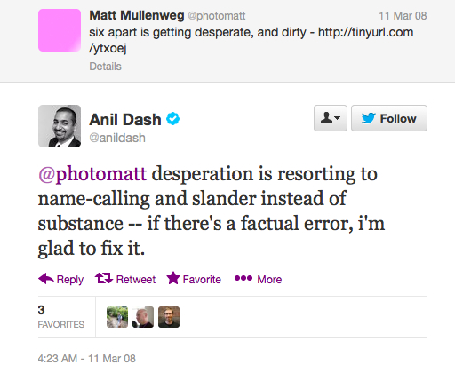

## Chapter 5

## On the Movable Type Licensing Change

The first blogging tool to have an impact was was dominated by Blogger, the FTP blogging platform developed by Pyra Labs, but by the time Matt and Mike forked WordPress, the biggest blogging platform around was Movable Type. Movable Type, just like WordPress, grew from one person's personal need. Mena Trott, a designer based in San Francisco, started up a blog called [Dollarshort](http://dollarshort.org). Like other bloggers, she was concerned with the lack of powerful tools for blogging. Blogger wasn't easy to customize. Rather than just resting on what she had, Mena teamed up with her programmer husband, Ben, and the two of them decided to write their own blogging platform. It was [clear from the start](http://web.archive.org/web/20040803233814/http://www.movabletype.org/news/2001/09/what_are_some_of_the_feat.shtml), that the Trotts were sensitive to what blogging had evolved into. Blogging was no longer about throwing up content and links, it was about creating a personal space on the internet that had functionality built-in for maintaining a web log. They wanted a comment system, date stamps, and archives. They wanted more than the bare bones that Blogger provided. Besides, Blogger was only partially self-hosted - the service had to be used to FTP content onto the user's server - and at that time the servers were overworked and constantly going down.

Movable Type aimed to bring elegance and beauty to blogging. It had functionality that we take for granted today - titles and archives, for example, some the hallmarks of blogging.

[include an image of the MT admin]
[include an image of the Blogger admin]

Anil Dash, former Vice President at Six Apart, [recalls in an interview in Salon](http://www.salon.com/2004/08/09/six_apart/), that the belief at Movable Type was that tools influence content. "If you look at a PowerPoint presentation you know you're not going to get something particularly profound — you’re going get bullet points shouted at you for 10 minutes. In terms of how people use the Web, the tools inform what you write. This was Mena's sense of it: 'What's going to make someone be inspired?'" This ethos helped them to quickly become the most popular blogging platform around. As bloggers themselves, they were tuned into what people wanted. Soon, many major bloggers, including Laurence Lessign, Jason Kottke, and Gizmodo, published their blogs using Movable Type. It grew to the point that web hosting services were providing one copy of Movable Type to hundreds of users, and soon major sites such as Gawker and about.com were making money from the platform while the developers were making less than 40 cents per copy. They weren't losing money, but they weren't making any money either.

Six Apart, the company behind Movable Type grew too. They received funding from Neoteny, a Japanese venture capitalist firm whose CEO, [Joi Ito](http://joi.ito.com/), was a Movable Type blogger. They put time and effort into developing [TypePad](http://www.typepad.com/), a commercial hosted blog service, which would become one of their key services. This focus on TypePad, however, directed much of their development energy away from their core product, Movable Type. Improvements happened slowly and the platform became increasingly vulnerable to comment spam. 

The time came when Six Apart needed to monetize the platform. Movable Type didn't have an open source or free software license so Six Apart were able to refine their terms as they saw fit. They didn't release it under a license like the GPL because "[we had this fairness thing](http://www.salon.com/2004/08/09/six_apart/)." They preferred to give broad powers to users to access and extend the code, but wanted to retain control over the platform themselves.

To get the right license, the team at Six Apart did a survey of hundreds of Movable Type users. They asked, "how many blogs do you have and how many people contribute to your blogs?" When the [survey came back](http://web.archive.org/web/20040609064130/http://www.sixapart.com/log/2004/05/movable_type_30.shtml) around 85% said that they had fewer than five weblogs or authors. The thinking behind the new pricing structure was to leave Movable Type free for 85% of users, and charge the other 15%, some of whom were big sites like Gawker and About.com who were making money from the platform while the developers behind it made hardly any.

On May 13th, 2004, Six Apart [released Movable Type 3.0 Developer  Edition](http://web.archive.org/web/20040605225637/http://www.sixapart.com/corner/archives/2004/05/movable_type_de.shtml). The release saw minor changes to functionality but the focus was touted as platform stability. The biggest change, however, was to licenses and pricing, to the previously free-from-cost platform. The changes were:

- if a user builds 3 or fewer websites and didn't need tech support they could have it for free. 
- if the user wanted more more authors or blogs they had to pay more, even for noncommercial purposes.

The licenses, while claiming to be flexible, were in fact confusing. There where five different licenses: personal edition, personal edition volume 1, personal edition volume 2, commercial license 5 authors, and commercial license 20 authors.

On her blog, Mena's Corner, Mena [wrote about the reasoning behind the changes to the licences](http://web.archive.org/web/20040611093323/http://www.sixapart.com/corner/archives/2004/05/its_about_time.shtml). The post reflects a business that was making the shift from personal blogging to more enterprise-level services. In it she says, "we will be offering a variety of licensing options for small to large sized business, education institutions and we are also beginning to sign-up qualified companies who are interested in hosting Movable Type." Not only that but Six Apart moved from describing Movable Type as a "Personal Publishing System" to a "Publishing Platform."

The [Salon article from 2004](http://www.salon.com/2004/08/09/six_apart/), notes this shift towards enterprise. Over time Movable Type moved away from its roots as a blogging tool for everyone, to positioning itself as an enterprise level tool. The article provides examples of Disney's cable operation using it to track activities doing throughout the day and lawyers using it for tracking their time and activity. 

However, while hosting companies and big business were the main targets, Mena wasn't shy about making it clear that another was "a personal user who sets up weblogs for 50 of his friends."

To say that the change didn't go well is an understatement. The team posted about the licensing change on a Thursday night. Over the following weekend they made around a quarter of a million dollars and racked up hundreds of trackbacks complaining about the changes. The backlash was furious. Six Apart were accused of  "[punishing your best customers](http://web.archive.org/web/20040605062342/http://brianburnham.com/archives/2004/05/13/there_goes_the_.html)", of having a "[show me the money" attitude](http://web.archive.org/web/20040803054258/http://enki.cthuugle.com/archives/000231.php), and of producing "[crippleware](http://web.archive.org/web/20040605142309/http://www.drunkenmonkeys.org/archives/000109.html)".

For Six Apart, the force of the backlash was shocking. Dash recalls:

> I remember I was at my desk for about three days straight. I mean we were all openly crying at our desks, we were getting death threats, we were getting… whatever you can imagine. People calling up to say "how dare you. You’ve taken the most special thing on the Internet and ruined it". I mean just savage.

Six Apart had encountered an entirely new phenomenon: a furore surrounding their platform in which everyone had a platform to complain. Dash says:

> Nobody had ever had an audience where by definition every single one of your customers had a blog before. And so nobody had ever had a social media shit storm before. And now we can see… you can see a fast food company makes a stupid tweet, and they have like a checklist. They’re like, oh, okay, we fired the intern, we’re sorry, it won’t happen again, here’s the hashtag for how we’re going to apologize, we made a donation… like you just run through the list. It doesn’t even get attention unless it’s something really egregious. But it hadn’t happened before. And mostly because nobody else had a lot of customers that were bloggers before. So you might have one. But every single person we’d ever had as a customer was a blogger. 

In the days that follow, Mena wrote various posts to try to calm the storm. On the Six Apart blog, [she requested](http://web.archive.org/web/20040810080648/http://www.sixapart.com/log/2004/05/how_are_you_usi.shtml) that people use the trackback function to tell Six Apart how they were using the software. The huge number of responses that recorded the way that people were using blogging software all over the world. A writer in Denver, [reported that he had](http://web.archive.org/web/20041009223000/http://www.average-bear.com/archive/004290.html) a personal blog, three different role playing blogs, a private writing blog, and a writing blog dedicated to supporting authors. Another user, a Quaker in South Jersey, [ran only two blogs](http://web.archive.org/web/20040808152408/http://www.nonviolence.org/martink/archives/000347.php), but wanted to add more users. With the licensing changes he would have to pay for each one he added.  

Stories were similar all over the net, and the overwhelming response was that while people didn't mind paying for a license, they did mind paying for a license that required them to pay more for any additional blogs or authors. One author, who maintained 3 blogs and 3 authors, [put it](http://web.archive.org/web/20040820191420/http://blog.warmbrain.com/2004/May/2004May19_how_i_use_movable_type.html):

> I think the current (revised) licensing scheme still limits the usage too much. I feel that it is restrictive enough that people are already considering alternative software packages to just avoid the hassle of license upgrades and the guilt of potentially withholding money from Ben and Mena when a license is somehow breached.

Why should a user have to pay for software and then have to keep paying to expand on your use of it? It didn't make sense. It left people puzzled and upset.

Two days after the initial launch, [Six Apart tried to simplify the licenses](http://web.archive.org/web/20040802225333/http://www.sixapart.com/log/2004/05/movable_type_30.shtml#more). They:

- removed the one CPU restriction, which was apparently in there by accident
- scrapped the tiered licensing system for personal users, and added a new "Personal Edition Add-On" that lets someone who had bought a Personal Edition License pay for an additional blog and author for $10
- increased the number of users allowed on the personal edition from 3 to 5.

A key indicator of the confusion is that they also revised their definition of a "weblog". For example, some people were using multiple weblogs within Movable type to build just one site. This now only counted as one weblog, defined as "a single Web site viewable at a single URL consisting of one or more weblogs as generated by the Software via the "Create New Weblog" function of the Software".

However, [users still had questions](http://web.archive.org/web/20040803040904/http://dev.puddingbowl.org/sitelog/archives/2004/05/remaining_conce.php): how long was a Movable Type license valid for? Was the license just valid for Movable Type 3.0? Would they have to pay again for Movable Type 3.1? How long would they continue to receive support for the product that they had paid for? None of this was made clear by the license terms, which offered "professional support" and "application updates and fixes (not including major upgrades)." Besides, the question remained - why should a person pay once for a piece of software and then keep having to pay to expand upon their use of it?

Then, in June, Six Apart tried to address these issues with even [further revisions to the licenses](http://web.archive.org/web/20080517135446/http://www.sixapart.com/log/2004/06/announcing_pric.shtml). The revisions included:
- no limits to the number of weblogs that could be created with Movable Type
- paid options included support
- commercial licenses were perpetual
- paid licenses would include free updates and bug fixes.

One of the most coherent and thought out posts was written by Mark Pilgrim, a programmer and writer well-respected in web logging circles. In his post, titled [Freedom Zero](http://web.archive.org/web/20070911032533/http://diveintomark.org/archives/2004/05/14/freedom-0), Pilgrim reminds his readers that while Movable Type had been "free" (as in free from cost), it wasn't free according to the [definition of the Free Software Foundation](http://www.gnu.org/philosophy/free-sw.html) (free as in freedom, not as in beer), and while the source code might be available, it wasn't open source [as defined by the Open Source Initiative](http://opensource.org/docs/definition.php). He described Movable Type as having been "free enough"; developers could hack on the code and add features, and while they couldn't redistribute their modifications, they could share patches, so everyone was happy enough. 

Pilgrim reflects the dissatisfaction felt by people who watched as Movable Type 2.6 fell behind in the technology while Six Apart focused on growing TypePad. He, and others, waited for Movable Type 3.0 to appear, only to discover that the new features were lacking and, worse, there was a new licensing plan so that "free enough" no longer meant free in any sense.

To continue to run his sites, Pilgrim would have to pay $535. Instead of paying that money to Six Apart, he donated it to WordPress. He wrote:

> Freedom 0 is the freedom to run the program, for any purpose. WordPress gives me that freedom; Movable Type does not. It never really did, but it was free enough so we all looked the other way, myself included. But Movable Type 3.0 changes the rules, and prices me right out of the market. I do not have the freedom to run the program for any purpose; I only have the limited set of freedoms that Six Apart chooses to bestow upon me, and every new version seems to bestow fewer and fewer freedoms. With Movable Type 2.6, I was allowed to run 11 sites. In 3.0, that right will cost me $535.

> WordPress is Free Software. Its rules will never change. In the event that the WordPress community disbands and development stops, a new community can form around the orphaned code. It’s happened once already. In the extremely unlikely event that every single contributor (including every contributor to the original b2) agrees to relicense the code under a more restrictive license, I can still fork the current GPL-licensed code and start a new community around it. There is always a path forward. There are no dead ends.

> Movable Type is a dead end. In the long run, the utility of all non-Free software approaches zero. All non-Free software is a dead end.

> This site now runs WordPress. 

Pilgrim's post was an instigator in the exodus to WordPress. Even if users were willing to pay for their websites, who was to say that Six Apart wouldn't change their licensing terms again? How much would Movable 4.0 cost? How many sites would they be able to run? It was too easy for Six Apart to change the rules of the game, but with WordPress, and its GPL license, those rules could never change.

Pilgrim was one of many prominent people who moved from Movable Type to WordPress. Another significant adopter was [Molly E. Holzschlag](http://www.molly.com/). Along with [Porter Glendinning](http://www.g9g.org/), Molly had written a book about Movable Type, "Teach Yourself Movable Type in 24 Hours." The book was released the same week that Six Apart released Movable Type 3.0 and changed their licenses. Despite having a good relationship with the company, no one at Six Apart communicated any of the changes to the authors which meant that the book was already in danger of being out of date the week that it was published. [Molly wrote on her blog](http://web.archive.org/web/20040803105545/http://www.molly.com/2004/07/06/of-wordpress-movable-type-and-a-book/) "to find myself totally left out of the loop both as an advocate and user of the product kinda felt sucky." However, she did have a way out; she'd formed a friendship with Matt, who was more than happy to help her move. He wrote on his blog about [http://ma.tt/2004/07/mollycom-switches/](the difficulty of moving her blog). "Her switch was quite an adventure," he wrote. "Getting the data out of a partially-corrupted Berkeley database into something either MT or WordPress could parse really was a challenge." The migration was completed though, and Molly wrote that it was very much a public endorsement of WordPress, adding the caveat that there were some sites she still thought Movable Type the right tool for.

Not everyone moved purely because of the licensing changes. Others were frustrated by Movable Type's functionality. For Om Malik, [Movable Type 3.0 was simply too buggy](http://gigaom.com/2004/05/29/the-word-press-switch/). He had to deal with server errors and the worry that he wouldn't be able to post to his blog. He was helped in his switch by Pankaj Kumar, who had also produced the first Hindi translation of WordPress. Panjak [outlined Om's move to the platform](http://pnarula.com/2004/om-switch/) which went on a circuitous route via Expression Engine, WordPress 1.0.2, TypePad, Blogger, Movable Type 3.0, and then to WordPress 1.2. 

Six Apart's error galvanised the WordPress community. This was their opportunity to grow the platform. All of those dissatisfied Movable Type users were in need of a blogging platform that was flexible and without restrictions. Mark Pilgrim pointed them in the right direction, and the WordPress community was only too happy to help people migrate. The IRC chat rooms were buzzing. Craig Hartel recalls now that "we saw an opportunity to bring people who were passionate about something to our passion for WordPress. Maybe they would find WordPress to be as good, if not better than Movable Type. […] We spent a lot of time on the forums and directly with people to show that we were a stronger community, that we weren't the kind of community that was just going to slap some information out there and then you were on your own."

For weeks, everyone worked hard. Developers wrote scripts to allow people to easily migrate from Movable Type to WordPress. Writers wrote [guides to migrating from Movable Type to WordPress](http://carthik.net/blog/vault/2004/05/14/movabletype-to-wordpress/). On the WordPress.org blog, [Matt posted briefly](http://wordpress.org/news/2004/05/new-pricing-scheme/) about Six Apart's licensing scheme, reminding users that the GPL "ensures that the full source is available free of charge, legally." And [WordPress had its first mention on Slashdot](http://developers.slashdot.org/story/04/05/14/1314256/bloggers-assail-movable-types-new-pricing-scheme), where it was discussed as an open source alternative to Movable Type. 

The WordPress community actively sought out people who were dissatisfied with Movable Type and suggested that they move to WordPress. Anil remembers that "I was responding in the comments on every single blog post that had complained and saw on every single blog post Matt going in and saying you should try WordPress. And I was livid."

This was the start of a rivalry between WordPress and Movable Type that would last long into the years to come. Six Apart as a company moved on. With the most dissatisfied users gone to WordPress, they were left to focus on the users that were left and their future users. It was still, after all, a fledgling company, and the majority of their customer base came after the event. They focused much of their efforts on enterprise users and large blogs. In time, the furore would become a distant if unpleasant memory. The WordPress community saw a different effect. The community saw a huge influx of users, all of whom were angry at Six Apart and who wanted to see the success of this new platform that was open source and would always be available to them; many of those adopters in May 2004 and the following months were defined by their resentment at Movable Type. It was serendipitous that it happened in May 2004, which saw the release of WordPress 1.2 and its plugin system. Developers who moved from Movable Type to WordPress not only had a free, open source, platform at their disposal, it was easy for them to extend. This defining moment for the WordPress community saw its growth shoot forward and remains an important event in its history.

The rivalry between Movable Type and WordPress continued, and was most often played out in public by Anil Dash and Matt Mullenweg. While Six Apart focused on enterprise users, they saw some of their big customers [making the switch to WordPress](http://ma.tt/2005/12/about-switching/). In June 2007, Six Apart decided to [release Movable Type with an open source license](http://web.archive.org/web/20070607211443/http://www.sixapart.com/movabletype/news/2007/06/movable-type-4-beta.html). This didn't, however, bring the rivalry to an end. In a tongue-in-cheek post, Dash wrote a [WordPress 2.5 Upgrade Guide](http://www.movabletype.com/blog/2008/03/a-wordpress-25-upgrade-guide.html) in which he suggests that users upgrade from WordPress to Movable Type.

The incident was [picked up by Tech Crunch](http://techcrunch.com/2008/03/11/six-apart-takes-aim-at-wordpress-users-wordpress-pissed/) and a long back-and-forth ensued in the comment thread between Movable Type and WordPress community members. Looking back on it now, Dash recalls that "I found it very fun to go back and forth with Matt. I think he was more exasperated by it. I truly thought it was playful." 

[ask Matt for his perspective].

Nearly ten years on from that important moment, the rivalry has come to an end. When, in 2013, Movable Type back peddled and suspended its open source license, WordPress developers commented on the decision](http://markjaquith.wordpress.com/2013/07/16/six-apart-suspends-movable-type-open-source-project/) but it lacked any of the vitriol that marked the long relationship.

In the end, while WordPress' success was propelled forward for a short time by the drama surrounding Movable Type, it may have been something more prosaic which led to the sustained success that it has seen both as a blogging and content management platform. Anil, when he first encountered Movable Type, had an inkling of what would be the platform's weakness. Mena sent him a copy of the alpha version of Movable Type, "and it was a Perl app and I was a coder but I didn't know Perl. I didn't touch it. I didn't touch it for months. Because I was like, it's too hard and Blogger is so easy and I know PHP […] and so I just left it there." PHP was the language of casual hackers, and casual hackers wanted a PHP platform. People who couldn't code were able to learn their art through using PHP, through hacking on their blog. A Perl platform just wasn't as accessible to as many would-be coders.

As an open source platform, written in PHP, WordPress had a low barrier to entry. Like the original developers, new developers joined the project and learned how to code through WordPress. And as the project grew, it attracted more experienced developers, developers from other open source projects, developers who had spent years writing code and wanted to bring their own knowledge and experience to the project. It was in these circumstances that the WordPress community experienced its own trauma that came from within the very project.

