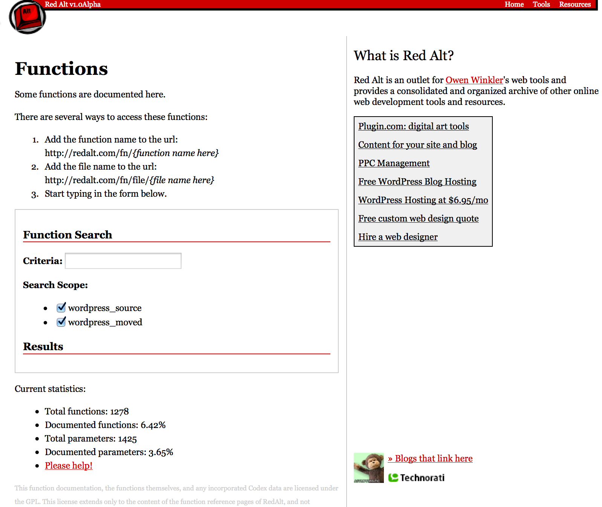
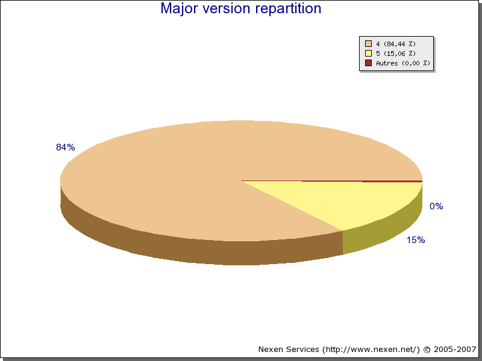
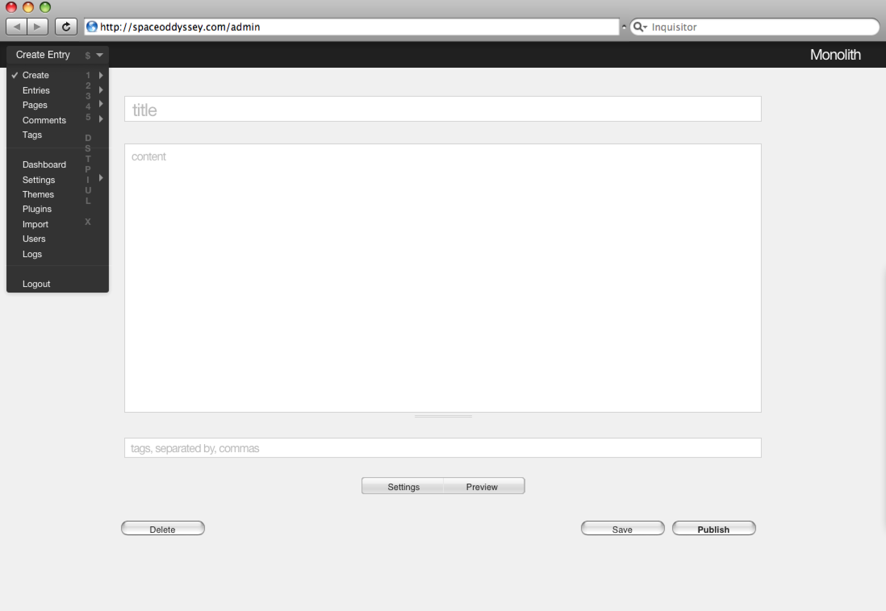

## Chapter 6
## On Habari

**Possbly to move this chapter to another part of the book. It may sit better following the chapter on Automattic, or integrating with chapter on the development process**

It was three years into the project when the WordPress community saw its first major conflict. It's perhaps inevitable in a growing community that people with different views will come into conflict with one another. WordPress grew in popularity the community became more diverse, with members taking different views on how a free software community should be run. It was in this context that WordPress experienced a fork, not of the software, but of the community itself.

In September 2006, at a Buca di Beppo in Columbus, 15 people went to eat lunch during OhioLinux Fest. They sat at a giant lazy susan table that had a plexiglass-encased bust of Pope John Paul at the centre. Four of those who attended were WordPress developers - Owen Winkler ([ringmaster](http://profiles.wordpress.org/ringmaster)), Rich Bowen ([drbacchus](http://profiles.wordpress.org/drbacchus)), Scott Merrill ([Skippy](http://profiles.wordpress.org/skippy)), and Chris Davis ([chrisjdavis](http://profiles.wordpress.org/chrisjdavis). During lunch they each talked about grievances that they had with the project, and the topic of conversation kept swinging back to the possibility of setting up a new open source project. The same story came up again and again. Rich Bowen recalls how "Several of us told stories around lunch of how we had submitted patches and they had been rejected out of hand because they were not according to the vision of some of this elite group. And that a later date a similar change was made, initiated by one of those guys." By the time the meal had ended, the four WordPress developers had decided [http://matsu.wordpress.com/2007/01/08/witnessing-the-birth-of-an-open-source-project-habari/](to stop talking and act), settling on creating a new blogging tool. A few weeks later at ApacheCon, they came up with a name: Habari, which is a Swahili word for "What's up?" or "What's the news?" At the same gathering, they came up with the governance structure and development ethos of the project, and started work on it in earnest.

The development of Habari marked the first major split in the WordPress project, which saw community members who were dissatisfied decide to go and work elsewhere. It brought to light diverging beliefs about development, leadership, commercialisation, and governance, ones that were ultimately incommensurable for the Habari developers, who decided to go and do their own thing.

The significant flash points still resonate in the minds of the founding Habari developers today. They are emblematic of the different approaches to running a free and open source project (FOSS), and also highlight some of the problems that were afoot in the project three years following its launch. Every FOSS project, indeed every group or community, has its problems, especially one that has been established for a few years. Problems that may have been ignored during the initial heat of enthusiasm become entrenched and as enthusiasm fades they come to the surface.

One of the major flash points in 2006, which led to huge dissatisfaction amongst not just the Habari founders but in the community more generally was around inline documentation. There was strong support in the community to improve WordPress' inline documentation. For many developers, digging into the code is the best learning tool that they have. In February 2006, Rich proposed [that he document WordPress' functions](http://lists.automattic.com/pipermail/wp-hackers/2006-February/004921.html) and asked if there was a philosophical objection to having inline documentation. Carthik [responded that](http://lists.automattic.com/pipermail/wp-hackers/2006-February/004926.html) it was frowned upon because it would lead to bloat. He referred to a thread from May 2005, [when Matt said](http://lists.automattic.com/pipermail/wp-hackers/2005-May/001114.html):

> Commenting is tricky. Some "well-commented" code I've seen had a bunch  of lines of repetitive filler that "documented" what you could easily see by just looking at the code itself and doubled the size of the program. APIs should be documented religiously, but I think spending a ton of time on redundant comments for code only a few core hackers will ever look at will bloat the codebase and waste everyone's time. I also  believe that well-written code usually doesn't need comments unless it's doing some sort of voodoo or workaround.

The proposal, however, had wide support across the community, with some developers offering to [take on the labour themselves](http://lists.automattic.com/pipermail/wp-hackers/2006-February/005084.html). Rich's initial proposal started a long discussion about the best way to generate documentation from the code and the best format for inline documentation, but it was [ultimately stalled by Matt](http://lists.automattic.com/pipermail/wp-hackers/2006-February/005088.html) who argued that documentation shouldn't be auto-generated, pointing to the Codex as the best place for documentation.

Over the coming months there [continued to be support for inline documentation in the community](http://lists.automattic.com/pipermail/wp-hackers/2006-March/005481.html). [Tickets were opened but left ignored](http://core.trac.wordpress.org/ticket/2473), and Owen Winkler created his own [developer function reference](http://lists.automattic.com/pipermail/wp-hackers/2006-April/005534.html)

It was within the context of this discussion that a central community member expressed his dissatisfaction with the project. For Scott Merrill, the quashing of the inline documentation efforts was a sign of Matt's autocratic approach to the project. In a long post on the wp-forums mailing list, [he outlined his issues with the project](http://codex.wordpress.org/IRC_Meetups/2006/February/February22RawLog), which he sees as being caused by Matt's unilateral decision-making. 

> Rather than fix the codex (one mechanism of which would be to install a fresh MediaWiki installation into a new directory, and then manually copy-and-paste pages from old to new -- yes, we'd lose history, but we'd keep the damn docs usable), Matt wants to write a new plugin for WordPress to "solve" the problem.  This is perfectly acceptable from Matt's point of view, even though the documentation continues to suffer in the meantime.
> But when others come along and volunteer to "solve" the problem of inline function references, Matt poo-poos the whole effort as a waste of time, saying instead that such documentation belongs on a publicly editable wiki.  Forgive me for not leaping to participate when the current wiki situation is abominable.

The following month, Scott announced on his blog that he would [no longer be participating in the WordPress community](http://skippy.net/wordpress-less). As someone who had been active on the forums, documentation, plugin development, and core, other members of the community were sad to see him go. It wasn't long, however, until other developers followed him, and just a few months later, the Habari founders had that lunch in Bucca de Beppo.

The issues around documentation weren't limited to inline documentation. Mark Riley (Podz) one of WordPress' longstanding forum moderators, [pointed out in 2006](http://lists.automattic.com/pipermail/wp-forums/2006-March/001530.html) that the WordPress Codex was failing users. For example, it was [recommended on the Codex](http://codex.wordpress.org/index.php?title=Hardening_WordPress&oldid=16988) that users hide which version of WordPress they were running, but the code itself contained a comment asking users to leave the information for statistical purposes. Mark also complained that the content in the Codex meant nothing to WordPress users. He cites the section on permissions which said "All files should be owned by your user account, and should be writable by you. Any file that needs write access from WordPress should be group-owned by the user account used by the webserver." WordPress has a low barrier to entry for users, but the documentation that came with it wasn't easy enough for them to understand.

This came up in a [discussion around permissions](http://wordpress.org/support/topic/wordpress-defacement-by-arip_reca?replies=20#post-335543). Computer files have a set of permissions that specify who can read, read, modify, and have access to a folder or file. The specific configuration for permissions differs from host to host. WordPress files hosted on a server need to have specific permissions set to ensure that WordPress works correctly, however the correct configuration differs from server to server. That makes it difficult for WordPress to provide hard and fast rules about file permissions on a web server. With no standard recommendation, it wasn't uncommon for a user facing problems to find out that setting the permissions to 777 would fix everything for them. This might fix the problem, but it makes all of their files and folders writable to everyone in the world. And what results, particularly in shared hosting environments, is that the site gets compromised.

Discussions like these brought up a tension that was perhaps inevitable given WordPress' low barrier to entry especially for setup and install. While anyone could set it up, not everyone who did so knew about server configurations, so while they could use WordPress, they couldn't necessarily use it safely. 

This relationship between the developers and the support team, is clear when looking through the wp-hackers mailing list. Again and again, Mark Riley posts questions that come up on the support forums to try and get help from developers. There is a sense of frustration as he tries to get the answers from the developers that the users need.

A clear fault line was around release dates. Almost every release cycle, Mark made a request asking to be informed in advance the release date so that he could ensure that the support forums were properly manned when the new version came out. Again and again, a release would arrive with him unaware of it. "All I am trying - and yet again complete failing - to ask,"  [he asked on the mailing list](http://lists.automattic.com/pipermail/wp-hackers/2006-March/005310.html) "is that IF you want support for the product it would nice to at least let the forums know. You guys just don't see it do you? You really don't have a clue."

These tensions between the core development team and the volunteers who worked on areas such as support and documentation, were a feature of WordPress for some time, to the point that even the core developers noticed. Owen Winkler recalls:

> Within WordPress, more weight was given, like significantly more, to where no one else was getting any credit, for contributions that were not code. So you contribute code? Oh you’re a king! That’s great! But you’re doing support, like user support on the forums? Whatever.

This lack of obvious support for non-code contributions coupled with the dissatisfaction of some community members, was perhaps a symptom of the differing philosophies around leadership. Certainly the founding members of the Habari project had a fundamentally different philosophy on the way that a project was run. Their founding ethos came from Rich Bowen, who had, prior to WordPress, already been involved in the Apache Foundation. Unlike many free and open source projects, the Apache Foundation has dispensed with the Benevolent Dictator for Life (BDFL) model and instead has a committee that is responsible for decisions. When it comes to running an open source project, Apache, Rich says, is a meritocracy, and [WordPress is not](http://drbacchus.com/meritocracy):

> Matt claims that WordPress is a meritocracy. I disagree. WordPress has one attribute that eliminates it from that category - Matt is in charge. Please don't take this as an attack on Matt. It's not. It's a question of definitions. The fact that there is one person who has the final say makes WordPress not a meritocracy. Even if Matt always bends to the will of the people, he still has the final say. 

Matt and Rich's disagreement came down to a fundamental disagreement on how an open source project should be run. In _Homesteading the Noosphere_ Eric Raymond discusses [project structures and ownership](http://catb.org/esr/writings/homesteading/homesteading/ar01s16.html), looking at how a project structure emerges over time. The emergence of WordPress' project structure very much follows what Raymond outlines - the project has a single owner/maintainer, or in the case of WordPress it had two - Mike Little and Matt Mullenweg. Over time, Matt assumed leadership of the project. As more and more contributors were attracted to the project those that were active would be given commit access. In WordPress' case, commit access carried with it an implicit level of authority. Those with commit access are the arbiters of the code that ends up in core and the code that doesn't. Matt [made clear on a number of occasions](http://codex.wordpress.org/IRC_Meetups/2005/June/June29RawLog) that he didn't "want it to be a status thing," but this didn't prevent it from becoming so.

For some time, only Matt and Ryan Boren had commit access to WordPress, themselves constituting a funnel and checking mechanism through which all the code would run. More committers were eventually added, but it was a slow process and one that led to frustration, particularly amongst prolific contributors such as Owen Winkler and Scott Merrill. 

Coming from Apache, Bowen brought a different perspective to the project, one that chimed with the more dissatisfied developers. The Apache Project has discarded the BDFL model of open source governance and instead has a voting committee which is responsible for governance. [A discussion between Rich and Matt in a comment thread](https://neosmart.net/blog/2007/a-clarification-on-wordpress/comment-page-1/#comment-10985) makes clear their disagreement around leadership. Matt maintains that WordPress is a meritocracy because commit access is provided to "the best of the best of the best contributors who prove their worth over time with high quality code, responsiveness to the community, and reliability in crunch times." Bowen, on the other hand, challenges him by saying:

> A meritocracy is a system by which ability determines power. WordPress is a system by which the leader of the community is by definition [sic]. You, Matt, are the leader of the WordPress community. You have the power to overrule decisions, and you use that power. There are meritocratic aspects to how WordPress operates, but the fact that you exercise your right of fiat makes it not a meritocracy.

This mode of governance led to a disagreement how a FOSS project should be structured. In the WordPress project, authority followed commit access to the repository, and commit access followed high quality code submissions along with an understanding and commitment to the project ethos. Because authority naturally followed code, it meant that there was no defined leadership roles within the project for non-coders. At times, Matt did try to [emphasise that](http://lists.automattic.com/pipermail/wp-hackers/2005-June/001417.html) "Committing != community status. It simply is a way to ensure that all the code that goes into the core is reviewed before being distributed to the world," but this didn't prevent the feeling of disenfranchisement from people who had felt they had no clear way to be on par with the core committers. Commit access may have been given out sparingly to developers but authority and leadership was still in theory achievable to anyone who could write code. For those whose role was helping on the support forums, writing documentation, providing translations, or any of the myriad supporting activities that go on around software development, there was no formal way for those who worked hard and demonstrated a commitment to the project to be acknowledged.

In the Habari project, commit access isn't just given to people who review and commit the code, but is a symbol of trust and status within the community. In a recent interview, Owen Winkler said:

> there’s some people who are committers, who are part of the primary management committee in Habari who I would never want to actually touch the code because they don’t really do development. But we give them access to it because they’ve demonstrated that they’re part of the community and they’re actively trying to advance Habari as a project.

In a project in which commit access = responsibility and authority, it makes sense to give access to anyone who holds such a position within the project. However, if you're trying to create a project in which the two do not go hand-in-hand, keeping commit access as purely a checking mechanism makes sense. That said, it's not always clear to people within the project what constitutes authority and what doesn't, and having a commit access is inevitably a clear symbol of trust.

Another fundamental disagreement between the Habari developers and Matt and Ryan was around coding best practices. From its inception, [questions were asked about whether WordPress would be rewritten](http://wordpress.org/support/topic/how-much-will-you-rewrite#post-16). WordPress' focus has always been on users, and maintaining a good experience for them. Habari, on the other hand, was intended to be useful to users, but at its heart was an educational tool for developers. One of the driving ideas behind Habari was to create a tool that taught people about development, development best practices, and being part of an open source project. Rich Bowen, who did't know a lot of PHP, said that he hoped that the new project would teach him about it. This meant not just teaching developers about PHP, but educating them about best practices around coding methods and being part of an open source community. They eschewed WordPress' low barrier to entry in favour of an approach that would cultivate fewer developers but better developers. 

In a post [announcing the Habari Project](http://skippy.net/spread-the-news), Scott Merrill writes about how one of the founding principals behind Habari was to make it fully object-oriented. 

> This has resulted in some wonderfully efficient code, and so far the system is remarkably fast. Object oriented programming allows us to streamline the development of user-created plugins; allows us to integrate a unified error handling system; and vastly simplifies the construction of our Application Programming Interface.

Habari was written in PHP 5.1, allowing the developers to use [PHP Data Objects](http://php.net/manual/en/intro.pdo.php). This gave them a level of database independence which WordPress lacked. 

WordPress was completely focused on users, and ensuring that nothing broke for users. Habari was concerned with creating an educational tool for developers. On the one hand, the Habari developers found fault with WordPress for not using the latest coding practices, on the other, the WordPress developers felt that Habari's approach messed with users. As [Ryan Boren memorably put it](http://lists.automattic.com/pipermail/wp-hackers/2007-February/010881.html):

> Screwing users because developers want to play is not cool. It’s a good way to become irrelevant. A big reason WP is so popular is because it is not infatuated with the latest, greatest developer lust objects that require users to upgrade their platform.

In February 2007, when Ryan wrote the above comment, PHP 4 was still running on 88.44% of websites. PHP 5 adoption was slow and many web hosts didn't support it. If WordPress had made the switch to PHP 5 it would have meant that it was suddenly become unavailable on a huge number of hosts. 

The other sign of this difference of emphasis is in the choice of license. WordPress has a GPL license, which is intended to secure the freedoms of users. Habari, on the other hand, uses the [Apache License](http://www.apache.org/licenses/LICENSE-2.0). This permissive license allows developers to take the code and make use of it in any way, even if they use it in a proprietary product. In the Apache License, the emphasis is very much on developer freedom. Owen Winkler outlined the reasons why the Habari project chose not to use a GPL license:

> There's the idea of developer freedom. If you give the software away you should be able to give it away with no requirements at all. If you want to take it and make software that you sell, then go ahead and do that. Hopefully you won’t. Hopefully you’ll contribute. Or if do, you’ll contribute what you make back to the community somehow.

All of these problems might have been solvable. After all, the developers who went on to set up Habari all enjoyed working on WordPress, had created friendships and relationships within the community, and all felt invested in the project. For some developers, however, the founding of Automattic and the setting up of WordPress.com was one step too far. Owen Winkler recalls how, while he might have liked more modern coding techniques, that didn't drive him from the project:

> You recruit all these developers to do work on this thing and then you take that work and make a product out of it that those developers don’t have any involvement in, monetarily. And it’s not… it sounds a little greedy for the developers, but really, there’s a lot of people who contributed to WordPress that all they got was credit. The argument is that anyone could have taken WordPress and done what Automattic did with WordPress, but no one could have done what Automattic did with WordPress because Automattic and Matt and whoever owned the trademark to the name. So you create a new project that uses WordPress, you have to call it something else, and it’s not WordPress.

Some developers were asked to go to work at Automattic, the first being Donncha O'Caoimh and Ryan Boren, and Mark Riley was the first non-developer to join the team. However, many were not. This led to problems. First, there was a perception that development talent was being taken from the community and diverted into Matt's commercial venture, with particular issue being taken with the fact of WordPress.com appropriating the name "WordPress." Secondly, it created a division in the community of those who were asked to go and work at Automattic and those who weren't. The [Habari developers maintain](http://asymptomatic.net/2007/01/09/29/whats-up) that Habari wasn't simply a product of their being annoyed because they hadn't been offered jobs at Automattic. In fact, while originally some of the developers left in frustration, by the time the Habari project launched they appeared to be happier doing their own thing than they had been at WordPress.

The [Habari Motivations](https://web.archive.org/web/20070111191036/http://code.google.com/p/habari/wiki/Motivations) page lists the reasons for being involved with Habari. Each of the motivations is something that the founding developers saw as wrong within the WordPress project, that they wanted to change in their own project. 

The [first Habari user was Chris Davis](http://chrisjdavis.org/changes-around-sillyness), who switched his blog as soon as their was a version that he could work with. More influential people in the WordPress community followed suit. One of these was Michael Heilemann, the designer of the Kubrick Theme. For him, [WordPress was moving in a more commercial direction] (http://web.archive.org/web/20070117005952/http://binarybonsai.com/archives/2007/01/07/time-to-habari/), "There’s no shame in that, things change after all; but sitting here on my high horse of idealism and sparetime open source projectness (_so_ a sentence!), I cannot help but crave for the days of old."

Michael undertook a redesign of the Habari interface, which he says now was both a good and a bad experience. He had a good experience designing it, a bad experience getting it approved, and a good experience implementing it. The experience that he had getting it approved came down to the fact of Habari's meritocratic structure. A lot of time was spent discussing approving the new admin interface. People would weigh in with opinions who weren't designers but whose voice was given equal credence. For Michael, this left him feeling that he couldn't get his work done and he ended up bowing out of the community. When asked about whether he is more comfortable with a BDFL or Apache-style model, he says now: 

> It’s easy to end up in very long discussions if everybody has equal footing. And that makes for a great democracy, but it’s also very hippie, 60s, everybody gets to sit around and share their opinion, but that’s not always something that’s really worthwhile. You don’t actually, necessarily, get a better product out of it. And so often you need somebody with vision, or at least somebody with a point of view with opinion to weigh in.

Not all developers who felt dissatisfaction with the project decided to leave. Some felt that it would be better to put the effort in to try to change things. Mark Jaquith ([markjaquith](http://profiles.wordpress.org/markjaquith)), particularly, was pushing Matt to delegate more. It was slow, but things did change incrementally over time. For example, in June 2005, the [bug gardening scheme was started](http://codex.wordpress.org/IRC_Meetups/2005/June/June29RawLog). Mark, Scott, and another user were given maximum privileges in trac and were assigned the task of bug gardening. Change was slow and the developers became more and more disenfranchised, but change was happening. Mark Jaquith recalls "I felt like […] Matt was right on the verge of loosening the reins, it felt like things were really starting to get good and they left. And I was like oh, if you’d just held on." 

Change was reflected in Matt's actions. Just prior to the announcement of Habari in January 2007, Matt posted to the mailing list to [apologise for his stance on the issue of inline documentation](http://lists.automattic.com/pipermail/wp-hackers/2006-December/009812.html). "Sorry there was such a fuss over that before," he wrote, "that was pretty silly, I think I understand the issues better now." This was followed up with [inline documentation patches](http://core.trac.wordpress.org/ticket/2474#comment:7) being [committed to core](http://core.trac.wordpress.org/ticket/2473#comment:3).

However, despite the changes that were slowly taking place, there were still crucial issues that would always be incommensurable. For developers who were wedded to the Apache mode of FOSS governance, being part of a BDFL-style project would never sit comfortably. There was the ongoing issue of how to acknowledge non-code contributions, which continues to be discussed in the WordPress project to this day. And for some it was simply that they weren't happy with the founding of Automattic and WordPress.com and the impact that had on the project. So they went to do their own thing, went to scratch their own itch. And the [Habari project](http://habariproject.org/en/), eight years later, is still available for download and open to contributors today.

*Image CC license [Sean T Evans](http://www.flickr.com/photos/morydd/1463477046/)*

