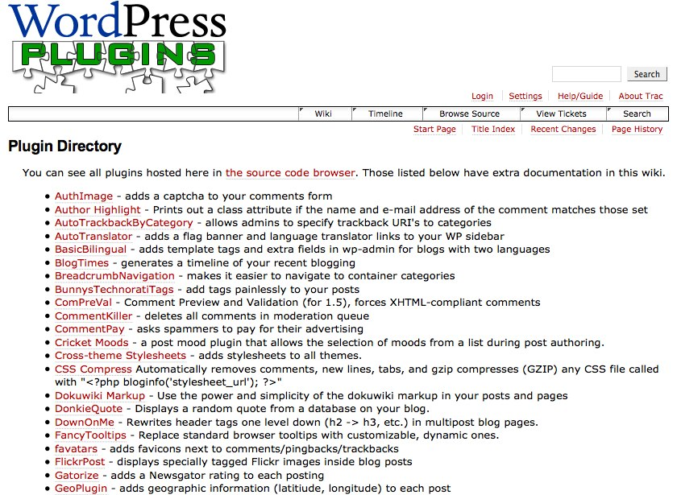

## 11. The birth of wp-hackers

WordPress 1.2 development discussions happened in the support forums, the IRC chat rooms, and via private chat and email. But the community was growing. The switchers from Movable Type had increased WordPress’ user base, proper internationalization made WordPress more usable worldwide, and the plugin system allowed developers to extend the platform. The growing community needed more diverse communication channels with which to manage development, communicate, and support users. 

Many community members were happy with just the forums and IRC, but some developers wanted a mailing list. This was the case particularly for developers with free software project experience. A mailing list is one of the most important communication tools in a free software project and at the time, WordPress had no development mailing lists. It took more than a year after the project’s inception for WordPress’ developer infrastructure to take shape. The [FAQ on WordPress.org reflects the approach to development at the time](https://web.archive.org/web/20040402000122/http://wordpress.org/docs/faq/):	

> _I am a programmer/designer/hacker — can I help with the development of WP?_	
> Sure you can! Post your suggestions and requests for features in the forums. Design or alter some hacks to add functionality to the WP suite of tools. Got some cool ideas on an innovative design? By all means, build it and show it off! If you want to be directly involved in the daily development of WP, the best way is to show your competence by building clean hacks or patches that conform to the developer guidelines. Once you have some code out there, contact Matt and he’ll talk to you about getting you involved more directly with development.	

That was the process: post on the forums, blog about it, and email the lead developers. There wasn’t a clear, single entry point for developers to go. The forum [didn’t provide the proper infrastructure that developers were used to on free software projects](http://wordpress.org/support/topic/development-culture-at-wp?replies=21). Ryan Boren had Linux development experience. [He posted to a discussion thread on the forum in 2003](http://wordpress.org/support/topic/development-culture-at-wp?replies=21#post-7523): 

> Communities are built around development mailing lists. That's where the bazaar really takes place. A BB [bulletin board] isn't nearly as good for sending and reviewing patches, performing UI reviews, and so forth. The BB is a nice resource that has its purpose, but a mailing list is better suited to development traffic. I would much rather use my favorite email client with its editing, sorting, and filtering capabilities than any web BB. Plus, the mail comes to me, not me to it.	
> Right now, I send all of my patches directly to Matt. I hope he gets them. If there was a development mailer, I would send the patches there so all interested parties could give them a look and see what people are working on.	
There was, in fact, a mailing list, but it was a private one with just Matt, Mike, and the other early developers. It wasn’t publicly archived and it wasn’t possible for anyone to get involved with the discussion. There were no plans to create a public mailing list as, at the time, they preferred development discussion to take place on the WordPress forums. 

That discussion thread contains the seed of contention in the WordPress community -- the division between people who didn’t write code and people who did. A developer mailing list could segregate the community into different groups -- on the one hand developers, and on the other, everyone else. “It's exactly the mentality that causes most OS projects to become these developer-heavy, 'in-the-know' kind of places that make them unpleasant (and unapproachable) for the average user,” [wrote Cena](http://wordpress.org/support/topic/development-culture-at-wp?replies=21#post-7536). 

But with a growing developer base a mailing list was inevitable. Developer mailing lists are one of the primary communication tools for most free software projects. They're a part of the bazaar-style development of a free software project, a place for the hubbub of development discussion. A mailing list allows developers to communicate with one another from their email inbox. Everyone can participate in the conversations that take place. They enable developers to ask questions about development, review patches, and discuss new features. A developer can send a patch to the mailing list and anyone can review it. It also helps to prevent bottlenecks when a patch is sent privately to a developer and sits in their inbox waiting for review. Often, advanced users participate -- those who either have questions about the product or who want to answer others' questions. Mailing lists serve a different purpose than an IRC chat room. To participate in a chat room, a person needs to be online at the time a discussion takes place. They can follow up by reading logs (if the chat room is logged), but that’s after-the-fact. 

The first mailing list in the project, however, wasn’t wp-hackers, but wp-docs which was [set up in November 2003](https://web.archive.org/web/20090107221645/http://comox.textdrive.com/pipermail/docs/2003-November/000000.html) to discuss WordPress’ documentation and wiki. It was active for six months before the [hackers mailing list](http://lists.wordpress.org/pipermail/hackers/) was set up in June 2004. This later moved to [wp-hackers](http://lists.wordpress.org/pipermail/wp-hackers/). Development discussion shifted from the support forums to the mailing list, leaving the forums as a place to provide support. 

The wp-hackers mailing list exploded with activity, busy with heated discussions about issues such as [whether comment links should be nofollow](http://plugins.lists.wordpress.org/pipermail/hackers/2005-January/003617.html) to discourage spammers, [the best way to format the date](http://lists.wordpress.org/pipermail/hackers/2004-August/001335.html), and [how to start translating WordPress](http://lists.wordpress.org/pipermail/hackers/2004-December/003462.html). Developers finally had a place to congregate. They embraced the new communication platform -- their new home in the project.

As predicted in the 2003 support forum discussion, the mailing list further cemented the division between those who provided support (whether by answering support tickets or writing documentation) and those who wrote code. Coders are usually more focused on solving code problems than helping with user support. But those providing support sometimes needed the input of those who write the code. It [frustrated many support forum volunteers](http://lists.wordpress.org/pipermail/hackers/2004-July/000962.html) that the project’s developers weren’t usually available to help out. 

Still, wp-hackers became an important place for WordPress development, particularly during the project’s early growth. As is the general trend with mailing lists, it became less useful over time, but for the first few years after it launched there was ongoing discussion about WordPress development. Many important features were discussed   and debated. It was the place where many of today’s developers had their first taste of WordPress.

The WordPress Repository was the other development resource that appeared around this time. The [WordPress Plugin Repository](http://wordpress.org/news/2005/01/the-wordpress-plugin-repository/)launched in January 2005. Hosted at dev.wp-plugins.org, and powering subversion and trac, it’s quite different to the user-friendly plugin directory that we’re used to today. The plugin repository literally was just a code repository. 

In order to make it a little more accessible, a wiki was used to create a very early version of the Plugin Directory.	

While being full of developer tools, it didn’t have an easy interface to allow users to find the right plugins. Trac and wikis can often be difficult for non-technical software users to navigate. Users just want to get what they want, easily, and interfaces that look code-heavy can be confusing and off-putting. For developers, however, the repository nurtured the free software community’s inclination toward code sharing, and was the first step toward the plugin directory on WordPress.org.
