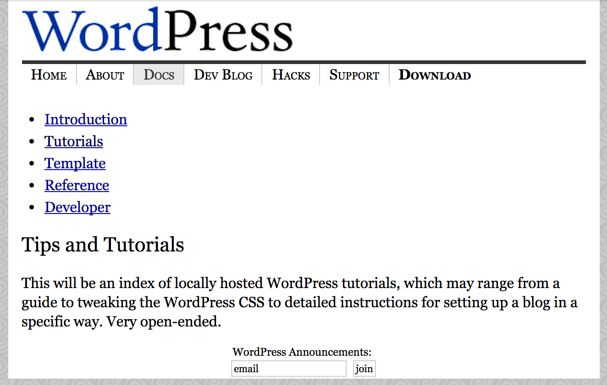

## 8. Support and Documentation

Many early WordPress developers got their start answering support forum questions. Support was also an entry point for people who worked on other aspects of the project. A user installs the platform, encounters a problem, and visits the support forum to ask a question. That user sticks around, surfs the forums, or hangs out in the chat rooms. Then, someone asks a question that they know the answer to and that's it, they're hooked. Mark Riley (<a href="http://profiles.wordpress.org/podz">Podz</a>) was one of the first WordPress.org forum moderators. “You’re a hero to somebody every day, aren’t you?” <a href="http://archive.wordpress.org/interviews/2013_07_04_Riley.html#L37">he says</a>. “There’s nothing like somebody saying thank you. 'Yay, you fixed it! It works!' You’re thinking, 'Cool. I’ll remember that. That was cool. I like doing this.'”

A contributor community grew in parallel to the development community. Developers wrote code, other contributors helped with support and documentation. People tried WordPress, liked it, and wanted to help out. Craig Hartel (<a href="http://profiles.wordpress.org/nuclearmoose/">nuclearmoose</a>) was an early contributor. He signed up at WordPress.org in November 2003. Like many contributors, he was interested in blogging and had programming experience. "I didn't have any specific skills," <a href="http://archive.wordpress.org/interviews/2013_04_21_Hartel.html#L7">he says</a>, "but there was no better way than jumping right in. I decided I was going to find some way to get involved." He asked questions, dropped hints that he wanted to help, and after hanging out on the IRC channel, "<a href="http://archive.wordpress.org/interviews/2013_04_21_Hartel.html#L9">realized</a> that getting involved was a matter of just doing something."

The project's user-centric focus meant there were ways for people from a variety of backgrounds to help. Anyone could answer support forum questions, write documentation, or get involved with IRC discussions. Some contributors found that while developers aren’t always good at explaining things to non-technical users, they could translate "developer speak" into "user speak." These community members acted as advocates for users; Mark Riley, for example, became a go-between for the support forums and the wp-hackers mailing lists. As the developers became more absorbed in developing the software and started using it less, this sort of user advocacy became increasingly important.

Not long after WordPress launched, blogs starting cropping up dedicated to the platform. The first, <a href="http://weblogtoolscollection.com/">Weblog Tools Collection</a> (WLTC), was a blog that Mark Ghosh (<a href="https://profiles.wordpress.org/laughinglizard">laughinglizard</a>) initially launched to cover every type of weblog tool. It was the first of many WordPress community blogs, followed by <a href="http://wordlog.com">Wordlog</a> by Carthik Sharma (<a href="http://profiles.wordpress.org/carthik">Carthik</a>),  and <a href="http://lorelle.wordpress.com">Lorelle on WordPress</a> by Lorelle VanFossen (<a href="https://profiles.wordpress.org/lorelle">lorelle</a>). 	

These were places outside official channels where people congregated -- where enthusiasts could write about the growing platform, providing information, tutorials, and commentary. Some focused on tutorials, sharing guides on how to do things with WordPress, others created lists of plugins and themes that drew large amounts of traffic. Mark Riley’s tamba2 blog, for example, was home to a number of popular tutorials, and Lorelle VanFossen, who wrote many popular tutorials, ported her writing over to WordPress’ official documentation. The authors soon discovered that people were interested in what they had to say. “I suddenly got all of this attention for not knowing a lot and not really doing a lot," <a href="http://archive.wordpress.org/interviews/2013_04_28_Ghosh.html#L26">says Mark Ghosh</a>, "and that really pleased me." The community respect he got for running WLTC spurred him to help out more with the forums, write his own plugins, and get more involved. Posts on WLTC about platforms like Movable Type quickly tailed off and almost all of the posts are on WordPress, or on migrating from other platforms to WordPress.

At its peak, WLTC received 12,000 to 15,000 unique hits per day, but Mark was never fully able to take advantage of the traffic. Running a niche community blog takes a lot of work and <a href="http://archive.wordpress.org/interviews/2013_04_28_Ghosh.html#L61">doesn't result in a huge monetary payoff</a>. "Most of the people who came to WLTC wanted news about plugins, or they wanted to know how to do X, Y, or Z. They were trying to find this information and the quality of audience was kind of low." These site visitors weren't necessarily valuable to advertisers. However, WLTC played a major role in the WordPress community's development, providing a home for discussion and debate away from WordPress.org. 	

With the project attracting so many writers and bloggers it's no surprise that six months after the project launch there were calls for documentation. Users needed it and there were people willing to write it. The people answering questions on the forums saw this need -- users asked the same questions over and over again. With good documentation they could help themselves. In November 2003, WordPress’ first mailing list was set up -- to discuss WordPress documentation.  

The first schematic documentation was on the WordPress.org website, but this was merely an outline that lacked content. By and large they were holding pages for content that was promised in the future:

*The WordPress.org [docs page in late 2003](https://web.archive.org/web/20031203161840/http://wordpress.org/docs/)*

In <a href="http://wordpress.org/news/2003/12/wordpress-wiki/">December 2003, the WordPress wiki launched</a>. Now, any contributor could help with documentation. Free software projects often use wikis for their docs. The advantage is that anyone can easily edit the content. Some wikis require a login, while others can be edited by anyone. The downside to using a wiki is that contributors have to learn a new tool with a new syntax for creating content. This is particularly onerous when the free software project is a CMS. A further problem is that, without careful curation, it can become messy, out-of-date, and difficult to navigate. 

Originally, the wiki was designed to complement the <a href="http://web.archive.org/web/20030811221523/http://wordpress.org/docs/">official documentation</a>. The <a href="http://web.archive.org/web/20031224140754/http://wiki.wordpress.org/">landing page informed visitors</a> that it was "designed for us to be able to work together on projects." While developers worked toward shipping WordPress 1.0 in January 2004, other community members worked furiously on the wiki. 

This was in contrast to the aborted work on the official documentation. An <a href="https://web.archive.org/web/20040402000122/http://wordpress.org/docs/faq/">FAQ</a> and <a href="https://web.archive.org/web/20040411104706/http://wordpress.org/docs/template/">template documentation</a> were created. But the <a href="https://web.archive.org/web/20040323105321/http://wiki.wordpress.org/">majority of documentation was written on the wiki</a>.
 
While the official docs felt formal and rigid -- a place for only official documentation writers -- the wiki was informal and free-form, an experimental place where anyone could help out. By July 2004, the wiki was the main documentation for WordPress. It needed a name. In WordPress' IRC chat room, (<a href="http://wordpress.org/support/profile/monkinetic">monkinetic</a>) suggested "Codex.” The community loved the suggestion. Matt said it was "short, sweet, and we can totally own that word on Google."

Writing documentation for WordPress wasn’t always easy, particularly in those first few years. In a post on WordPress.org, Cena Mayo (<a href="http://profiles.wordpress.org/cena/">cena</a>), who had taken on the <a href="http://wordpress.org/news/2004/03/a-brief-introduction/">role of reporting on the WordPress.org blog</a>, outlined <a href="http://wordpress.org/news/2004/04/state-of-the-docs-address/">some of the issues</a>:

<blockquote>Part of the problem is the rapidly changing face of WordPress itself. The CVS is currently at version 1.2-alpha, with almost daily updates. 1.2, which will be the next official release, is much different from the widely used 1.0.1/1.02 series, and even more different from the still-used .72.</blockquote>

With changing file structures, new features appearing, new template tags, and new database tables, writing formal documentation must have felt, with this rate of change, like a pointless task. By April 2004, the software changed so fast that much of the documentation on hacks (the standard way of extending WordPress) was out of date. With WordPress 1.2 shipping in May, a huge amount of documentation needed to be written. But just before release, something happened that distracted contributors from writing documentation and writing code, and that brought together everyone in the community.
 
