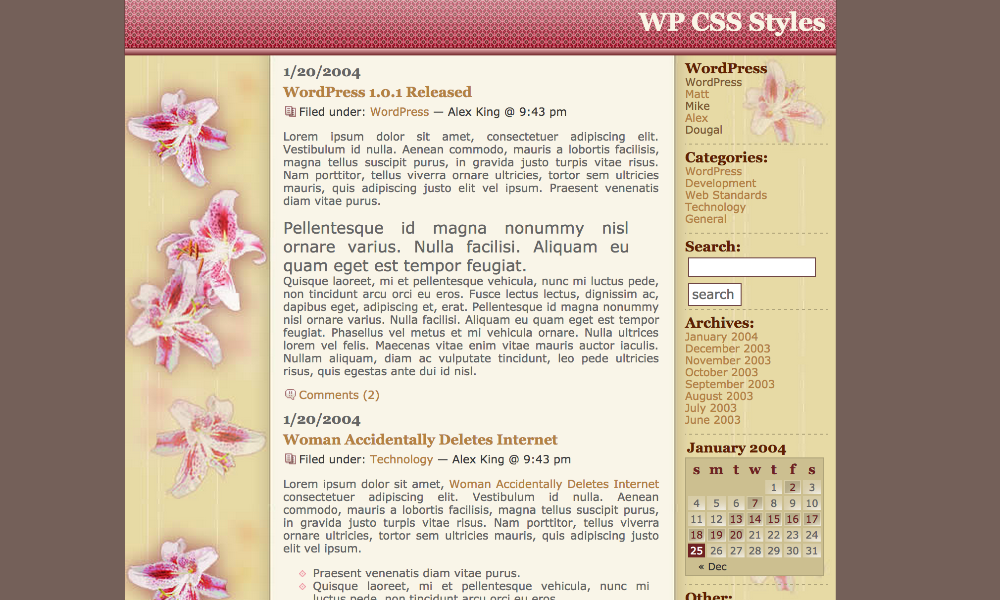
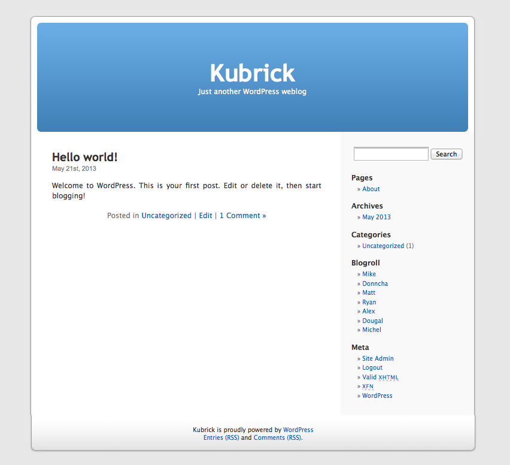

## 12. Themes

Templating was the next area ripe for improvement -- users could extend their blog and have it in their own language, but there wasn't yet an easy way to change their site’s design. Even in the b2 forums, many support questions were about changing a website’s design. A blog is a visual representation of the author, their tastes, and their interests -- a blog is a home on the internet, and, just as with any home, owners decorate it according to their tastes. To change the look of a b2 or early WordPress blog, the user had to create a CSS stylesheet. This changed the colors and layout on the front end. However, it didn’t offer any real flexibility in site design; a robust templating system was needed. Michel had looked into creating a templating system for b2, but it was not until the transition between WordPress 1.2 and 1.5 that WordPress got its theme system. 

A lot of research went into finding the best approach to templating. Smarty templates came up again and again. Smarty is a PHP templating system that allows the user to change the front end independently from the back end. The user can change their site's design without having to worry about the rest of the application. There <a href="http://wordpress.org/news/2003/04/smarty-and-smarttemplate/">are a number of posts</a> on the WordPress.org development blog discussing Smarty's merits. <a href="http://core.trac.wordpress.org/changeset/530">Donncha even imported it to the repository</a> (his first commit to the project). But, despite sharing PHP with WordPress, Smarty had a difficult syntax to learn. In the end, <a href="http://wordpress.org/support/topic/smarty-the-templating-system-that-came-from-hell?replies=6#post-22474">it was rejected for being too complicated</a>. What WordPress needed was a system as easy to use as the software itself. 

While templating system discussions continued, WordPress users got creative with CSS stylesheets. To make switching designs easy, Alex King wrote a <a href="http://alexking.org/blog/2004/01/20/wordpress-css-style-switcher">CSS Style Switcher</a> hack, which came with three CSS stylesheets. Not everyone who had a WordPress blog wanted to create their own stylesheet, and many didn’t know how. Users needed a pool of stylesheets to choose from. To grow the number of stylesheets available, Alex ran a WordPress <a href="http://alexking.org/blog/2004/01/25/wordpress-css-style-competition">CSS Style competition</a>. Prizes, donated by members of the community, were offered for the top three stylesheets; $70, $35, and $10, respectively. 

Creating a resource similar to the popular <a href="http://csszengarden.com">CSS Zen Garden</a> was the secondary aim of the stylesheet competition. Just as the CSS Zen Garden showed off CSS' flexibility, a CSS stylesheet repository would show off WordPress' flexibility.

The competition created buzz in the community. In total, there were 38 submissions. Naoko Takano won the first competition with her entry, Pink Lillies:

*The Pink Lillies design, by Naoko Takano*

The competition successfully widened the pool of available stylesheets, increasing the number from seven to 45. On his website, Alex launched a <a href="http://alexking.org/projects/wordpress/styles/sample.php?wpstyle=pink_lilies">style browser to allow visitors to view the different stylesheets</a>. The competition <a href="http://alexking.org/blog/2005/02/27/wordpress-theme-competition">ran again in 2005</a>, this time receiving more than a hundred submissions. 

By the second competition, the theme system was in place and designers had more tools to design and build their theme. Alex’s experience in the second competition, however, foreshadowed problems that would dog the community in later years. In hosting 138 themes on his site, <a href="http://alexking.org/blog/2005/03/28/theme-competition">Alex had to review all of the code</a> to make sure there was nothing malicious, and to ensure that each theme used coding best practices. He decided not to host the competition again in 2006 due to the sheer amount of work it required. WordPress’ growth meant there would be even more submissions, far too many for one person to review. This problem persisted as the project grew: how does one balance a low barrier to entry with achieving good code quality, particularly in third-party plugins and themes?

Still, the 2005 competition showed off the flexibility of the brand new theme system, which appeared in February 2005, in WordPress 1.5. [fn^1] In the end, the theme system was built using PHP, which is a templating language itself, after all. Using a PHP template tag system was fast and easy, particularly for WordPress developers and designers who were learning PHP. It was "cheap and easy, and well-known and portable," <a href="http://archive.wordpress.org/interviews/2013_05_15_Boren1.html#L101">says Ryan</a>. The theme system breaks a theme down into its component parts -- header, footer, and sidebar, for example. Each part is an individual file that a designer can customize. Designers use template tags to call different elements to display on the front end. This bundle of files is a WordPress theme. A native WordPress theme system, as opposed to a templating system such as Smarty, meant that designers could design and build themes without learning an entirely new syntax.

Bundled with WordPress 1.5 was a new default theme -- an adapted version of Michael Heilemann’s Kubrick. While some welcomed the new theme, <a href="https://web.archive.org/web/20041016090654/http://binarybonsai.com/archives/2004/08/22/kubrick-vs-wordpress/">others were unhappy that it was chosen</a>:

*The Kubrick Theme, which was WordPress' default theme until 2010*

One of the problems with Kubrick was that it contained images; if a user wanted to change their theme they had to use an external image editor. Some felt that users should not be expected to download additional software just to change their site’s design. Others thought Kubrick too complex; it had .htaccess issues, and that other (better) default theme choices existed. The <a href="https://wordpress.org/support/topic/why-using-kubrick-on-13-is-a-mistake">thread on the forums</a> reached five pages with substantial flaming. 

These types of fires ignite quickly in bazaar-style development. They can get out of hand as people take their opinions to blogs and social media. As with many debates in free software communities, the Kubrick debate burned ferociously for a short time before fizzling out. But the brief outbreak portended later debates about WordPress themes. There’s something about themes that ignites passions more than other aspects of WordPress. 

Still, by the release of WordPress 1.5, the software had two elements that define the project and the community: themes and plugins. These two improvements transformed WordPress from stand-alone software into an extensible platform. Extensibility creates the right conditions for an ecosystem to flourish. If a product is solid and attracts users, then developers will follow, extending the software and building tools for it. The theme and plugin systems made this possible, in both features and design. 

[fn^1] WordPress versions were skipped between 1.2 and 1.5. This was due to the length of time between the two releases.
