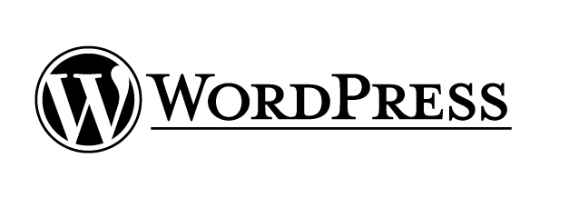

## 14

While development was taking shape, so WordPress’ design and branding started to take shape. Some of the first lengthy discussions about the look and feel of WordPress happened on the [wp-design mailing list](http://lists.automattic.com/pipermail/wp-design/). This was a private mailing list of designers and a few developers who were interested in crafting WordPress’ aesthetic. The group comprised Michael Heilemann ([michael](http://profiles.wordpress.org/michael)), Khaled Abou Alfa ([khaled](http://profiles.wordpress.org/khaled)), Joen Asmussen ([joen](http://profiles.wordpress.org/joen)), Chris Davis ([chrisjdavis](http://profiles.wordpress.org/chrisjdavis)), Joshua Sigar ([alphaoide](http://profiles.wordpress.org/alphaoide)), and Matt.

The first discussions that they had were about WordPress’ logo. The original logo was simply the word "WordPress" in the Dante font: 

 

The benefit, however, of being a small project was that community members could have some fun on the homepage. Often they would riff on the logo creating versions for seasonal holidays, birthdays, and other events.

 

 

 

 

By 2005 the project was in need of a new logo. With usage of the software growing, it needed a logo that encapsulated the software and that helped it to be taken more seriously. As a FOSS project, the first place to look for a logo was in the community. They were asked to make suggestions about the logo. A mixed set of results came back, which were shared with the wp-design group for feedback.

The [first suggestions](http://lists.automattic.com/pipermail/wp-design/2005-March/000163.html) were from Andreas Kwiatkowski

 

A [second batch were sent](http://lists.automattic.com/pipermail/wp-design/2005-March/000171.html) by Denis Radenkovic:

 

The feedback for the logos was mostly lukewarm, though [some of the](http://lists.automattic.com/pipermail/wp-design/2005-April/000175.html) [designers](http://lists.automattic.com/pipermail/wp-design/2005-March/000173.html) liked Radenkovic's heart logos, describing them as "instantly recognisable" . 

The heart logo was iterated on, with another version posted to the design mailing list: 

 

And a version of the admin screen with it in situ was produced.

 

Outside of the WordPress community other people were trying their hands at the logo. In March, Matt met [Jason Santa Maria](http://jasonsantamaria.com/) at South by South West and asked him to try redesigning the WordPress logo. They shared abstract ideas about what they thought the logo should be: "the things that kept coming up were not only the idea of publishing but the idea of having a personal journal and a personal thing that might have some sort of tactile overtones," says Jason now.  "We were making links to things like letterpress and journaling and any sort of older representations of what it meant to publish something in a physical form." In April, [some of the early versions were shared](http://lists.automattic.com/pipermail/wp-design/2005-April/000182.html) with the wp-design group:

 

The response, once again, was note entirely positive: ["a little too aristocratic"](http://lists.automattic.com/pipermail/wp-design/2005-April/000194.html) was one of the comments. The designers [felt that the design by Denis Radenkovic](http://lists.automattic.com/pipermail/wp-design/2005-April/000185.html) was more in line with WordPress' brand. 

More designs were posted to the group, but the responses failed to improve.

 

 

It’s possible that the members of the mailing list weren’t completely on the same page when it came to what WordPress’ overall aesthetic should be. On the one hand, there were people who felt that the logo should represent warmth and community, and on the other something more classic. Khaled and Matt chatted about it off-list and Khaled [reported back](http://lists.automattic.com/pipermail/wp-design/2005-April/000192.html):

> WordPress is meant to be the Jaguar or Aston Martin of Blogging tools. [...] that line sets the stage for what the design of the branding should be. Elegance, polished, and impecably [sic] designed is where we should be aiming. 

The logo was finally decided on May 15th, when Matt sent an email to the mailing list with the subject "I think this is it". It contained just one image:

 

The major addition to the logo, other than the change to the typeface, was the mark. The creation of a mark meant that there would be a standalone element of the logo which, over time, would be recognisable even without the word beside it. This could then be used in icons, branding, and t-shirts. Over time, it’s become recognisable all over the world, helped in particular by its appearance on WordCamp t-shirts the world over. 