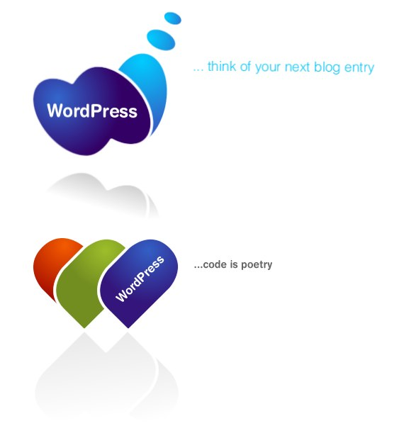
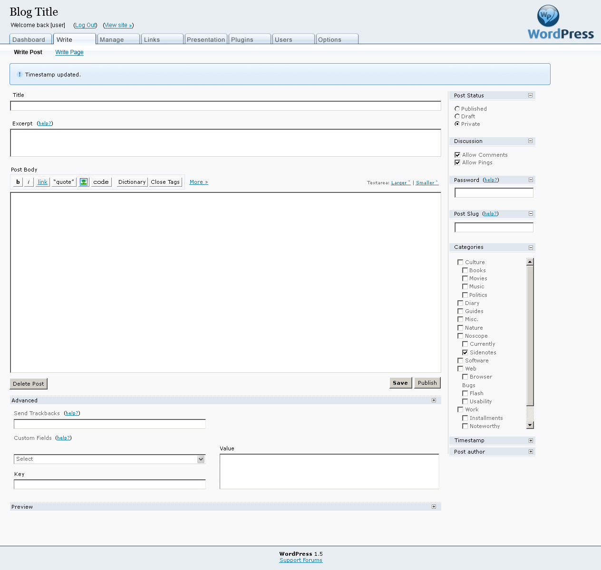
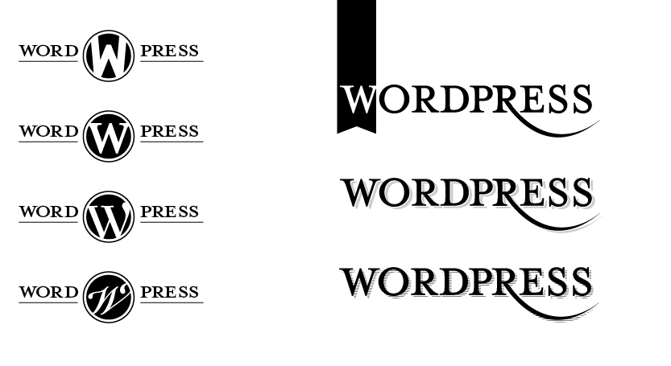
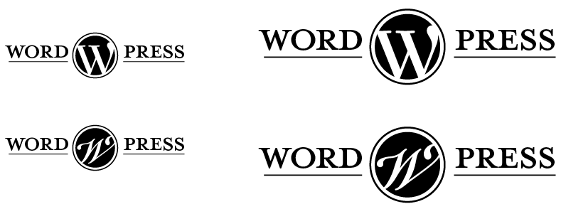

## 14. A New Logo

As development progressed, WordPress’ design and branding took shape. Some of the first lengthy discussions about WordPress' look and feel happened on the <a href="http://lists.wordpress.org/pipermail/wp-design/">wp-design mailing list</a>. This was a private mailing list of designers and developers interested in crafting WordPress’ aesthetic. Michael Heilemann (<a href="http://profiles.wordpress.org/michael">michael</a>), Khaled Abou Alfa (<a href="http://profiles.wordpress.org/khaled">khaled</a>), Joen Asmussen (<a href="http://profiles.wordpress.org/joen">joen</a>), Chris Davis (<a href="http://profiles.wordpress.org/chrisjdavis">chrisjdavis</a>), Joshua Sigar (<a href="http://profiles.wordpress.org/alphaoide">alphaoide</a>), and Matt composed the main group.

The first focused design discussion was about WordPress’ logo. Matt designed the original logo; it was simply the word "WordPress" in the Dante font:

 

*The original WordPress logo.*

Since the project was so small, community members had fun on the homepage, riffing on the logo with versions for seasonal holidays, birthdays, and other events.

 

 

 

 

*Logos that were created for WordPress.org for special occasions.*

Eventually, WordPress needed a professional logo. Usage was growing and WordPress needed a logo that properly represented it. As a free software project, the community was the first place to look for a logo. Community suggestions were solicited. A mixed set of results came back, which were shared with the wp-design group for feedback.

The <a href="http://lists.wordpress.org/pipermail/wp-design/2005-March/000163.html">first suggestions</a> were from Andreas Kwiatkowski:

 

*WordPress logo suggestions from Andreas Kwiatkowski.*

A <a href="http://lists.wordpress.org/pipermail/wp-design/2005-March/000171.html">second batch came</a> from Denis Radenkovic:

 

*WordPress logo suggestions from Denis Radenkovic.*

Logo feedback was mostly lukewarm, though <a href="http://lists.wordpress.org/pipermail/wp-design/2005-April/000175.html">some of the</a> <a href="http://lists.wordpress.org/pipermail/wp-design/2005-March/000173.html">designers</a> liked Radenkovic's heart logos, describing them as "instantly recognizable."

The heart logo was iterated on, with another version posted to the design mailing list: 

 

*Joen Asmussen's iteration of the heart logo.*

A version of the admin screen with it in situ was produced.

 

*Joen Asmussen's admin design with the heart logo in situ.*

Community members weren't the only ones tackling the logo. In March, Matt met <a href="http://jasonsantamaria.com/">Jason Santa Maria</a> at South by South West and asked him to try redesigning the WordPress logo. They shared ideas about what they thought the logo should be: "the things that kept coming up were not only the idea of publishing but the idea of having a personal journal and a personal thing that might have some sort of tactile overtones," <a href="http://archive.wordpress.org/interviews/2014_01_22_Santa_Maria.html#L7)">Jason says</a>. "We were making links to things like letterpress and journaling and any sort of older representations of what it meant to publish something in a physical form." In April 2005, <a href="http://lists.wordpress.org/pipermail/wp-design/2005-April/000182.html">some of the early versions were shared</a> with the wp-design group:

 

*The first logo ideas sketched by Jason Santa Maria.*

There were a number of responses from the designers on the mailing list: "<a href="http://lists.wordpress.org/pipermail/wp-design/2005-April/000194.html">a little too aristocratic</a>" was one of the comments. The designers <a href="http://lists.wordpress.org/pipermail/wp-design/2005-April/000185.html">felt that Denis Radenkovic's design</a> was more in line with WordPress' brand.

More designs were posted to the group:

 

 

*Further iterations on the logo design from Jason Santa Maria.*

The members of the mailing list didn’t seem to agree on WordPress’ aesthetic. On one hand, there were people who felt that the logo should represent warmth and community, and on the other hand, something classic and elegant. To reach a consensus, discussions happened offline. Khaled <a href="http://lists.wordpress.org/pipermail/wp-design/2005-April/000192.html">reported back</a>:
<blockquote>WordPress is meant to be the Jaguar or Aston Martin of Blogging tools. [...] that line sets the stage for what the design of the branding should be. Elegance, polished, and impecably [sic] designed is where we should be aiming.</blockquote>
The logo was finally decided on May 15th, when Matt sent an email to the mailing list with the subject "I think this is it." Matt's message contained just one image:

*The final design for the WordPress logo.*

The major change to the logo, other than the new typeface, was the mark. The creation of a mark gave WordPress a stand-alone element of the logo which, over time, would be recognizable even without the word beside it. This could and would be used in icons, branding, and t-shirts. It’s become instantly recognizable, helped by its appearance on WordCamp t-shirts the world over. 
