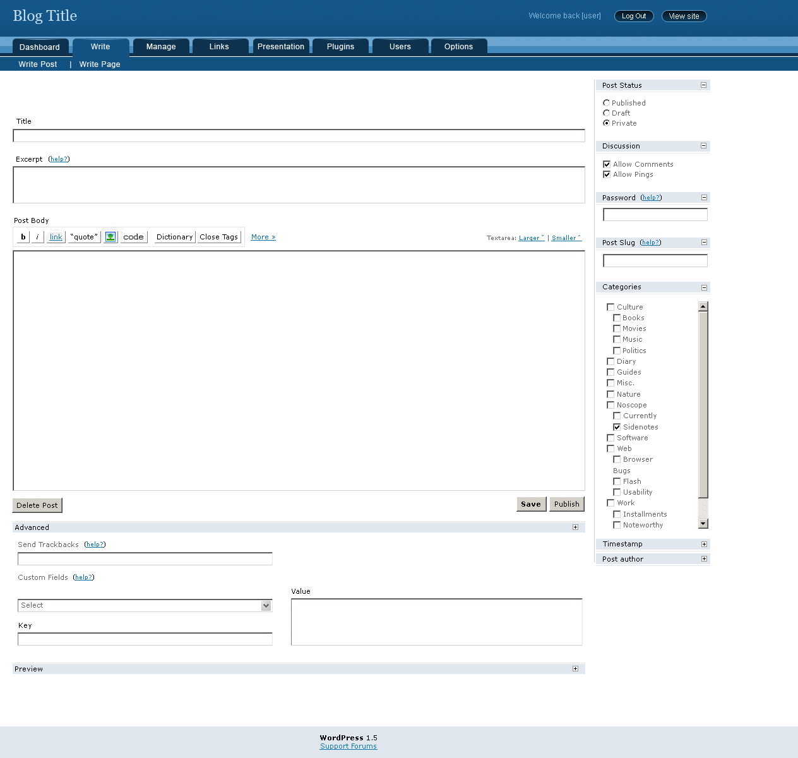
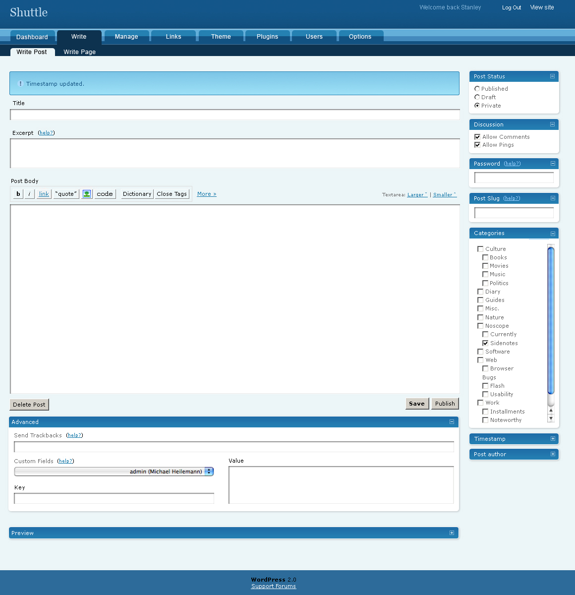
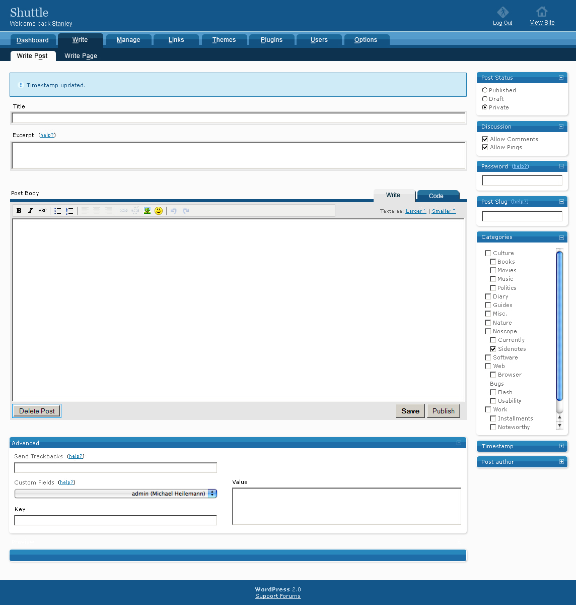
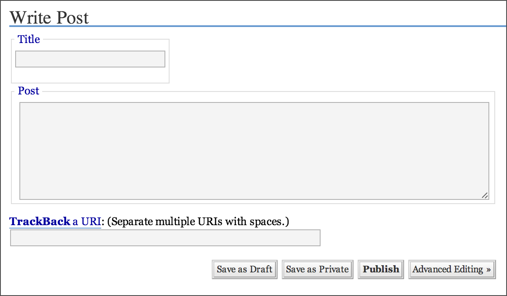
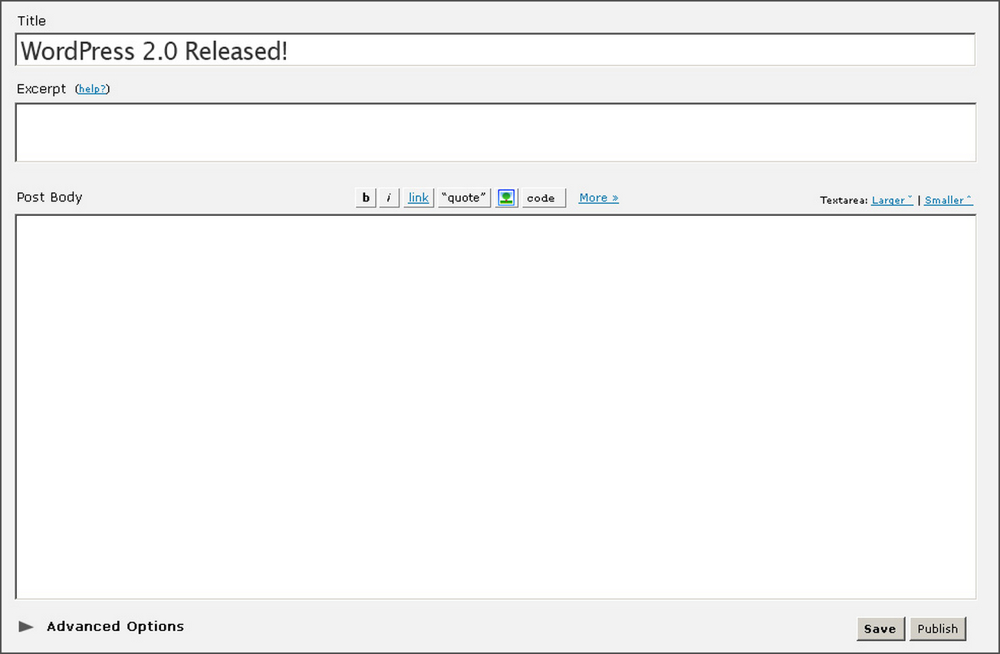
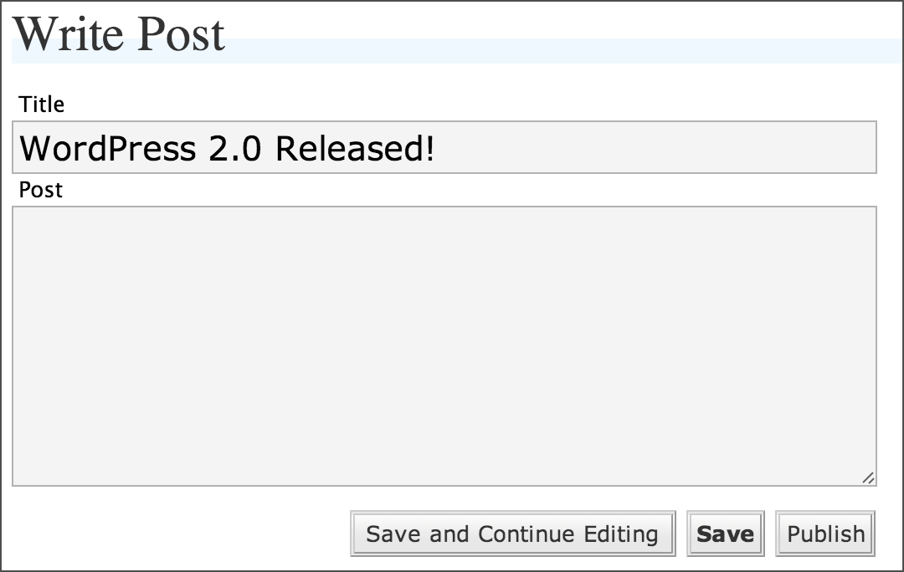
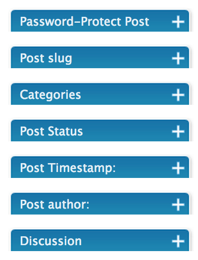
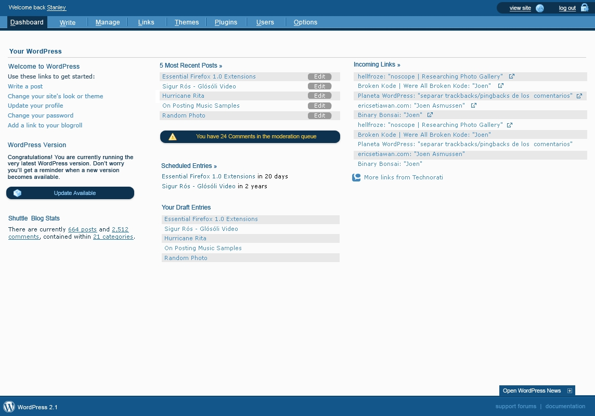

## 18. Shuttle

As people experimented with ways to make money with WordPress, design changes were underway in the interface. Between 2005 and 2006, the WordPress community organized the "Shuttle" project to overhaul WordPress' admin screens. Their aim: to create a coherent, distinct look for WordPress by redesigning wp-admin, which had inherited its design from b2.

The group's aesthetic refresh reimagined and modernized wp-admin, iterating on the design without re-architecting the interface or adding new features. They started work in the wake of WordPress 1.5, which came out with a set of admin screens ripe for improvement:

 

Just as dealing with spam revealed tensions in the development process, Shuttle's work highlighted a pressure point: squaring coherent design and free software development. Design decisions, which are usually highly subjective, seem not to lend themselves to a public process. To work effectively, Shuttle felt they needed to tweak their methods.

Linus's Law, <a href="http://www.catb.org/esr/writings/homesteading/cathedral-bazaar/ar01s04.html">outlined by Eric Raymond</a>, says that "given enough eyeballs, all bugs are shallow." If there's a bug in the software, make the code available to many people; someone will see the solution. For an issue with a defined answer, this can speed progress considerably. With design so subjective in nature, however, Shuttle designers worried that an open process would lead to too many cooks in the kitchen, and that competing opinions would lead to stalemates.

Unlike WordPress' core developers, the Shuttle group communicated via private mailing list, wp-design. This list was open, but list archives weren't public. To be involved, a contributor had to be added to the group, and the group had to agree to add the new member. Discussions among members indicate that they deliberately tried to keep the group limited. "An open mailing list would become so much noise and so little signal so quickly that there would be no way we could move forward," <a href="http://archive.wordpress.org/interviews/2013_11_18_Davis.html#L91">recalls Chris Davis</a>.

The group remained small, with three main designers -- Michael, Joen, and Khaled -- supported by coders responsible for realizing the design vision. The group sent designs around among themselves, offered feedback on one another's work, and iterated on the design. They focused on specific elements, mainly the Post screen (<code>post.php</code>). Over the course of the project, twenty-eight versions circulated among this group.

Version 8

 

Version 14

 

Version 21

 

Version 26

 
 
As the design process continued, elements of Shuttle were implemented in WordPress. One of the earliest Shuttle designs increased the size of the title field in the <code>post.php</code> edit screen.

In WordPress 1.5:

In Shuttle:

WordPress 2.0:

Another iteration of the <code>post.php</code> screen collapsed elements like post status, categories, and author.

In WordPress 1.5:

In version 8 of Shuttle:

In WordPress 2.0:

When WordPress 2.0 shipped with Shuttle-inspired changes, the feedback wasn’t entirely positive. <a href="https://web.archive.org/web/20060203042213/http://www.molly.com/2006/01/05/wordpress-20-and-akismet/">Molly Holzschlag wrote that</a> "what WP2.0 has gained in interface appeal it's lost in some practicality too." <a href="http://lists.wordpress.org/pipermail/wp-design/2006-January/000559.html">Piecemeal implementation of their vision</a> kept the Shuttle group from creating a single, cohesive redesign.

The project was beset by other problems. Despite the closed mailing list, progress stalled without a clear leader charged with the project's overall vision. When one skims the mailing list's archives today, it reads like a design-focused discussion forum rather than the communications of a focused team with a clear task. As the Shuttle team discovered, a group of independent designers, each with their own ideas, can trip up design work as surely as a mailing list full of hackers.

It took the group a long time to complete work. They discussed minor design elements like rounded corners and gradients for lengthy periods, rather than examining the fundamental needs and wants of WordPress users. "I don’t know if we were cooperating enough on getting a unified feel and a unified understanding of everything before we tried to actually apply our ideas to the problem," <a href="http://archive.wordpress.org/interviews/2013_11_06_Heilemann.html#L74">says Michael</a>. Besides that, the contributors had jobs that absorbed their time, so work happened in fits and starts. While the original plan was to complete the admin redesign within three months, by mid-April 2005, this slid to September. The team eventually <a href="http://lists.wordpress.org/pipermail/wp-design/2005-November/000502.html">missed the deadline for WordPress 2.0</a> in late 2005. The next deadline (for inclusion in WordPress 2.1, which itself never materialized) was the end of January, though it was March 2006 before a complete set of mockups arrived.

It was then that Khaled sent out a comprehensive set of screenshots with his vision for the new WordPress admin:

 

 

The rest of the group loved the designs, and the developers began coding. Still, development dragged on. In mid-April, <a href="http://lists.wordpress.org/pipermail/wp-design/2006-April/000721.html">Michael Heilemann withdrew from the project</a>, saying that he had to prioritize other commitments. The same month, <a href="http://lists.wordpress.org/pipermail/wp-design/2006-April/000723.html">Khaled asked</a> whether Matt or Ryan would ever get around to implementing the design. <a href="http://lists.wordpress.org/pipermail/wp-design/2006-April/000730.html">The response</a> placed the redesign as a medium priority. Changes would be iterative.

On May 14 2006, <a href="https://web.archive.org/web/20061105004935/http://www.brokenkode.com/archives/shuttle-launched/">Khaled posted a complete set of designs to his blog</a>, bringing the Shuttle project to a close. He was still under the impression that the mockups would be implemented in due course. They never were. Khaled and other members of the group felt disenfranchised, and drifted away from the community. Chris Davis and Michael Heilemann made the switch from WordPress to the Habari project.

The biggest failure of the Shuttle project wasn't the designs or implementation, but the process itself. To avoid getting bogged down with too many opinions, the group closed itself off from the community -- which created a new set of problems. Isolated from the larger community, they lost touch with the development process. The project's closed nature limited opportunities for other enthusiastic designers to step in and move the work forward. For each person excited to see a spectacular WordPress redesign, there was another person resentful that a blessed group of designers was working privately on something the whole community had a stake in.

In one of the final emails on the wp-design mailing list, <a href="http://lists.wordpress.org/pipermail/wp-design/2006-May/000732.html">Matt outlined</a> some of the things that he learned about design-oriented free software projects:
<blockquote>
<ul>
	<li>Work should not be done in private</li>
	<li>Design by committee doesn't work, better to break up tasks and let individual people focus on one section</li>
	<li>Focus on lots of incremental changes, rather than giant redesigns (you end up in the same place, and probably sooner)</li>
	<li>Document the process and decisions along the way</li>
	<li>Code concurrently with the designs (and iterate)</li>
	<li>Don't hype it, expectations get out of control</li>
	<li>Avoid scope creep of features into designs</li>
	<li>Set a deadline and stick to it</li>
</ul>
</blockquote>

These tenets influenced the relationship between WordPress design and development, helping future design projects avoid the difficulties faced by the Shuttle group.
