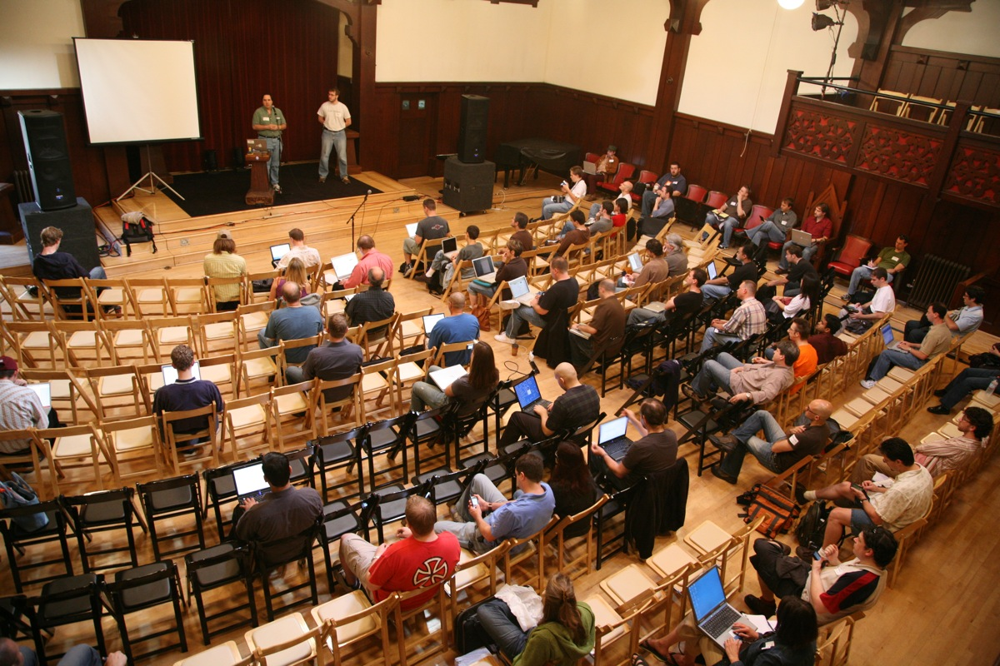
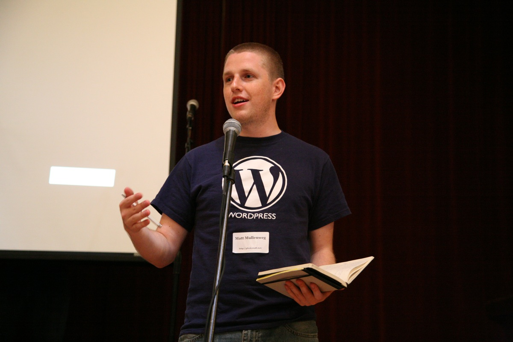

## 21. WordCamp 2006

The WordPress community has a long tradition of getting together to have fun and work on design and development in person. <a href="https://wordpress.org/news/2004/06/meetup-location/">As early as June 2004</a>, contributors were meeting in San Francisco to socialize <a href="https://wordpress.org/news/2005/02/upgrade-party/">and hold "upgrade parties.</a>" (Before the days of the one-click upgrade, users had to upgrade their sites individually using FTP; contributors gathered to help people upgrade, or to migrate from other platforms to WordPress.) A dedicated WordPress conference was the next step. 

Matt, along with Tantek Çelik, had helped organize an informal technology conference called BarCamp, a series of open, workshop-style events where attendees helped create the schedule. In July 2006, Matt announced that he would host a BarCamp-style event called <a href="http://ma.tt/2006/07/wordcamp/">"WordCamp"</a> later that summer in San Francisco. "BarCamp-style" is a code phrase for 'last minute,'” <a href="http://ma.tt/2006/07/wordcamp/">he joked</a>.

The event -- which he announced without a venue or schedule -- would be on August 5th. More than 500 people from all over the world registered: Donncha flew in from Ireland, and Mark Riley from the UK. When WordCamp did get a venue, it was the Swedish American Hall, a Market Street house that served as headquarters for the Swedish Society of San Francsico.

<a href="http://2006.wordcamp.org/schedule/">WordCamp 2006's schedule</a> reflects the project's concerns and its contributors' passions. Mark Riley gave the first-ever workshop on getting involved with the WordPress community, now a staple talk at WordCamps. Andy Skelton presented on the widgets feature that he was working on for WordPress.com. Donncha spoke about WPMU, and Mark Jaquith explored <a href="http://markjaquith.com/wordcamp/wordpress-versatility/">WordPress as a CMS</a>, <a href="http://markjaquith.wordpress.com/2006/08/30/wordcamp-thoughts-late-to-the-game/">one of the most-requested sessions</a>. There were presentations about blogging and podcasting, and about journalism and monetizing.

_The first WordCamp. (cc license Scott Beale ([Laughing Squid](http://laughingsquid.com)))_

WordCamp San Francisco 2006 also saw Matt's inaugural "State of the Word" presentation, in which he <a href="http://dan.hersam.com/2006/08/05/wordcamp-notes/">focused on keeping the software simple</a>, with streamlined installation and user-friendy theme and admin pages. He invited more people to contribute to documentation and support, highlighting Mark Riley's work, and discussed future updates in a Q&amp;A afterwards.  This WordPress year-in-review and "coming soon" talk has been a feature of every WordCamp San Francisco since (and in 2015, of the first-ever WordCamp US in Philadelphia, Pennsylvania).

_Matt giving his State of the Word presentation. (cc license Scott Beale ([Laughing Squid](http://laughingsquid.com)))_

The event, despite the short lead time, was a success and the first of what would be a global conference series. WordCamp returned to the Swedish American Hall in 2007, to be followed by WordCamp Beijing in September 2007 and additional WordCamps in Israel, Argentina, and Melbourne, Australia. 

Mirroring WordPress itself, these events are organized and supported by volunteers. There was no formal WordCamp program -- if someone wanted to organize an event, they did it. Like their BarCamp ancestors, they remained informal and user-led. It wasn’t until later, when the project had grown and the number of WordCamps across the world exploded, that WordCamps started to get some structure.  
