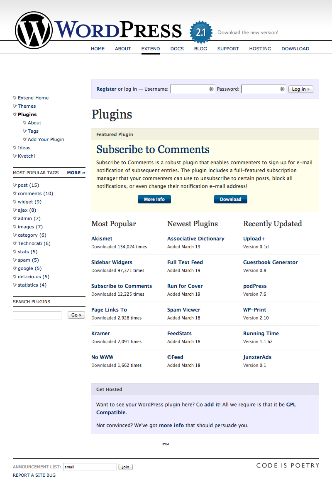
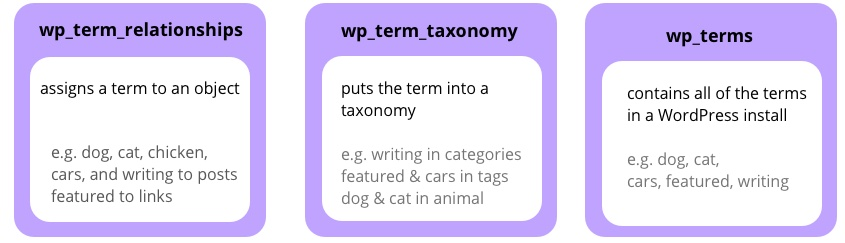

## 25. Creating a Folksonomy

In the wake of the exodus to Habari, the project began to evolve. In March 2007, Robin Adrianse (<a href="https://profiles.wordpress.org/rob1n">rob1n</a>) became WordPress’ first temporary committer when he received commit access for three months to help Ryan Boren address languishing trac tickets.

Also in March, the plugin directory launched. Before the plugin directory, developers hosted their plugins on their website. The directory gave them exposure to a huge number of WordPress users. Samuel Wood (<a href="http://profiles.wordpress.org/otto42">Otto42</a>) <a href="http://archive.wordpress.org/interviews/2014_06_07_Wood.html#L204">recalls how the plugin directory encouraged him to distribute his code</a>. “I was writing them before, but I didn't give them to anybody. It encouraged me to release plugins because I had a place to put them.”

*The WordPress Plugin Directory in 2007.*

WordPress 2.1 had launched in January 2007, after a release cycle of more than a year. WordPress 2.2 was the first to adopt the new 120-day release cycle. This goal, which would later become codified as <em>deadlines are not arbitrary</em> in WordPress’ <a href="https://wordpress.org/about/philosophy/">philosophy</a>, was an ongoing challenge. It was tested in WordPress 2.2, which featured a new taxonomy system -- the biggest database architecture change to date. Developing in an open source environment means leaving time for every voice to be heard, waiting for volunteers with busy lives to get things done, and discussing new features and architectural changes. It’s a challenge that WordPress would have to address release cycle after release cycle.

In the early 2000s, the internet abounded with discussions about the best way to organize information. Content has metadata assigned to it, which can be used to organize and display information. Traditional web classification methods imposed a top-down categorization structure. A website created a category structure and users placed their content in the correct category. These structures were often rigid, forcing users to shoehorn their content into something that didn’t necessarily fit. A new method of classification emerged -- tags, a bottom-up classification form in which an index or a cloud can be generated based on keywords that the creator applies to the content.

Social bookmarking site <a href="https://delicious.com/">Del.icio.us</a> was the first to use tags. While Del.icio.us wasn't a bookmark management pioneer, its tagging system set it apart. Users tag the links they save, and the tags are then used to group together links in a user’s own collection and across the entire social network. Visiting the link http://delicious.com/tag/php displays all links tagged PHP.

The classification system in which users classify content themselves, creating mass tagging networks, became known as a <a href="https://en.wikipedia.org/wiki/Folksonomy">folksonomy</a>.

In 2005, Technorati, the blog search engine, <a href="http://www.sifry.com/alerts/archives/000270.html">launched its own tagging system</a>. It enabled users to run a tag search across major platforms such as Blogger and Typepad, CMSs like Drupal, and other services such as Flickr, Del.icio.us, and Socialtext.

WordPress lagged behind, and there was pressure from both the free software and WordPress.com communities to add tags to the platform. WordPress’ native classification form is hierarchical, top-down categories. To interact with WordPress, <a href="http://lorelle.wordpress.com/2005/09/11/adding-technorati-tags-to-wordpressmu-sites/#comment-113)">Technorati picked up the “tag” from the WordPress post’s category</a>. Many users found this unsatisfactory, as categories and tags are two different types of classification.

On his blog, <a href="http://carthik.net/blog/vault/2006/02/21/tags-are-not-categories/">Carthik Sharma wrote</a>:
<blockquote>Categories can be tags but tags cannot be categories. Categories are like the huge signs you see on aisles in supermarkets – “Food”, “Hygiene”, “Frozen,” etc., (sic) they guide you to sections where you can find what you are looking for. Tags are like the labels on the products themselves.</blockquote>
Categories and tags address two distinct use cases. Categories are more rigid, whereas tags are a lightweight way of classifying content. There was, of course, a plugin that did the job: WordPress users installed the <a href="http://neato.co.nz/ultimate-tag-warrior/">Ultimate Tag Warrior</a> plugin (though WordPress.com users could not).

In 2007, <a href="https://core.trac.wordpress.org/ticket/3723">Ryan Boren opened a ticket to add tagging support to WordPress</a>. Finally, WordPress would have tags. The next step was to identify the database schema.

A database stores all the content and data of a WordPress user. The database contains different tables from which data is retrieved. There is a post table, for example, which stores post-related data. The user table stores user data. Making changes to the database is not trivial. Any changes have to be done correctly because undoing them in the future can be difficult. Changes need to be performant. In a PHP/MySQL setup, increasing the number of database queries can slow the site down. The question arose: where should we store tagging data? Should it be in a new table? Or should it be stored in an existing table?
	
Ryan proposed two database schemas. One of these <a href="https://core.trac.wordpress.org/attachment/ticket/3723/tagging.diff">created a new table for tags</a>. Matt was keen on the second proposal -- putting <a href="https://core.trac.wordpress.org/attachment/ticket/3723/tags.diff">tags in the categories database table</a>. He believed it didn’t make sense to create another table identical to the categories table. In a <a href="https://core.trac.wordpress.org/ticket/3723#comment:16">comment on trac, he wrote</a>:
<blockquote>We already have a ton of rewrite, API, etc. infrastructure around categories. Mostly I see tagging as a new interface to the data. On the display side, people want their tags listed separately from their categories, and probably something like a tag cloud function.</blockquote>
Previously, WordPress had already successfully reused tables; for example, posts, pages, and attachments are all stored in the same table, and at that time, the categories table also contained link categories. Tagging, from a user’s perspective, enabled them to tag posts, display a list of tags, and display posts with the same tag. What was the point in duplicating the infrastructure when it could be achieved within the current table system?

<a href="http://lists.wordpress.org/pipermail/wp-hackers/2007-April/011730.html">Few developers supported</a> putting tags in the categories table. Some believed the table would become bloated and argued that adding tags to it meant including additional code to keep the two taxonomy types separate. This additional code could introduce bugs, and make future maintenance and extension of the table difficult for developers.

On <a href="http://lists.wordpress.org/pipermail/wp-hackers/2007-April/thread.html">wp-hackers</a>, April 2007 was spent discussing the new database schema for taxonomies. A suggestion that gained considerable community traction was splitting categories, link categories, and tags into their own individual tables -- but it was impossible to reach consensus.

After checking in the single-table taxonomy structure (changesets <a href="https://core.trac.wordpress.org/changeset/5110">#5110</a> and <a href="https://core.trac.wordpress.org/changeset/5111">#5111</a>), Matt posted a new thread on wp-hackers <a href="http://lists.wordpress.org/pipermail/wp-hackers/2007-April/011930.html">making the case for using the categories table</a>. He argued that:
<ol>
	<li>It would perform faster as no additional queries would need to be carried out to support tags. A separate tag table would require at least two extra queries on the front end.</li>
	<li>It would provide a better long-term foundation. Tags and categories would be able to share terms (for example the category “dogs” and the tag “dogs”).</li>
	<li>There were no user-facing or plugin-facing problems.</li>
</ol>
In the thread, he also proposed an alternative, inspired by Drupal’s taxonomy system: creating a new table for terms within a specific taxonomy. Terms are the items within a category, tag, or any other taxonomy; dog, cat, and chicken are all terms within an “animal” taxonomy. This additional table allowed terms to be shared among taxonomies, while having the same ID (the ID is what identifies an item in the database). Just one term -- “dog” for example -- would be saved in the database, and this term could be used in any taxonomy.

Ryan Boren <a href="http://lists.wordpress.org/pipermail/wp-hackers/2007-April/011991.html">proposed a compromise</a>, one which enabled individual terms to be part of any taxonomy, while keeping the same ID. It was a three-table solution, with tables for terms, taxonomies, and objects. Discussion ensued, a <a href="https://core.trac.wordpress.org/ticket/4189">new trac ticket was opened up</a>, and a new structure was created based on this proposal. The first table, wp_terms, holds basic information about single terms. The wp_term_taxonomy table places the term in a taxonomy. The final table, term_relationships, relates objects (such as posts or links) to a term_taxonomy_id from the term_taxonomy table.

*The database structure for WordPress taxonomies.*

This approach had the advantage of assigning one ID to a term name, while using another table to relate it to a specific taxonomy. It's extensible for plugin developers who can create their own taxonomies. It also enables large multisite networks, such as WordPress.com, to create global taxonomies -- unified tagging systems in which users of different blogs can share terms within a taxonomy.

Like many WordPress features, tags landed on WordPress.com before they shipped in WordPress. From the beginning, the new structure caused huge technical problems. The increase in tables meant that WordPress.com needed more servers to deal with the additional queries. “It was slower to be completely honest,” <a href="http://archive.wordpress.org/interviews/2014_07_07_Mullenweg.html#L156">says Matt</a>. “That was a cost that we saw in a very real way on WordPress.com, but also a hidden cost that we did impose on everyone who was doing WordPress in the world.”

More than just a challenging code problem, the taxonomy implementation highlighted problems in the development process. Heavy discussion meant development dragged on. Some wanted to delay the release. Some wanted to pull the feature. Others wanted to revise the schema in a subsequent version. Andy Skelton <a href="http://lists.wordpress.org/pipermail/wp-hackers/2007-April/011988.html">responded to the wp-hackers discussion</a>:
<blockquote>To include a premature feature in an on-time release degrades the quality of the product. I refer to not only the code but the state of the community. Increments are supposed to be in the direction of better, not merely more. Better would be to release on time with a modest set of stable upgrades.

To block release while the one new feature gets sorted out would be a maladjustment of priorities. If 2.2 seems light on sex appeal, so be it. Better to keep the release date as promised.</blockquote>
The 120-day release schedule was in danger because of one issue. Making major architectural changes to core just weeks before a release was contrary to the aims of the new development process. A thread suggested <a href="http://lists.wordpress.org/pipermail/wp-hackers/2007-April/011901.html">delaying 2.2's release</a>. The architectural changes were too important to be done in an unsatisfactory way.

Eventually, Matt decided to <a href="http://lists.wordpress.org/pipermail/wp-hackers/2007-April/012090.html">delay the 2.2 release</a>, pull tags out of core, and bring in widgets -- a user-facing feature that would encourage people to update their version of WordPress.

<a href="http://andy.wordpress.com/2006/03/08/widgets-user-interface-and-api/">Andy Skelton developed widgets</a> for WordPress.com users; he built them to give bloggers more flexibility with their site's layout. Widgets are code blocks users can drag and drop into place through the user interface. They allow bloggers to add a calendar, a search bar, or some text (among other things) to a sidebar in any order they wish. It was a hugely popular feature on WordPress.com; the plugin for WordPress was also a great success. Launching widgets on WordPress.com meant that many different users could test them before they made it into core as a feature.

The new tagging feature finally shipped in WordPress 2.3 -- in a structure that was the outcome of extensive negotiating and haggling. This wrangling process has had consequences for WordPress developers ever since. Shared terms have had lasting implications for core developers, plugin developers, and users. The problem with shared terms is that an item could have multiple different meanings, but the database treats all of them identically. For example, the word apple. A developer creates the taxonomy “Companies” and the taxonomy “Fruit,” and the user places the term “apple” in both. Conceptually, this is a different item -- a company and a fruit -- and they appear in the user interface as two distinct entities. But the database treats them as the same thing. So if a user makes changes to one -- for example, capitalizing it -- changes are made to both.

In a post in 2013, <a href="http://make.wordpress.org/core/2013/07/28/potential-roadmap-for-taxonomy-meta-and-post-relationships/">Andrew Nacin wrote that</a>, “Hindsight is 20/20, and shared terms are the bane of taxonomies in WordPress.” Each term is represented in two different ways. Since an individual term can appear in multiple taxonomies, it’s not straightforward to identify the actual term in the actual taxonomy that you want. It has become a challenge to build new features that use one identification method when there are parts of WordPress that use the other.

A case in point: to attach metadata to a term, there must be one object identifier. However, the public ID uses a different identifier. It is extremely difficult to target data consistently when it is identified in multiple ways. WordPress has a long-term commitment to maintaining backward compatibility, so creating a new schema isn’t possible. The effort to get rid of shared terms must progress step by step, over a number of major releases (this is being carried out over three releases in the 4.x series).

The over-engineered taxonomy system came about through argument and compromise. When the bazaar model works, it can produce software that people love to use. The model fails when intractable arguments result in compromises that no one is 100 percent happy with. The new taxonomy system did, however, contain one notable benefit. Neither of the original proposals for the taxonomy schema (putting tags into the category table, or creating a new table just for tags) would have allowed developers to create custom taxonomies, and the latter became a major element in WordPress' transition from a straightforward blogging platform to a bonafide content management system.

Even with these setbacks, software development continued mostly on schedule. Since tags were pulled from 2.2, there were only 114 days between WordPress 2.1 and 2.2, and then 129 days between the release of 2.2 and 2.3. While delays would recur in some future releases, there was nothing that resembled the long, dark year between 2.0 and 2.1.
