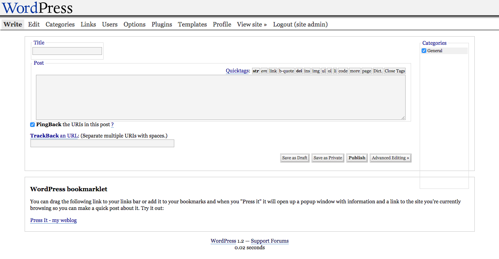
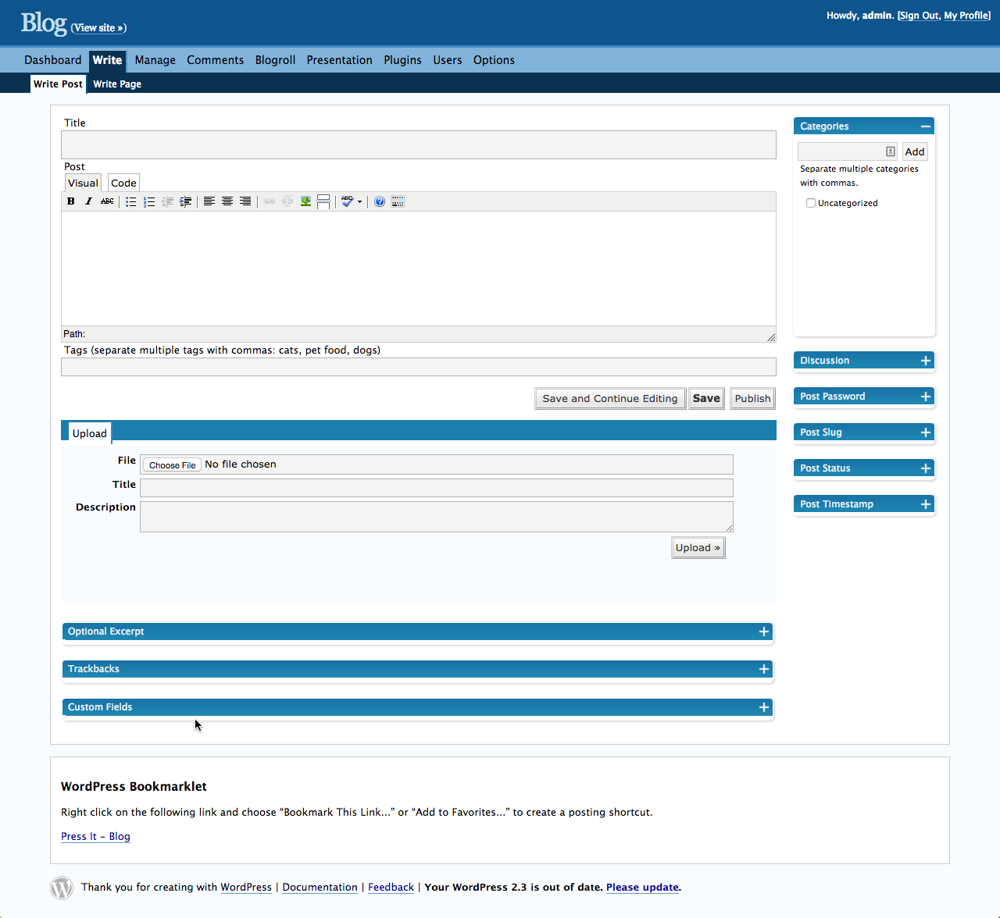
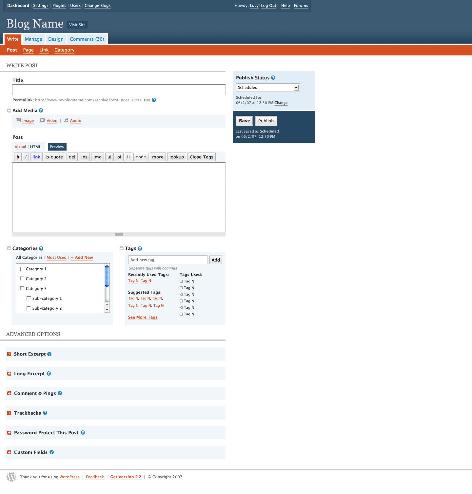
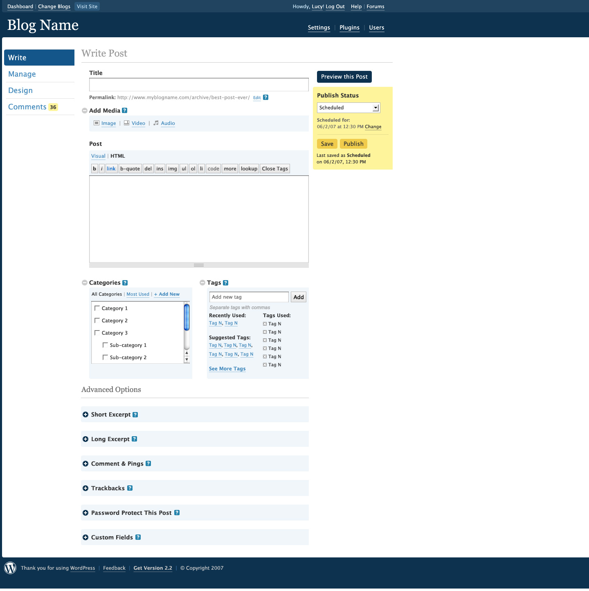
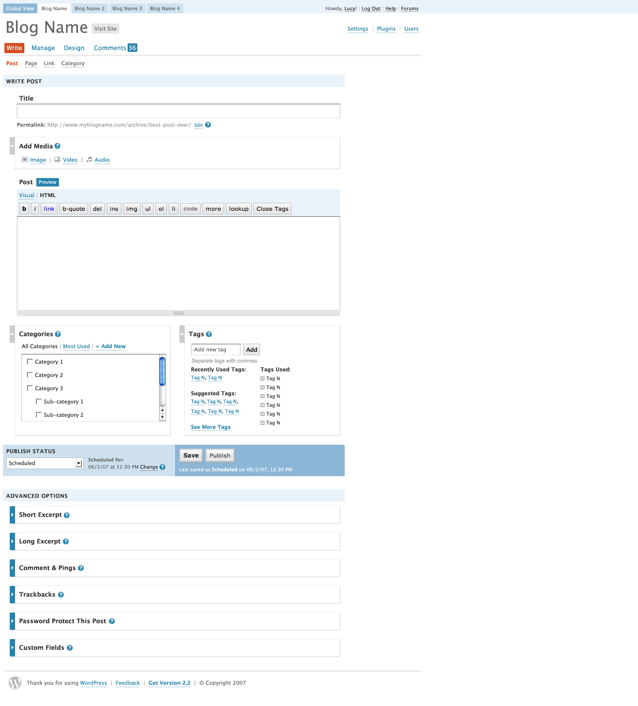
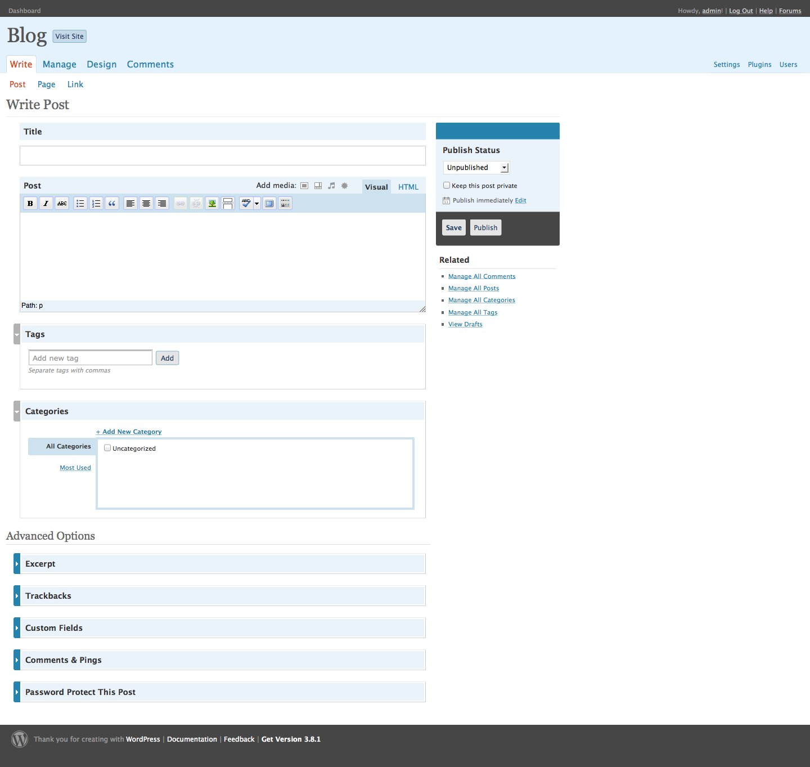

## 28. Happy Cog Redesign

Shuttle had failed back in 2006 and WordPress' admin still needed a redesign. Matt turned to design studio Happy Cog. Jeffrey Zeldman, Happy Cog founder, led the project, along with WordPress' logo designer Jason Santa Maria and UX designer Liz Danzico.

Whereas Shuttle focused on aesthetics, Happy Cog identified and corrected information architecture problems, and updated and improved WordPress' look and feel. Despite the project's user-first ethos, the admin screens had become cluttered, as new features were sometimes added in a haphazard way. The change between WordPress 1.5 and WordPress 2.3 speaks for itself.  

*The Write screen in WordPress 1.5.*

*The Write screen in WordPress 2.3.*

Happy Cog produced designs that WordPress developers then coded. The project included user research and an interface audit to identify WordPress' strengths and weaknesses, and to inform new structural and interface designs. 

WordPress, as a free software project, was an unusual client for a traditional design agency. Matt and Jeffrey formed a buffer between the Happy Cog team and the community, but the designers, nonetheless, knew this was an entirely different type of client. <a href="http://archive.wordpress.org/interviews/2014_01_22_Santa_Maria.html#L82">Jason Santa Maria says</a>:

<blockquote>Any other client will have customers and their own community, but you really have to just manage the people inside of a company, whereas when you’re dealing with an open source project, you deal with the people that you’re talking with, but there’s this whole gamut of other people that you will only ever get to talk to a small portion of. I think that that’s really difficult.

Plus, I think that on an open source project like this, it’s inherently different, not just because it’s more of a CMS than an informational website -- the design needs are different -- but it’s just a different kind of way to work, knowing that whatever you do probably isn’t going to stick around for very long. It’s going to continue to evolve and continue to be adapted. Usually, in the very near-term as well, not even three-four months from now, but next week.</blockquote>

An audit and usability review were among the first steps. Liz Danzico researched and produced a 25-page document on WordPress. WordPress needed an admin that didn’t intrude on the user. In the audit, she quotes <a href="http://markjaquith.wordpress.com/2007/02/21/engine-awareness/">Mark Jaquith</a>: "That’s when I know WordPress is doing its job: when people aren’t even aware they’re using it because they’re so busy using it!"

Liz spoke to Mark Riley, whose support forum experience gave him direct access to users' complaints. One of the major problems he highlighted was the clutter that had amassed in the Write screen between WordPress 1.2 and WordPress 2.0. Features had been added and then tucked into modules using the pods introduced by the Shuttle project. There were many actions a user could take on the Write screen, and many of them were confusing or hidden.

Discussion focused on navigation structure: labelling, position, and functionality grouping. Should they go with an object-oriented navigation (Posts, Pages, Comments, etc.) or an action-oriented navigation (Write, Manage, etc.)? Liz's first hunch -- supported by the newly launched Tumblr -- was that users preferred navigating by nouns. She felt WordPress’ verb structure was confusing. The first navigational structure iterations introduced both a noun version and a verb version. In the end, however, and after limited user testing, the team went with a mixture of nouns and verbs: Write, Manage, Design, Comments. This meant that the functionality for different content types was scattered over different menu items -- to write a post, for example, users would go to "Write." To manage the same post they would navigate to "Manage." 

Happy Cog provided extensive and detailed proposals and research for WordPress, and shared them with Matt. Their reports display a sensitivity to web users, and an appreciation for simplifying and streamlining WordPress. 

When it came to the design stage, Jason Santa Maria created three designs to present to Matt, who would choose one to move forward. 

He designed three early mockups:

*Mockup Number 1.*

*Mockup Number 2.*

*Mockup Number 3.*

Matt chose the visually lighter design. Jason had taken Shuttle's heavy blue palette and lightened the interface. An orange accent color complemented the lighter blues.

When the design was finally signed off, WordPress trunk started to transform. As changes took place, <a href="http://lists.wordpress.org/pipermail/wp-hackers/2008-February/017849.html">community feedback</a> was <a href="http://lists.wordpress.org/pipermail/wp-hackers/2008-February/017850.html">posted to wp-hackers</a>. Was the admin actually more usable? Major changes broke familiar patterns. Some comments compared the design to Shuttle's; a few community members even <a href="http://weblogtoolscollection.com/archives/2008/01/02/wordpress-24-admin-preview/#comment-1207158">wanted to implement Shuttle's interface</a>. 

Just before release, <a href="http://wordpress.org/development/2008/03/25-sneak-peek/">a sneak peek was posted to the development blog</a>, and WordPress users installed the release candidate to get a better look. The response echoed that of the rest of the community. Regular WordPress users were surprised by the functionality changes to the Write screen. For some, it was <a href="http://www.neatorama.com/2008/04/21/wordpress-25-admin-backend-category-shenanigans-and-how-to-fix-it/#!vG29i">a step backward</a>.  

*The Write screen in the WordPress 2.5 admin.*

WordPress 2.4 was the first version to fall significantly behind the 120-day release cycle. Versions 2.2 and 2.3 were mostly on schedule, but the Happy Cog redesign brought in major changes to the codebase. Rather than just delaying release, a version was skipped, <a href="http://lists.wordpress.org/pipermail/wp-hackers/2008-January/016993.html">moving straight from WordPress 2.3 to WordPress 2.5</a>, which was scheduled for release in March. 

But there were bigger problems with this release cycle than just the delay. The community felt that they had not been consulted; they felt disenfranchised. In some ways, the redesign was destined to fail before it even began. With no participation and no process, there was no way to ensure community buy-in. Jeffrey Zeldman, reflecting on the process, says:

<blockquote>It worked for us, from our perspective, that we were a small team reporting to a single client who had life or death approval over everything. We had to please one user: Matt. He could say yes or no. We completely bypassed the community. That enabled us to get a design done that we felt was crisp and focused and achieved certain goals. And that sounds great. Except that, because the community wasn't involved, inevitably, the design then became unpopular because nobody got their say in it. And if I could go back and do it again, I would involve them up front, and find ways to get my feedback without it turning into a committee clustercuss. </blockquote>

As with Shuttle before it, problems surfaced in the design process. Free software projects are collaborative enterprises; when part of the process moves behind closed doors to avoid the problems of working by committee, new problems arise. However much a project tries to avoid it, that committee exists and must have its say.
	
