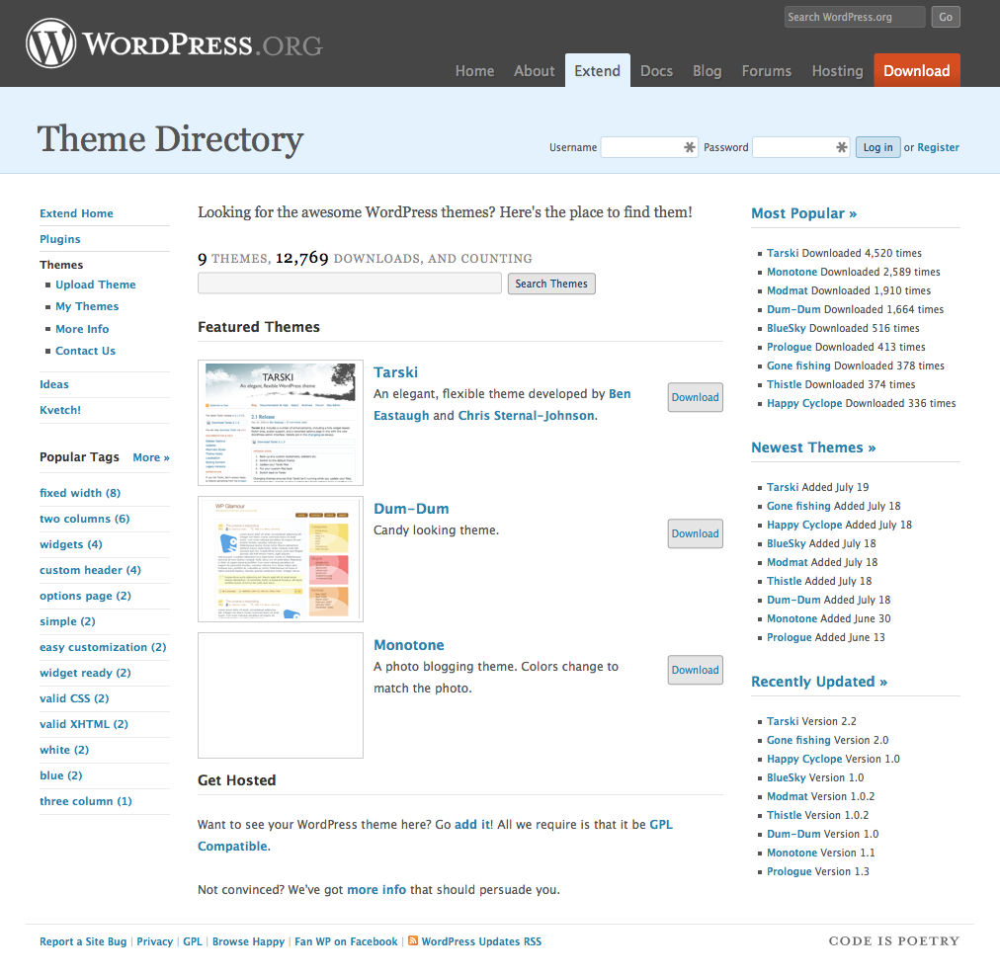

## 29. Premium Themes

In the wake of sponsored themes, theme developers were looking for ways to make money. Some made money from customizations, but increasingly, people wanted to make money with WordPress products rather than with services. Why build one site when you can build one theme and sell it multiple times? If theme developers couldn’t sell links, they could do the next best thing -- sell themes directly to WordPress users. There was, however, some hesitation around this. When the project removed sponsored themes from official resources, people interpreted this in different ways:

<em>"WordPress doesn't support sponsored themes."</em>

<em>"WordPress doesn't want me to make money."</em>

<em>"Automattic doesn't want me to make money.”</em>

Some people felt that Matt only wanted Automattic to make money from WordPress, a situation that wasn't helped when, after the sponsored themes debate, <a href="http://ma.tt/2007/11/wpcom-marketplace-idea/">Matt announced a WordPress.com theme marketplace</a>, resulting in <a href="http://www.blogherald.com/2007/11/01/wordpress-theme-marketplace-hypocrisy-from-matt/">cries of hypocrisy</a>. Despite laying the initial groundwork, Automattic decided not to go ahead with the plan. "It didn't seem right to go into it when we hadn't really worked out all the licensing issues yet," <a href="http://archive.wordpress.org/interviews/2014_04_01_Mullenweg.html#L157">says Matt</a>. [^Fn-1]

While the WordPress.com theme marketplace was set aside, employees inside Automattic were still curious about whether people would pay for a blog design. Noël Jackson (<a href="http://profiles.wordpress.org/noel">noel</a>), a former Automattic employee, <a href="http://archive.wordpress.org/interviews/2014_03_23_Jackson.html#L48">recalls</a> the time when premium WordPress themes started to appear:

<blockquote>It was interesting, especially in the beginning when it started happening. It was interesting to see revenue figures for themes that were released as a premium theme -- not a WordPress.com premium theme -- but someone selling their theme and keeping the GPL license and thinking, "Well, people are actually buying this." There wasn't an issue with it. I think that made everybody happy.</blockquote>

Bloggers who used WordPress dabbled with making themes. They released them for free. “A funny dynamic happened,” <a href="http://archive.wordpress.org/interviews/2014_05_11_Miller.html#L10">recalls Cory Miller</a> (<a href="https://profiles.wordpress.org/corymiller303">corymiller303</a>), the founder of iThemes. “People started hitting my contact form and saying will you customize this, or will you do this theme, or will you do all that stuff, and I was like I’m, I’m kind of a fraud here. And so I started charging for my work.” This is the familiar tale that some of the most prominent WordPress business founders tell today. Many of the people who run these businesses started out simply by making themes. These were often accidental businesses, with accidental businesspeople -- people who came to the community to scratch their own itch and found themselves inundated with requests for help, support, and customizations.

Although sites like Template Monster sold WordPress themes as early as 2006, the last quarter of 2007 saw the first surge in WordPress premium theme releases from within the WordPress community. Brian Gardner's <a href="https://web.archive.org/web/20070825022722/http://www.briangardner.com/blog/the-revolution-begins.htm">Revolution</a> --  one of the first premium WordPress themes -- launched in August 2007. A few weeks after, Tung Do released <a href="https://web.archive.org/web/20071016132417/http://www.wpdesigner.com/2007/09/10/showcase/">Showcase</a>. Later that year also marked the launches of <a href="http://www.nathanrice.net/blog/premium-wordpress-themes/">Proximity</a> from Nathan Rice, <a href="https://web.archive.org/web/20080202093724/http://www.solostream.com/2007/10/28/wordpress-theme-solostream-40/">Solostream</a> from Michael Pollock, <a href="https://web.archive.org/web/20080106173642/http://designadaptations.com/notebook/a-cornerstone-to-build-from/#comment-2836">Cornerstone Theme</a> from Charity Ondriezek, <a href="https://web.archive.org/web/20071106033124/http://www.adii.co.za/2007/11/02/the-launch-of-premium-news-theme">Premium News Theme</a> from Adii Pienaar, and PortfolioPress from Magnus Jepson. Early the following year, Chris Pearson released <a href="http://www.pearsonified.com/2008/03/diy-themes-pre-launch.php">Thesis</a>.

Most of the theme vendors followed a similar path: from blogger to hobbyist themer. From releasing a free theme to testing the brand-new market. Few had career aspirations -- these were side projects to make them money in their spare time. Some also did independent development for clients. But the idea that selling WordPress themes could be big business didn't cross their minds. "Even when I quit my job to spend more time working on these themes," <a href="http://archive.wordpress.org/interviews/2014_03_05_Pienaar.html#L63">says Adii Pienaar</a> (<a href="https://profiles.wordpress.org/adii">adii</a>), co-founder of WooThemes, "and eventually rebranding and calling that effort WooThemes, I still thought that I was going to build a business around the custom design/development stuff, around consulting."

<a href="https://web.archive.org/web/20081005045548/http://www.briangardner.com/blog/how-much-would-you-pay-for-a-premium-theme.htm">Theme sellers</a> weren't sure how to price and license their themes. There was no community consensus about licensing and nothing clear from the project. Theme authors created their own license. A common model was offering a single-use license to use a theme on one site, and a developer or bulk license to use a theme on more than one site. These licenses restricted the number of sites on which a theme could be installed, and what the user could do with a theme. Some, for example, required that the user retain the author credit in the theme, which enabled the authors <a href="http://diythemes.com/thesis/remove-attribution-link/">to charge users to remove the attribution link</a>.

Users downloaded a free theme at no cost, or paid for a premium one. The label “premium,” however, implied that paid themes were <em>intrinsically better</em>, as though attaching a price tag elevated premium themes above free (and theoretically inferior) themes.

These commercial themes were often branded as “premium themes,” but there was little consensus about what made a theme “premium.” When Weblog Tools Collection (WLTC) asked, "<a href="http://weblogtoolscollection.com/archives/2008/01/12/what-makes-a-wordpress-theme-premium/">What Makes a WordPress Theme Premium?</a>," <a href="http://weblogtoolscollection.com/archives/2008/01/12/what-makes-a-wordpress-theme-premium/#comments">responses</a> from community members were varied: "better documentation and support," "less bloggy," "better design," "better features," "better code," and "more functionality." Several people argued that money was the only difference between free and premium themes.

What distinguished designers and developers making free and premium themes was the time and effort they put into them, and the level of effort required to set them up. In <a href="http://vandelaydesign.com/blog/wordpress/free-vs-premium/">an interview in June 2008</a>, premium theme developer Darren Hoyt talks about the differences between creating a free and premium theme. He outlines his considerations: 

<ul>
<li>That hand-coding and tweaks to the files should be minimized with the inclusion of a custom control panel.</li>
<li>That users shouldn’t have to download plugins so all theme functionality was bundled with it. "We tried to make Mimbo Pro more than just a theme or 'skin' and more like an application unto itself."</li>
<li>That best practices for commenting code, valid markup, and well-written CSS are followed.</li>
<li>That documentation be provided and evolve.</li>
<li>That buyers get ongoing support and interactions with the developer.</li>
</ul>

Brian Gardner, designer of Revolution, <a href="https://web.archive.org/web/20080427183149/http://www.revolutionizeyourblog.com/askthanks.php">said in a March 2008 interview</a> that for him, a premium theme differs in how the site looks and acts. "If people respond to a site and say 'wow, I can't believe WordPress is behind that,' that's what premium themes are all about."

Attitudes varied widely between users, developers, and other community members. The <a href="https://web.archive.org/web/20080427183149/http://www.revolutionizeyourblog.com/askthanks.php">user who interviewed Brian Gardner</a> was a keen Revolution advocate. He commends the guaranteed support, comfort, safety, and the feeling that he's being looked after. A price tag doesn’t necessarily equate to these things, but some premium theme developers make customer support a priority -- and their theme sales rise. WordPress was no longer confined to the world of personal blogging. Businesses, particularly small businesses, used WordPress to build their websites. Paying a small fee for peace of mind was a worthwhile trade-off; it brought the promise of ongoing support. A free theme came with no guarantees.

Some theme developers were frustrated by premium theme sellers. "'Premium,' when it comes to WordPress themes," <a href="http://themeshaper.com/2008/02/28/the-future-of-premium-wordpress-themes/">writes Ian Stewart in 2008</a> (<a href="https://profiles.wordpress.org/iandstewart">iandstewart</a>), "simply means 'it costs money' and not 'of superior quality.'" The false dichotomy set up by the "premium" label undervalues themes released for free. Justin Tadlock (<a href="https://profiles.wordpress.org/greenshady">greenshady</a>) released the Options theme to <a href="http://justintadlock.com/archives/2008/02/24/options-wordpress-theme">prove</a> that there was nothing to stop developers from releasing a free theme fully packed with bells and whistles. He was one of the first to explore an alternative business model, setting up his own <a href="http://justintadlock.com/archives/2008/05/31/project-m">theme club</a>. In contrast to theme sales, he wanted to create a community around theme releases and support. Later that year, he <a href="http://justintadlock.com/archives/2008/08/05/wordpress-theme-club-launch">launched</a> Theme Hybrid.

The issue of whether someone <em>should</em> be selling themes wasn’t clear-cut. Some thought that you had to choose: you could either be involved in the community, or make money selling themes or plugins. 

In a discussion on a <a href="http://lists.wordpress.org/pipermail/wp-hackers/2008-March/018694.html">wp-hackers thread from March 2008</a>, the author concluded that a person either focused on making money or contributing to the community. But Mark Jaquith <a href="http://lists.wordpress.org/pipermail/wp-hackers/2008-March/018792.html">pointed out</a> that the two aren’t mutually exclusive: it’s possible to make money with WordPress, while still making a positive contribution to the project. In the same thread, Matt outlined how he saw businesses best interacting with the WordPress community: 

<blockquote>A GPL software community is like the environment. Yes you could make profit building widgets in your widget factory and not pay any heed to the forests you're clearing or the rivers your (sic) polluting, but in a few years you're going to start to deplete the commons, and your business and public perception will be in peril...Contrast that with sustainable development, with giving back to the community that sustains (and ultimately consumes) your services and you have the makings of something that could be around for generations to come.</blockquote>

Matt didn't see the premium theme market as in step with the community. He <a href="http://lists.wordpress.org/pipermail/wp-hackers/2008-March/018780.html">proclaimed premium theme sellers were in</a> "murky waters," pointing out that there wasn’t much money in the enterprise. In a 2009 conversation with Ptah Dunbar, Matt said that he didn't like where premium WordPress themes were going, and that the premium theme market wasn't helping the community to grow.  

Whatever the community's perception, users pay for themes, and companies that sell themes make money. Take ThemeForest, for example. The marketplace sells themes and templates for WordPress and different CMSs, as well as HTML templates. Upon launch in September 2008, ThemeForest sold mostly HTML templates; WordPress themes were 25% of sales. By September 2009, WordPress themes were 40% of all ThemeForest sales. In 2013, WordPress themes were 60% of all sales.

The discussions weren’t just focused on whether people should make money from WordPress. A bigger question was: how should themes be licensed? WordPress itself is licensed under the GPL. The GPL's copyleft distribution terms ensure that distributions and modifications of the software carry the same license. Derivative works also carry the license. Is a theme derivative of WordPress? There were arguments for and against, speculation, and opinion -- much of which was based on interpretations (or secondhand interpretations) of the license. Court cases are rarely fought around the GPL. Those that come close are often settled out of court, as with the <a href="http://www.fsf.org/news/2008-12-cisco-suit">Free Software Foundation vs. Cisco lawsuit</a>, which happened at the same time as the WordPress community's debate over WordPress themes. The community was divided into two camps -- those who thought themes didn't have to be GPL, and those who thought they did.

There are a number of different factors, and one is whether a WordPress install and its theme is an "aggregation" or a "combination." The GPL FAQ <a href="http://www.gnu.org/licenses/old-licenses/gpl-2.0-faq.html#MereAggregation">distinguishes between the two</a>: an aggregate means putting two programs side by side (like on a hard disc or a CD-ROM). People who thought that themes don’t have to be GPL argued that WordPress with a theme is an aggregate. They believed that a theme modifies the output of WordPress, but doesn’t necessarily engage with its internals. WordPress core developers, however, stated <a href="http://wordpress.org/support/topic/theme-licensing?replies=22#post-543507">that themes use WordPress core internals</a>. For a theme to be completely independent, it would need to use none of WordPress' internal functions. 

For those who accepted that PHP was linked with WordPress in such a way that the theme inherited the GPL, there was still another possibility: distributing with two licenses -- which is what people often refer to as a "split license" -- or <a href="http://themeshaper.com/2008/09/08/the-ethics-of-premium-wordpress-themes/comment-page-1/#comment-8843">what Matt described as</a> "packaging gymnastics." While the PHP in a WordPress theme works with WordPress internal functions, the CSS, JavaScript, and images do not. Therefore, a theme developer can package their theme with two licenses: one for the PHP and one for the other files. For theme authors concerned about piracy and copyright, this protected their intellectual property, while ensuring they followed the letter of the GPL. For the project, however, this was simply an evasive game that did an injustice to the spirit of the GPL.

Piracy was a major concern for many theme authors. They worried that anyone could buy their theme, legally distribute it, and even sell it.  Putting a proprietary license on a theme, however, doesn’t stop people from distributing them. Themes from commercial sellers cropped up on torrent sites all over the web and <a href="https://web.archive.org/web/20080915174028/http://www.adii.co.za/2008/02/17/pirated-wordpress-themes-get-a-100-theme-for-only-6/">were sold on forums such as Digital Point for a cut price</a>. It was easy, if a user wanted, to download a commercial theme for free (though it often came loaded with additional links and malware). 

Other fears were around making money. How could a business make money by selling a product that the buyer had a right to give away -- or even sell themselves? Designers and developers were reluctant to distribute with a license that they thought would damage their business. While Matt suggested they look into doing custom development, theme sellers were interested in selling products. It's more immediately obvious how you can scale a business selling products than with services. After all, if you don't factor in support and upgrades, it's possible to sell a digital product ad infinitum, creating a relatively passive income for yourself. Time and resources constrain doing custom design or development for clients.

Revolution was the first theme to be distributed with a <a href="https://web.archive.org/web/20081004003406/http://www.briangardner.com/blog/revolution-going-open-source.htm">100% GPL license</a>. Brian Gardner, Revolution’s developer, has a typical theme developer story -- he started as a tinkerer, did some contract work, started to sell themes, and realized he could make a business out of it. 

Developers often came to the project with an implicit awareness of the free software and hacker ethos; they were comfortable with sharing code. Theme sellers came through another route: first they were bloggers, then tinkerers, then designers. As opposed to developers, theme sellers believed they had to protect their designs. "I and others that were starting to sell themes at that point wanted to protect our work," <a href="http://archive.wordpress.org/interviews/2014_03_31_Gardner.html#L36">says Brian</a>. "We were almost scared of the open source concept where the design and images and the code we felt was all ours and really wasn't derivative of WordPress itself so we sold things on a proprietary level."

<a href="http://themeshaper.com/2008/09/08/the-ethics-of-premium-wordpress-themes/comment-page-1/#comment-8841">Matt's ThemeShaper blog comment</a> made Brian reconsider his stance. Matt wrote:

<blockquote>I'm happy to give significant promotion to theme designers who stop fighting the license of the platform which enabled their market to exist in the first place, just email me.</blockquote>

This was the encouragement that Brian needed. He emailed Matt to tell him he was interested. Before making the switch, Brian <a href="https://web.archive.org/web/20081002042856/http://www.briangardner.com/blog/meeting-with-matt-mullenweg.htm">flew to San Francisco</a> with <a href="https://web.archive.org/web/20081003091633/http://www.wpelements.com/2008/09/29/from-seattle-to-san-francisco-and-back/">fellow theme author Jason Schuller</a> to talk to Toni and Matt. They discussed why theme sellers were using proprietary licenses and their fears around piracy. Matt and Toni made it plain: they were happy for theme sellers to make money, but themes needed to be GPL. In all of the confusion around the GPL, the message had become mixed. Theme sellers thought that they were expected to give themes away, not just that they were expected to distribute themes matching WordPress' principles of freedom.

A few days after the meeting, <a href="https://web.archive.org/web/20081002153427/http://www.briangardner.com/blog/revolution-going-open-source.htm">Brian announced that in the future, Revolution would be GPL</a>. <a href="https://web.archive.org/web/20081004031211/http://www.wpelements.com/2008/10/01/revolution-is-going-open-source-and-im-going-to-join-him/">Jason Schuller followed suit</a>.

In the midst of these debates, themes found a new home on WordPress.org. The theme viewer that had been hosted on themes.wordpress.net <a href="https://web.archive.org/web/20080404175227/http://themes.wordpress.net/blog/4421/version-30/#more-4421">was riddled with problems</a>: themes had security holes, and many of them had obfuscated code. The system was continually being gamed, there were duplicate themes, and many contained spam. The theme directory on WordPress.org was set up to rectify this; it was a place developers could host their themes, and where users could find quality WordPress themes. In July 2008, <a href="http://wordpress.org/news/2008/07/theme-directory/">the Theme Directory launched on WordPress.org</a>, using bbPress (which, at that time, was not a plugin), making it easier than ever to distribute free themes.

*The WordPress Theme Directory in 2008.*

[^Fn-1] The theme marketplace didn't launch until 2011, four years after the initial announcement.
