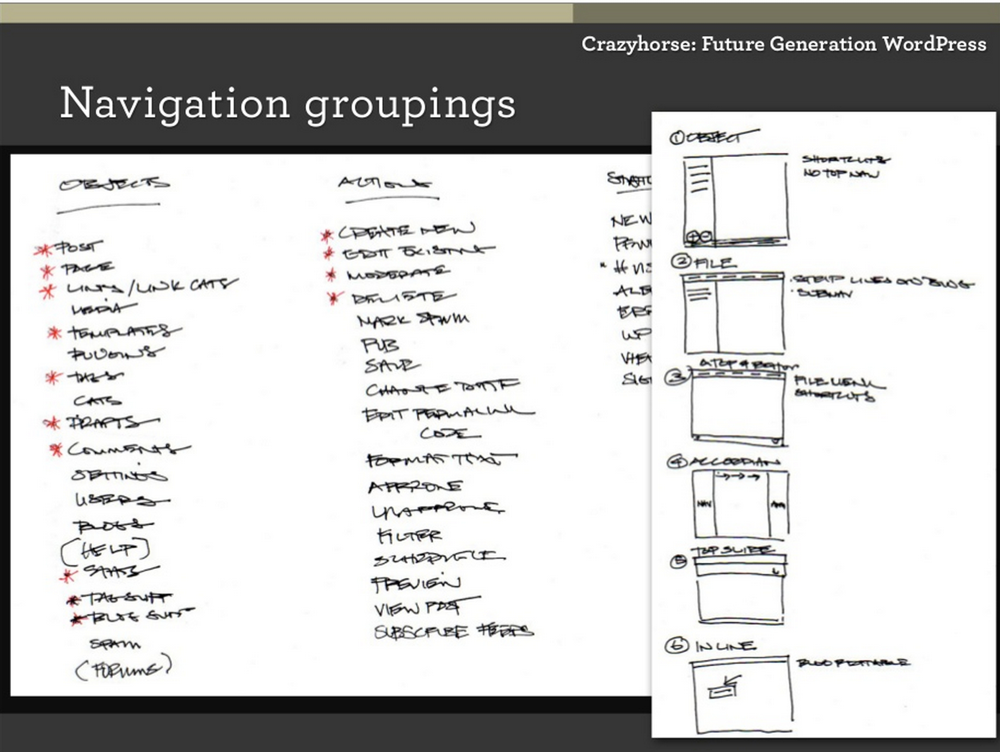

## 30. Riding the Crazyhorse

WordPress 2.7 brought in what Ryan Boren describes as “the modern era of WordPress”.  It also brought a new face to the WordPress project. When the reaction to WordPress 2.5 was less than positive, there was the question of whether whether the problem was inherent to the user interface, or whether people didn’t like it because they felt cut out of the process. Jen Mylo ([jenmylo](http://profiles.wordpress.org/jenmylo)) [^fn-1], an old friend of Matt, was running a usability testing and design centre at an agency in New York in conjunction with Ball State University. The centre carried out usability studies, including using eye tracking technologies. The agency’s usual clients were big companies like television networks such as ABC, NBC, and MTV. When a TV network didn’t have a product ready in time for a test window, Jen was able to offer the slot to WordPress at cost price. 

The usability review consisted of three main stages. First of all, WordPress 2.5 was tested, and some recommendations were drawn up for "low hanging fruit" that would make some improvements to the admin. Following that, the development team created a prototype (Test1515) based on the recommendations to see if they improved users' experience. These two stages constituted Round 1. Finally, based on the Test1515 findings, the Crazyhorse prototype was created and tested in Round 2.

The research team used three main methods for testing:

1. Talk-aloud, in which the participants are asked to think aloud as they carry out tasks.
2. Morae Software records screen activity and videos the participants, and enables researchers to watch remotely.
3. Eye-tracking technology identifies granular problems.

The [twelve participants involved](http://en.blog.wordpress.com/2008/05/20/new-york-usability-testing/) were tested with a broad range of activities across the WordPress admin. In Round 1, despite finding WordPress generally easy-to-use, the researchers identified a number of problems, including:

1. Verbs vs nouns - users found it difficult to conceptualize their tasks as action-oriented (Write/Manage), instead they thought of their content in a more object-oriented way (Posts, Pages, Comments, etc)
2. Users didn't spend time on the Dashboard. They just used it as an entry point for other pages.
3. The Write Post screen caused problems for users. Tags and categories appeared below the fold, and some participants forgot to add categories and tags before publication, returning to the post screen to add them afterwards. 
4. The comments screen was confusing. Users weren't aware that they had to click a commenter's name to edit a comment, and when they were asked to move a comment to spam they looked in the wrong place.
5. Users were confused by the difference between uploading and embedding media in the media uploader.

On top of this there were a number of minor issues around settings, the media library, link categories, and tag management. Users also demonstrated a desire to have more control over the modules, on the dashboard and the post edit screen, for example.

The usability test report says the following:

> In addition to a laundry list of small interface issues that presented simple fixes, such as changing comment author links, we were faced with larger issues such as the desire for user-determined hierarchies on long/scrolling screens, ambiguity in the Write/Manage navigation paradigm, and a disconnect between the act of adding media to a post and the ability to manage it.

While minor changes were incorporated into the Test1515 prototype and tested, they were so minor that participants didn't have a strong reaction either way. It was instead decided to use the results from Round 1 to create a more drastic prototype. The prototype had some guiding principles:
- maximize vertical space
- reduce scrolling
- increase access to navigation to reduce unnecessary screen loads
- enable drag and drop on screens that would most benefit from user control
- redesign management screens to take advantage of natural gaze paths.

Jen and Liz Danzico, who continued to work on WordPress’ usability in the Crazyhorse project, created the prototype. They sketched multiple ideas: front-end ending, accordion panes, and a top navigation. In the end the version that they picked for the prototype was the simplest - a left hand navigation panel, similar to Google Analytics and other web apps.

A branch was made in Subversion where WordPress [developers built the prototype](http://lists.wordpress.org/pipermail/wp-hackers/2008-June/020652.html), [based on the prototype document](http://ma.tt/dropbox/2008/06/wordpress-prototype-1.1.pdf) that outlined the changes and the reasons for them. The focus of the project was on user experience and functional development, so the prototype kept the same visual styles as WordPress 2.5. As with the previous round of testing, the participants carried out a series of tasks and the progress was assessed using talk-aloud, Morae, and eye tracking. 

Most responses demonstrated a preference for Crazyhorse over WordPress 2.5 and every new feature that was tested provided actionable information for the next version of WordPress. 

Participants loved new position of the navigation, for example, at the left hand side of the screen. They also preferred the object-oriented approach to organization (Posts, Pages, Media, etc). 

The new Dashboard was considered more useful, and people like the ability to customize it to their own needs. They liked the idea of QuickPress, though they weren't sure if they would use it. With action links now positioned under the comments, users found it easier to edit and act on comments. 

The new Write screen had a drag and drop feature, which allowed users to decide which elements to give the best screen real estate. They also liked having access to post comments and felt that the new media uploader, with its clear integration with the media library, was a huge improvement.

The only major negative responses were to a bottom publising bar that floated at the bottom of the screen. Users tended to look at the bar a few times before realising that it contained the Publish button. Some users compared it to a banner ad or thought it was part of their browser. 

While Happy Cog and Crazyhorse undertook user research, they ended up with quite different results. For Happy Cog, Liz conducted a series of interviews with community members, and later on she carried out in-person user testing. The Crazyhorse project, however, made use of eye tracking technology. This meant that the testers didn't have to rely solely on what participants said; instead they had insight into what the participants were looking at while they were making statements. Not only that, but gaze trails provided insight into the way that users were navigating the screen with their eyes - where were they drawn to first, were they missing important UI elements, did they understand what they were seeing?

With the success of the prototypes, the next stage was to put a design layer on top. When Crazyhorse was [first merged with trunk](https://core.trac.wordpress.org/ticket/7552) it was just a set of live wireframes. No design changes were, preventing participants from being swayed by whether they had a preference for a particular color or typeface. But by the time of the Automattic meetup in Breckenridge, Colorado, in 2008, Crazyhorse was ready to have some color added. 

At Automattic meetups, the company splits up into small groups to work on projects which are assigned at the beginning of the week. Everyone was given their assignments, and for Matt Miklic, MT, ([iammattthomas](http://profiles.wordpress.org/iammattthomas)) [^fn-2] was given the task of WordPress. He was given Crazyhorse and free reign to give it the coat of paint it needed. Jen and MT spent the entire week working on the admin redesign. A number of designs were produced - a heavy blue that harked back to the Shuttle-inspired version of WordPress, and a version that used the light blue, greys, and orange of Happy Cog. In the end the two were melded into a grey color scheme that became a feature of WordPress until 2013. Crazy horse brought a huge number of changes to WordPress, with the admin completely transforming. To deal with all of these changes, a new committer was added, Andrew Ozz ([azaozz](http://profiles.wordpress.org/azaozz)).

A marked distinction in process between the Happy Cog redesign and Crazyhorse was that Jen ensured that the community was kept abreast of what was going on. The testing itself was carried out as an adjunct to the WordPress project, with little community involvement; the reason for the testing was to see if there was an actual usability flaw or whether people simply didn't like the new design. If it had been just a matter of users not liking the new colors, the Crazyhorse project would have come to nothing. But when it became obvious that the WordPress interface did need to change, a dialogue was started in the community. The [designs were shared on the development blog](http://wordpress.org/news/2008/10/the-visual-design-of-27/), as was the [usability report](http://wordpress.org/news/2008/10/usability-testing-report-25-and-crazyhorse/), a [survey was carried out about the navigation options](http://wordpress.org/news/2008/09/wordpress-27-navigation-options-survey/), and [issues were discussed on the wp-hackers mailing list](http://lists.wordpress.org/pipermail/wp-hackers/2008-October/021944.html). When WordPress 2.7 was released, the [launch post](http://wordpress.org/news/2008/12/coltrane/) lists all of the posts written by Jen and the developers about the process. Up to that point, it is the only iteration of the WordPress admin to have such an information trail.

In 2008 alone the WordPress admin changed drastically, twice. When [screenshots of the changes made their way onto community blogs](http://weblogtoolscollection.com/archives/2008/09/02/first-look-at-wordpress-27/), the inevitable question was "why are they changing it again?" There had been no time for the WordPress 2.5 design to settle in before another huge change came about in 2.7. A change in the UI meant that users of varying skill levels needed to completely relearn how to use WordPress. Not only that, but there was a growing community of people who had created tutorials with screenshots and videos on how to use WordPress. Every screenshot would need to be retaken, every video re-shot. However, when WordPress users started upgrading the [feedback was positive](http://lorelle.wordpress.com/2008/12/10/wordpress-27-available-now/#comments). Users loved the new interface, finding it easy to use and intuitive, and demonstrating finally that it wasn't change they had been unhappy with just nine months earlier, but the interface itself.

There were other major changes in WordPress 2.7. The WordPress Plugin Repository was made available to users through the admin screens. Users no longer had to download a plugin and upload it using FTP. They could search the plugin directory for the features they needed right from their admin, and install the plugin with just a few clicks. This made it much easier for WordPress users to quickly find and install plugins, removing the barrier to entry that came with FTP. There were also improvements to WordPress’ documentation. [PHPDocumentor was added in WordPress 2.7](http://lists.wordpress.org/pipermail/wp-docs/2008-October/001769.html), when there was a big push by Jacob Santos ([jacobsantos](https://profiles.wordpress.org/jacobsantos/)) and Jennifer Hodgdon ([jhodgdon](https://profiles.wordpress.org/jhodgdon)) to get functions in WordPress documented in the code. There was also the beginning of an [official user handbook](http://lists.wordpress.org/pipermail/wp-docs/2009-January/001862.html).	

After completing the Crazyhorse redesign Jen was employed by Automattic to work on the WordPress software. At that time, the project was still small - bigger than the early days of the cluster of bedroom hackers who built the platform, but not as big nor as diverse as it is today. There was a close group of core developers who led the project working in IRC and a Skype chat room. In [October 2008, she made her first appearance on wp-hackers](http://lists.wordpress.org/pipermail/wp-hackers/2008-October/021899.html). What she brought to the project was a fresh set of eyes and a completely new perspective. So far the project had been run by a group of hackers, many of whom were sympathetic to the needs of users but who weren’t always able to put themselves in the user’s shoes. Jen had a background in user testing and user experience, something that was largely absent in the community until she joined the project. “Having someone with an actual formal training in testing and user experience, it was just useful,” says Mark Jaquith now. “It was not just useful then, but it also changed us. Or at least it changed me. Where I started thinking in these ways as well and becoming better at stepping out of my own head.”

This new focus on user testing and user experience meant that the project was able to hone its focus on users. With the number of WordPress users growing, this meant ensuring that the software didn’t just work for a small group of bloggers but for everyone who wanted to install it.

[^Fn-1] At that time Jen Mylo’s name was Jane Wells. Her name changed in 2014.
[^fn-2] At that time Matt Miklic’s name was Matt Thomas. His name changed in 2014.
