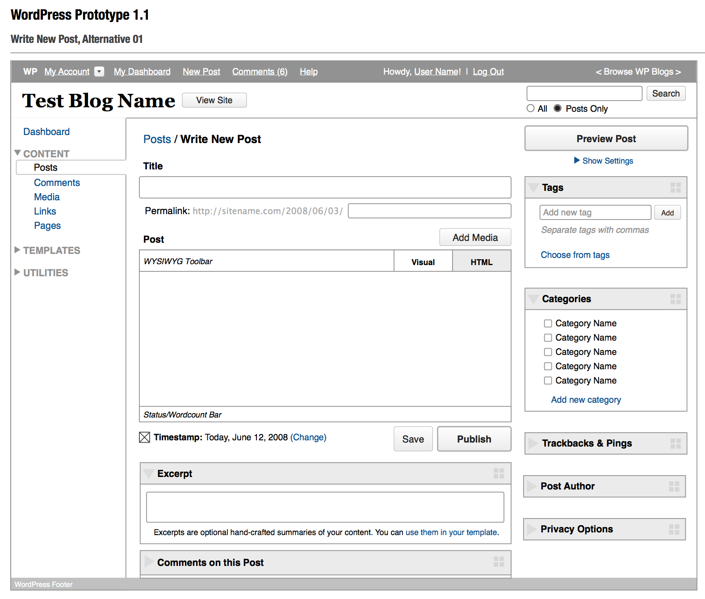
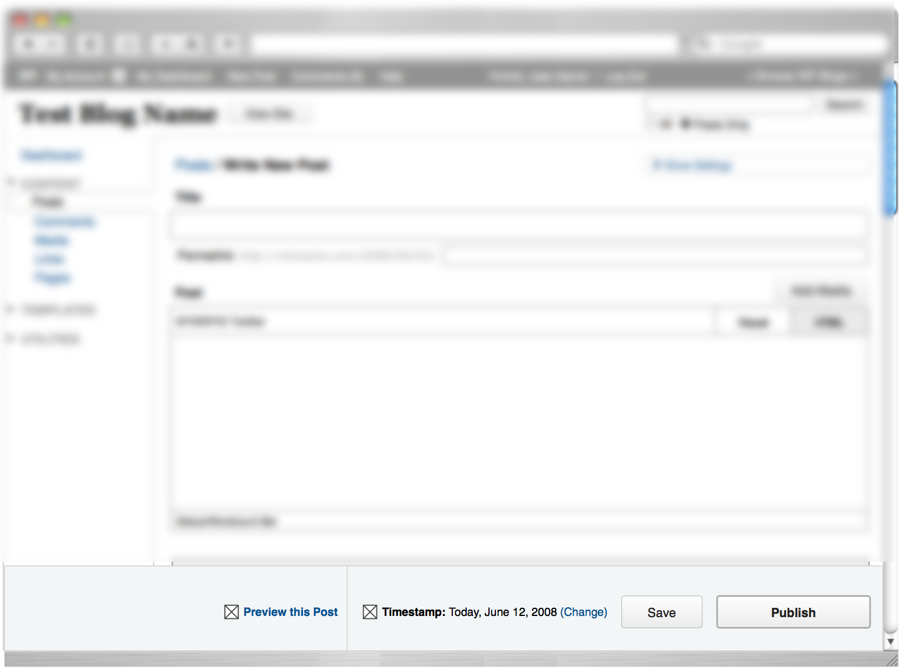

## 30. Riding the Crazyhorse

According to Ryan Boren, WordPress 2.7 ushered in “the modern era of WordPress.” It also brought a new face to the WordPress project. WordPress 2.5's redesign wasn't well received, though the reasons why weren't clear. Was the user interface the problem? Or did people dislike it because they felt cut out of the process? 

Jen Mylo (<a href="http://profiles.wordpress.org/jenmylo">jenmylo</a>)[^fn-1] and Matt are old friends. At the time, she ran a usability testing and design center at a New York agency in conjunction with Ball State University. The center's usability studies used the latest eye-tracking technologies with clients, including television networks such as ABC, NBC, and MTV. When a TV network missed a usability test window, Jen offered the slot to WordPress at cost. 

The usability review had three stages conducted in two rounds. In Round 1, they tested WordPress 2.5, gathering "low hanging fruit" recommendations to improve the admin's UI. Using the recommendations, the development team created and tested a prototype (Test1515) to learn whether users' experiences had improved. In Round 2, they created and tested a more drastic prototype -- dubbed Crazyhorse [^fn-2] -- based on the Test1515 findings.

The research team used three main testing methods in Round 1:

<ol>
<li>Talk-aloud, in which participants are asked to think aloud as they carry out tasks.</li>
<li>Morae screen activity and video recordings, which allow researchers to watch participants remotely.</li>
<li>Eye-tracking technology to identify granular problems.</li>
</ol>

<a href="http://en.blog.wordpress.com/2008/05/20/new-york-usability-testing/">Twelve participants</a> tested WordPress' admin. In Round 1, despite finding WordPress generally easy-to-use, the researchers identified several problems, including:

<ol>
<li>Verbs vs. nouns: users found it difficult to conceptualize tasks because they weren't action-oriented (Write/Manage). Instead, users perceived content in a more object-oriented way. (Posts, Pages, Comments, etc.)</li>
<li>Users didn't spend time on the dashboard. They used it as an entry point for other pages.</li>
<li>The write post screen caused problems for users. Tags and categories appeared below the fold; some participants forgot to add categories and tags before publication -- returning to the post screen to add them afterward.</li>
<li>The comments screen was confusing. Users didn't understand that they had to click on a commenter's name to edit a comment; they looked in the wrong place when asked to move a comment to spam.</li>
<li>The difference between uploading and embedding media in the media uploader confused users.</li>
</ol>

Round 1 testing on WordPress 2.5 uncovered minor issues with settings, the media library, link categories, and tag management. Users also wanted more control over dashboard modules and the post edit screen.

<blockquote>In addition to a laundry list of small interface issues that presented simple fixes, such as changing comment author links, we were faced with larger issues such as the desire for user-determined hierarchies on long/scrolling screens, ambiguity in the Write/Manage navigation paradigm, and a disconnect between the act of adding media to a post and the ability to manage it. -- <a href="https://github.com/WordPress/book/blob/master/Resources/articles/2008_07_Usability_Report_Crazyhorse.pdf">Usability Test Report</a> (PDF)</blockquote>

Minor changes were incorporated into the Test1515 prototype and tested -- though they were so minor that participants didn't react strongly either way. The team created Crazyhorse to:

<ul>
<li>maximize vertical space,</li>
<li>reduce scrolling,</li>
<li>increase access to navigation to reduce unnecessary screen loads,</li> 
<li>enable drag and drop on screens that would most benefit from user control, and</li>
<li>redesign management screens to take advantage of natural gaze paths.</li>
</ul>

Jen and Liz Danzico -- who continued to work on WordPress’ usability in the Crazyhorse project -- created the design for the prototype. They sketched multiple ideas: front-end editing, accordion panes, and a top navigation. They chose the simplest prototype: a left-hand navigation panel, similar to Google Analytics and other web apps.

*The Dashboard in the Crazyhorse prototype.*

WordPress <a href="http://lists.wordpress.org/pipermail/wp-hackers/2008-June/020652.html">developers built the Crazyhorse prototype in a Subversion branch</a>, <a href="http://ma.tt/dropbox/2008/06/wordpress-prototype-1.1.pdf">based on the prototype document</a> (PDF), which outlined changes and rationale. The project focused on user experience and functional development, so the prototype retained WordPress 2.5's visual styles. As in Round 1 testing, participants carried out tasks; talk-aloud, Morae, and eye-tracking helped assess results.

Most participants preferred Crazyhorse over WordPress 2.5 and every new feature tested provided actionable information for the next version of WordPress. 

Participants loved the navigation on the left-hand side of the screen. They also preferred the object-oriented approach to organization. (Posts, Pages, Media, etc.) 

Participants thought the Crazyhorse dashboard was more useful, and people appreciated the ability to customize it. They liked QuickPress, though they weren't sure if they would use it. With action links beneath comments, users found it easier to edit and moderate them. 

*The Write Screen in the Crazyhorse prototype.*

The new Write screen had a drag and drop feature -- allowing users to decide which elements got prime screen real estate. They also liked access to post comments; they felt that the new media uploader -- with media library integration -- was a huge improvement.

*The bottom publish bar in the Crazyhorse prototype.*

Users panned a publishing bar that floated at the bottom of the screen -- they'd look at the bar a few times before realizing it contained the Publish button. Some users compared it to a banner ad or thought it part of their browser. 

While Happy Cog and project Crazyhorse did user research, they ended up with quite different results. For Happy Cog, Liz interviewed community members and conducted in-person user testing. The Crazyhorse project, however, used eye-tracking technology. This meant that the testers didn't have to rely solely on what participants said; they had insight into what participants were actually looking at during tests. Additionally, gaze trails revealed how users navigated the screen with their eyes, allowing testers to ask: what draws user attention first? Do they miss important UI elements? Do they understand what they're seeing?

With the Crazyhorse prototypes a proven success, fleshing out its design was the next step. When Crazyhorse <a href="https://core.trac.wordpress.org/ticket/7552">first merged with trunk</a>, it was a set of live wireframes. Design changes had not been introduced to prevent swaying participants by color or typeface preferences. By the time the Automattic meetup in Breckenridge, Colorado, took place in 2008, Crazyhorse was ready for some color. 

At Automattic meetups, small teams work on projects assigned at the beginning of the week. Matt Miklic (MT) (<a href="http://profiles.wordpress.org/iammattthomas">iammattthomas</a>) [^fn-3] took on Crazyhorse with free design rein. In redesigning the admin, Jen and MT produced many designs. There was a heavy blue variant reminiscent of Shuttle-inspired WordPress, and a version using the light blue, grays, and orange of Happy Cog. Eventually, these two main variants melded into a gray color scheme that WordPress featured until 2013. Andrew Ozz (<a href="http://profiles.wordpress.org/azaozz">azaozz</a>) received commit access to help implement the Crazyhorse changes. 

Jen's community connection differentiated the Happy Cog and Crazyhorse processes. She kept the community abreast of what was going on. She did testing as an adjunct to the WordPress project to verify actual usability flaws with little community involvement. If it had been just a matter of user color preferences, the Crazyhorse project would have been fruitless. But when testing revealed WordPress' interface needed to change, community dialogue ensued. The <a href="http://wordpress.org/news/2008/10/the-visual-design-of-27/">designs</a> and the <a href="http://wordpress.org/news/2008/10/usability-testing-report-25-and-crazyhorse/">usability report</a> were shared on the development blog. The team surveyed users on <a href="http://wordpress.org/news/2008/09/wordpress-27-navigation-options-survey/">navigation options</a>, and <a href="http://lists.wordpress.org/pipermail/wp-hackers/2008-October/021944.html">the community discussed issues on the wp-hackers mailing list</a>. When WordPress 2.7 released, the <a href="http://wordpress.org/news/2008/12/coltrane/">launch post</a> lists the posts Jen and the developers wrote about the process. Up to that point, it is the only iteration of the WordPress admin to have such an information trail.

With the Crazyhorse project, WordPress' admin changed drastically -- twice in 2008 alone. When <a href="http://weblogtoolscollection.com/archives/2008/09/02/first-look-at-wordpress-27/">screenshots of the changes appeared on community blogs</a>, the inevitable question was "why are they changing it again?" WordPress 2.5's design hadn't settled in before another huge change came about with the implementation of Crazyhorse in 2.7. A UI change meant that users of varying skill levels needed to relearn how to use WordPress; the growing WordPress tutorial community would need to retake every screenshot and reshoot every video. However, when WordPress users upgraded, the <a href="http://lorelle.wordpress.com/2008/12/10/wordpress-27-available-now/#comments">feedback was positive</a>. Users loved the new interface; they found it intuitive and easy to use -- finally demonstrating that it wasn't change they had been unhappy with just nine months earlier -- but the interface itself.

*The Write Screen in the WordPress 2.7 admin.*

WordPress 2.7 brought the WordPress Plugin Repository to the admin screen. Users no longer had to download a plugin and upload it using FTP. They could search the plugin directory for the features they needed right from their admin, and install the plugin with just a few clicks. This made it much easier for WordPress users to quickly find and install plugins, removing FTP's technical barrier to entry. 

WordPress’ documentation also improved. In December 2006, Matt posted to wp-hackers, <a href="http://lists.automattic.com/pipermail/wp-hackers/2006-December/009812.html">apologizing for his stance on inline documentation</a>. <a href="http://core.trac.wordpress.org/ticket/2474#comment:7">Inline documentation patches</a> were <a href="http://core.trac.wordpress.org/ticket/2473#comment:3">committed to core</a>. In WordPress 2.7, <a href="http://lists.wordpress.org/pipermail/wp-docs/2008-October/001769.html">PHPDocumentor was added</a>, through a big push by Jacob Santos (<a href="https://profiles.wordpress.org/jacobsantos/">jacobsantos</a>) and Jennifer Hodgdon (<a href="https://profiles.wordpress.org/jhodgdon">jhodgdon</a>) to get WordPress functions documented in the code. There was also the beginning of an <a href="http://lists.wordpress.org/pipermail/wp-docs/2009-January/001862.html">official user handbook</a>.	

After completing the Crazyhorse redesign, Jen joined Automattic to work on WordPress. At that time, there was a close core developer group who led the project working in IRC and in Skype. In <a href="http://lists.wordpress.org/pipermail/wp-hackers/2008-October/021899.html">October 2008, Jen first appeared on wp-hackers</a>. She brought fresh eyes and a completely new perspective. Her background in user testing and user experience was largely absent in the community until she joined the project. “Having someone with actual formal training in testing and user experience, it was just useful,” <a href="http://archive.wordpress.org/interviews/2013_11_22_Jaquith.html#L71">says Mark Jaquith</a>. “It was not just useful then, but it also changed us. Or at least it changed me. Where I started thinking in these ways as well and becoming better at stepping out of my own head.”

This new focus on user testing and user experience meant that the software would work for everyone who wanted to install it -- not just a small set of users. 

[^fn-1] At that time Jen Mylo’s name was Jane Wells. Her name changed in 2013.

[^fn-2] Unlike WordPress releases, smaller projects, like Crazyhorse, don't always follow the jazz-musician naming convention.

[^fn-3] At that time Matt Miklic’s name was Matt Thomas. His name changed in 2014.
