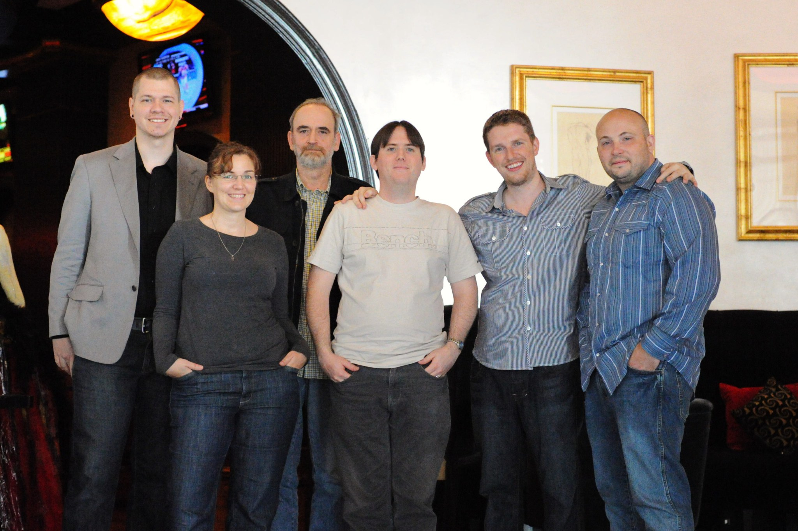

## 33. Meeting in Person

In December 2009, the core team -- Matt, Mark, Ryan, Westi, Andrew, and Jen -- met in Orlando, Florida. Despite working together on the project for years, it was the first time that some of them were meeting face to face. Working from the Bohemian Hotel lobby, they <a href="https://wordpress.org/news/2009/12/intermission/">discussed live project issues</a>, including “the merge, canonical plugins, the WordPress.org site, community stuff, and all the other things that are important but that we never seem to have time to address.” As well as discussing WordPress' vision and goals, they had a trac sprint that edged them closer to shipping WordPress 2.9.

*From left to right: Mark Jaquith, Jen Mylo, Andrew Ozz, Peter Westwood, Matt Mullenweg, Ryan Boren.*

They <a href="http://wordpress.org/news/2009/12/core-team-meetup-results/">posted results to the WordPress news blog</a>, highlighting the breadth of the discussion: 	

<blockquote>Direction for the coming year(s), canonical plugins, social i18n for plugins, plugin salvage (like UDRP for abandoned plugins), WordPress/MU merge, default themes, CMS functionality (custom taxonomies, types, statuses, queries), cross-content taxonomy, media functions and UI, community “levels” based on activity, defining scope of releases, site menu management, communications within the community, lessons learned from past releases, mentorship programs, trac issues, wordpress.org redesign, documentation, community code of conduct.</blockquote>

Meeting in person allowed them to bounce ideas off of one another and to get work done. Jen recalls:

<blockquote>We sat in these red velvet chairs in the bar of the Bohemian Hotel in Orlando, and when it was time to eat we would go into the dining room and we would eat. And we'd come back and we'd work, and we were on our laptops and actually going through trac as well. And doing bug scrubs, but then we would stop and we would have just conversations and we'd go outside maybe or we'd go out to lunch. And so we kind of mixed it up, and it was just so helpful. Both in terms of just getting to know each other better, and the actual work.</blockquote>

Meetups continue to be part of core development, from small and focused ones with the core team to large gatherings involving the whole community. Members meet at WordCamps, or at dedicated meetups to do code sprints and to discuss the general project and development direction. They provide an opportunity for people to discuss issues without the barrier of a screen, and also to socialize, hang out, and get to know one another better. When community members meet, they generate new ideas and thrash out old ideas in detail. Meetups aren’t, however, without side effects. Meeting in person, by its nature, excludes everyone who isn’t physically present. In a free software project, it's important to balance offline meetups with online activity, which allows everyone to have a say.

The canonical plugins project was discussed at the first core meetup. The WordPress plugin repository was growing, and many plugins did the same thing. Large, complex plugins can transform WordPress, though some plugins had poor code quality, while some were out of date. Sometimes, a developer drops a plugin, leaving users without support or updates -- a big problem if a user relies heavily on the feature. The core development team felt that some plugins warranted a similar process to the core development process, where a group of coders lead a plugin's development, deciding what goes in and what doesn’t, in a similar way to how WordPress, BuddyPress, and bbPress are developed. Rather than having ten SEO plugins, or ten podcasting plugins, for example, there would be one canonical plugin, sanctioned by core with its own official development team. 

WordPress’ core development team supported the proposal, which <a href="http://wordpress.org/news/2009/12/canonical-plugins/">Jen wrote about on the blog</a>; the strong relationship between WordPress core and canonical plugins would ensure plugin code was secure, that they exemplified the highest coding standards, and that they would be tested against new versions of WordPress to ensure compatibility.

Early discussions focused on what to call this cluster of plugins. The community voted and decided on “Core plugins.” Then, a team got to work, which included Westi, Aaron Campbell (<a href="http://profiles.wordpress.org/aaroncampbell">aaroncampbell</a>), Austin Matzko (<a href="http://profiles.wordpress.org/filosofo">filosofo</a>), Stephen Rider (<a href="http://profiles.wordpress.org/Strider72">Strider72</a>), and Pete Mall (<a href="http://profiles.wordpress.org/PeteMall/">PeteMall</a>).

<a href="https://wordpress.org/plugins/health-check/">Health Check</a>, which checks a website for common configuration errors and known issues; PodPress, a popular podcasting plugin which had been abandoned; and a proposed plugin to shift the post by email functionality from core into a plugin were the first canonical plugins. 

But plugin developers weren’t so enthusiastic. They liked having ownership over their own plugins. The WordPress project was accused of trying to stifle the growing plugin market. Discussions continued among developers about how core plugins might influence them. Justin Tadlock <a href="http://onefinejay.com/2010/01/10/shackling-a-free-market-wordpress-canonical-plugins/comment-page-2#comment-7578">said</a>:

<blockquote>There’s been some great discussion here, but it seems a little one-sided. Most of the people leaving comments are developers. What would make the conversation much better would be to hear from more end users.

I will refrain from sharing my opinion until I can gauge what a larger portion of the user base is feeling because, quite frankly, that’s the portion of the community that influences my opinion the most.</blockquote>

User feedback on the thread was positive: any help sifting through the mass of WordPress plugins was a benefit. Why should users have to sift through fifty contact form plugins when there could be one, officially sanctioned plugin that could serve 80% of users? The project didn't intend to kill off the plugin market, and Mark Jaquith <a href="http://onefinejay.com/2010/01/10/shackling-a-free-market-wordpress-canonical-plugins/comment-page-2#comment-7589">tried to calm developer fears</a>: “Core plugins will be safe and stable,” he wrote, “but limited in scope and probably a little bit boring and not completely full-featured."

The core plugins project, however, was beset by other problems. While there was potential for success, they lacked the tools to work effectively across a broad group of plugins. “We didn't have the toolset at the time to do it properly,” <a href="http://archive.wordpress.org/interviews/2014_06_05_Campbell.html#L32">says Aaron Campbell</a>, “without stepping outside of the WordPress ecosystem quite a bit and relying on something like a GitHub or something like that, which we prefer not to rely on for things that are really kind of the core of WordPress.” 

To properly manage core plugins, the WordPress project’s infrastructure would have to change. When the plugin repository was built, it was designed with one author per plugin; developer collaboration tools didn't exist. (While the plugin repository has become more flexible -- it’s now possible, for example, to have multiple plugin authors -- traditional developer collaboration tools are still lacking.) A system to submit contributions, discuss and modify patches, and merge them are useful for multiple developers working on a single plugin. To develop WordPress, tools have been built around the Subversion repository to make that possible, and the modified trac instance encourages collaboration. But each core plugin would need a replica of the infrastructure that WordPress uses itself, and it became obvious that the plan was untenable.	

On top of this, many of the developers were burned out from WordPress 2.9 (and taking a break with the promise of a major release cycle in WordPress 3.0). They didn’t have the time or energy to build core plugins, as well as develop the core product itself. Despite the coverage the project got across the community, and despite the initial burst of energy, the canonical plugins project eventually fizzled out.
