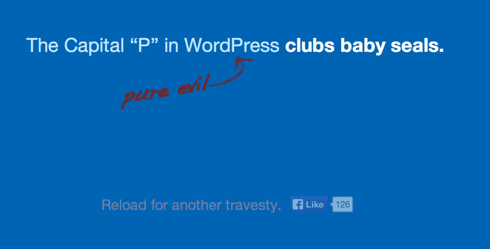

## 36. WordPress 3.0

2010 the year of WordPress 3.0. This brought in more iterations of the software, the development process, and the project structure. It was the start of a much wider commit policy, changes that shaped how the project works today. It was also another cycle which saw one of WordPress’ philosophy’s - _deadlines are not arbitrary_ - being seriously challenged.

One of the major changes was the number of new committers added during the 3.0 release cycle. In January 2010, Dion Hulse ([dd32](http://profiles.wordpress.org/dd32)) was given commit access. He was initially focused on the areas of automatic upgrades and HTTP. In the [post announcing Dion’s commit access](https://make.wordpress.org/core/2010/01/12/dd32-whatcha-gonna-do/), Matt outlines a new goal for the project:

> One of the goals for the team in 2010 is to greatly expand the number of people with direct commit access, so the emphasis is more on review and collaboration. Right now commit access is tied up with being a “lead developer,” of which we’ve always found a small group of 3-5 works best, but now we want commit to be more a recognition of trust, quality, and most importantly activity, and something that can dynamically flow in and out as their level of commitment (har har) changes and decoupled from the “lead dev” role.

This was a big change from prior days when every patch had to go through either Matt or Ryan. It was also significant that commit access be decoupled from the lead developer role. There was a need to give more trust to contributors without necessarily giving them leadership roles within the project. While there were no formal rules, contributors started to be given commit access for particular areas that they had contributed to. Ron Rennick ([wpmuguru](https://profiles.wordpress.org/wpmuguru)), was focused on multisite, Dion who was focused on HTTP, Daryl Koopersmith ([koop](https://profiles.wordpress.org/koop)), was give commit to work on front-end development, while Andrew Nacin ([nacin](http://profiles.wordpress.org/nacin)) was a generalist across the codebase.

As well acting as a symbol of trust, this new approach to commit access meant that tickets could be dealt with more quickly and bottlenecks cleared. When the lead developers had their attention diverted by their work or their lives the burden of the work always fell on Ryan Boren’s shoulders. Adding new committers would clear up this bottleneck, ensuring that tickets got reviewed and committed to the codebase. 

The release date for WordPress 3.0 was set for April 13th 2010. But as with the releases before it, despite having a deadline, development was focused on scope, rather than on a date. Headline features were discussed but focus was on the features, not on the date. At the [scope setting chat](https://irclogs.wordpress.org/chanlog.php?channel=wordpress-dev&day=2010-01-07#m51679) three main features were defined: merging WordPress MU with WordPress, menus, and a new default theme to replace Kubrick. 	

The merge of WordPress MU with WordPress came for a number of reasons. WordPress MU was difficult to maintain. The code was 95% the same as the main WordPress codebase and Donncha had to manually merge over new features after a release.  Also, WordPress MU wasn’t getting a lot of attention from plugin developers - it felt separate to the main WordPress project. To give users a clean upgrade path WordPress MU was merged with WordPress. They could have simply added a multisite feature to core but this would have left WPMU users languishing on an outdated piece of software that might end up being forked.

Ron Rennick was brought onboard to assist with the merge. He had been using WordPress MU for a number of years for the homeschooling blogging network that he ran with his wife, Andrea. He had written a script which ran on a WordPress install to turn it in to a WordPress MU install. He was able to reverse engineer his script to bring MU functionality into WordPress, ensuring that there was a utility to convert a single WordPress install to a Multisite install.

Ron ran a diff [fn^1] against all of the WordPress MU code, looked for differences in the codebase and [merged that into WordPress core](https://core.trac.wordpress.org/ticket/11644). The code was then cleaned up by Ryan Boren and Andrew Nacin. Ron also developed additional features in plugins, like [domain mapping](http://wordpress.org/plugins/wordpress-mu-domain-mapping/), that were absent from WordPress MU. 	

The original plan was that users be able to upgrade to WordPress Multisite by just clicking a button. “The reason we decided not to do that,” recalls Ron,  “is that a lot of the shared hosts would not have been happy if their users could just take any WordPress install, click a button, without actually knowing anything about what was going to happen and convert it over to Multisite.  The decision was made to actually make it a physical process that they had to go through.” In order to change a WordPress installation into Multisite, WordPress users have to edit wp-config. They need basic technical knowledge.

One of the biggest headaches surrounding the merge wasn’t to do with code, but was rather to do with terminology. In WordPress 3.0, the project decided to move away from “blog”  terminology and instead refer to a WordPress installation as a “site”.  It was more  more and more people were using it as a CMS so the “site” label felt more appropriate. However, in WordPress MU, the parent - example.org - is a site, and the subdomain blog.example.org is a blog. With WordPress MU and WordPress to merge, which one was the site? An individual WordPress install, or a WordPress install that hosted many blogs? WordPress MU became WordPress Multisite, but that wasn’t the end of it.	

WordPress MU had a function get_site_option, which gets options for the entire network, and get_blog_option which gets options for individual sites. The functions, therefore, don’t relate entirely to the user interface. That was just one of the functions that caused them problems, [as Andrew Nacin outlined in a post on his blog](http://nacin.com/2010/03/25/terminology-nightmare-blogs-sites-networks/).	

Another huge change for developers in WordPress 3.0 was custom post types and custom taxonomies. The default content types in WordPress are posts, pages, attachments, revisions, and nav menus (from WordPress 3.0), and the default taxonomies are categories and tags. However, from 3.0 onwards there was better support for custom post types and custom taxonomies. In WordPress 3.0, custom post types and taxonomies were given a user interface. So instead of being restricted to just Posts and Pages, developers could create themes and plugins that had completely new types of content for users: testimonials for a business site, reviews for a review site, or books for a book database website. This opened up totally new avenues for theme and plugin developers, and those building custom sites for clients. 

The big user-facing feature for WordPress 3.0 was menus. At the time it wasn’t easy for people to add navigation menus to their websites. Plugins that added menus to a site were extremely popular, so much so that it was obvious that the feature met the 80/20 rule - would 80% of WordPress users take advantage of the feature? If yes, put it in core, if not it stays in a plugin. The [ticket was opened at the start of January 2010](https://core.trac.wordpress.org/ticket/11817). The first approach was to make the menus interface act much like the widgets interface. By mid-February, however, little progress had been made. There were a number of competing proposals for how menus should work. Ryan and Jen got in touch with theme shop WooThemes to discuss bringing their [custom woo navigation](http://www.woothemes.com/2010/01/the-awesome-custom-woo-navigation/) into WordPress core. This was just days before the planned feature freeze on 15th February. 	

WooThemes’ custom navigation plugin was developed to make it easier for their users to add menus to their website. The developer, Jeffrey Pearce ([Jeffikus](https://profiles.wordpress.org/jeffikus)), was introduced to the core team and assigned to work with Ptah Dunbar ([ptahdunbar](https://profiles.wordpress.org/ptahdunbar)). The plugin needed to be modified for for core, and core needed to be updated to prepare for the feature. At the time, core didn’t have the version of jQuery that WooThemes was using so jQuery was updated.  The original WooThemes plugin created new database tables for the menus. The WordPress development team tries not to add additional tables to the MySQL database. Instead, core developers used Custom Post Types, which let them make use of functionality already available with core.

However, Jeffrey struggled with a factor that every distributed free software project has to work with - time zones. Jeffrey is based in South Africa, while much of the core development work goes on according to US time zones. The development chats were at 20:30 UTC, which was 22:30 in South Africa. Additionally, Ptah and Jeffrey kept missing each other on Skype.	

An environment in which everyone had a a voice and an opinion isn’t something that WooThemes was used to within their own development process. Adii Pienaar, who was then CEO of WooThemes, describes the process as excruciating. One of the main points of contention was that WooThemes had originally put the menus in the centre of the screen in the user interface, with the boxes to add menu items on the right hand side. WooThemes had put time into designing it that way but the [menu interface was flipped around](http://make.wordpress.org/core/2010/02/25/menus-ux-manifesto/) to follow the layout on WordPress’ interface that has a left to right convention.	

The integration of WooTheme’s menus into core was one of the first times that the project had worked directly with a commercial business (other than Automattic). While the process was not always completely smooth, both sides did benefit from the process. WordPress got its menu system. While not exactly the same as the menu system that WooThemes created, it gave the menus feature the kickstart that it was lacking. WooThemes got the satisfaction of seeing its code used by every WordPress user. [Not everyone felt that WooThemes received adequate credit](http://wptavern.com/woothemes-has-and-will-continue-to-get-credit), though this viewpoint wasn’t shared by Jeff. “Just to have our name on the contributors' wall, that to me was good enough,” he says. “It’s nice just to be able to say, I built a part of WordPress. No one can ever take that away from me. That was recognition enough for me.”	

WordPress 3.0 ended up being a huge release, and while discussion around menus went back and forth, shipping the product was delayed again and again. By April, the core team was still sending around wireframes and [discussing whether menus should be pulled from 3.0](https://irclogs.wordpress.org/chanlog.php?channel=wordpress-dev&day=2010-04-15&sort=asc#m109848. The [release candidate kept being pushed back]http://make.wordpress.org/core/version-3-0-project-schedule/). Matt posted on the development blog, [stating one of WordPress’ key philosophies](http://make.wordpress.org/core/2010/04/20/deadlines-are-not-arbritrary-theyre-a/):	

> Deadlines are not arbitrary, they’re a promise we make to ourselves and our users that helps us rein in the endless possibilities of things that could be a part of every release.	

Doing feature-led releases meant delays. Menus caused the particular hold-up with WordPress 3.0, with huge amounts of prevaricating about the user interface and the implementation. The final release was packed full of features that included the new menus, WordPress Multisite merged with core, custom post type and taxonomy UI, custom background and headers, and there was a refresh of the admin color scheme. Any of these features could have been pushed to the next release by there was no willingness to do so.

One of the more controversial changes in WordPress 3.0 was the [inclusion of a new function](https://core.trac.wordpress.org/changeset/14996) called capital_P_dangit.  This function corrects the spelling of WordPress from Wordpress to WordPress, I.e. capitalizing the P. 

People felt that [WordPress was messing with their content](http://justintadlock.com/archives/2010/07/08/lowercase-p-dangit), and that transforming Wordpress into WordPress was the start of a slippery slope. For some, it was a form of overbearing pedantry, for others it was censorship. After all, if someone wanted to write Wordpress instead of WordPress, why shouldn’t they? WordPress has no business changing what people wanted to write. People who were unhappy with the change, saw it as incommensurate with the core freedoms of the project - [openness, freedom, and community](http://justintadlock.com/archives/2010/07/08/lowercase-p-dangit).

A bigger problem was that in some instances the filter was breaking URLs. This was [reported prior to WordPress 3.0’s release](https://core.trac.wordpress.org/ticket/13583), but because the filter had already worked well on WordPress.com, it wasn’t fixed. For example, [a user reported on trac](https://core.trac.wordpress.org/ticket/13971) that his image, named “WordpressLogo_blue-m.png” was broken because it had been renamed to “WordPressLogo_blue-m.png”. Upon upgrading to WordPress 3.0, other users, those with folders named Wordpress, [experienced the same problem](http://wordpress.org/support/topic/images-not-appearing-3?replies=30#post-1559585). As well as folders, URLs with the spelling Wordpress were broken. Hosts saw an uptick in support request. "When 3.0 arrived,” says Mike Schroder ([dh-shredder](https://profiles.wordpress.org/dh-shredder)), of Dreamhost, “we had a deluge of support with broken URLs due to capital_P_dangit() applying to all content.  This was a particular problem because it was popular among customers to use '/wordpress' as a subdirectory for their install. We helped customers with temporary workarounds in the meantime, but were very happy to see the issue fixed in 3.0.1." Mark Jaquith [added a fix](https://core.trac.wordpress.org/ticket/13971#comment:15), but for many contributors it should never had got to the point at which the WordPress software was breaking users’ websites.

The capital_P_dangit function isn’t the only function in WordPress to filter content. Other filters include emoticons, autop, shortcodes, texturize, special characters, curly quotes, tag balancing, filtered HTML / kses, and comment link nofollows. From the perspective of many core developers, changing Wordpress to WordPress didn’t actually change the meaning of the sentence, except in edge cases such as the sentence “Wordpress is the incorrect capitalization of WordPress.”

[Core developers became frustrated](http://justintadlock.com/archives/2010/07/08/lowercase-p-dangit#comment-211354) by the hyperbole around the inclusion of the filter and by the amount of words spent arguing about it. In a comment in a post on Justin Tadlock’s blog, Mark Jaquith left the following comment:	

> Calling corrections censorship is absurd. It is no less absurd when the capitalization of a single letter is called censorship. There is actual censorship going on all around the world at this very moment. I’m damn proud of the fact that WordPress is being used to publish content that makes governments around the world afraid of the citizens who publish it. I’m incredulous that people are making a fuss about a single character (which is only one of dozens of automatic corrections that WordPress makes). It’s free software that is easily extended (or crippled) by plugins. If the thought of going the rest of your life without misspelling WordPress it too much to bear, you have an easy out. Take it, take a deep breath, and try to pick your battles.”	

[A website that Mark put together](http://capitalp.org/), reflects the position of many of the core developers about the capital_P_dangit discussion.	

While this had all of the [hallmarks of a bikeshed](http://lists.wordpress.org/pipermail/wp-hackers/2010-July/032919.html), there were some procedural issues that community members felt ought to be taken seriously. Whether the WordPress software capitalized the P in WordPress or not, the method with which the function was added to core broke accepted procedure - no ticket was opened, no patch was uploaded to trac, the code was simply committed. For some this set up an us and them mentality whereby some core developers could commit code as they felt, whereas everyone else in the community was subject to a different process.	

Despite these snafus in development, WordPress 3.0 saw WordPress mature even further as a platform, making “WordPress as a CMS” into a reality. It also introduced a new default theme for WordPress, ushering in a new approach to the default theme which saw a new one being released every year. Gone was Kubrick, with its bold, blue header, the new theme, Twenty Ten, showing off WordPress’ brand new menus feature.

WordPress 3.0 ushered in new changes to the project and the development process. It opened up WordPress to a new generation of people who became increasingly active. Over the coming releases, some of those committers would take on leadership both in terms of development and in the wider community. 

[^Fn-1] - a diff is a comparison tool that compares the difference between two files. 
