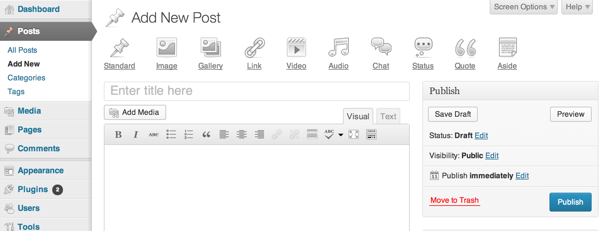

## 44. The Problem with Post Formats

The 3.6 release cycle was a challenging one, precipitating a new approach to the development process. Two core WordPress philosophies, _design for the majority_ and, again, _deadlines are not arbitrary_, were tested. The 3.6 release cycle process followed the contours of a cycle started in WordPress 3.4. There was a unified theme for the release -- this time [content editing](https://make.wordpress.org/core/2012/12/19/wordpress-3-6-cycle/). Small teams worked on key features. This approach didn’t account for the fact that some features need more research and development than can be achieved within a single development cycle. And it was in the WordPress 3.6 cycle that the flaw in this approach became obvious.

Post formats was 3.6's headline feature. Introduced in WordPress 3.1., [post formats](http://codex.wordpress.org/Post_Formats) is a theme feature that allows theme developers to give specific types of post a unique visual treatment. Much in the same way that Tumblr has different types of posts, like quotes or images, theme developers can style types of posts in different ways.	

Post formats lacked a standard user interface. In WordPress 3.6, release leads Mark Jaquith and Aaron Campbell tackled the problem. The release cycle was made up of a number of different stages: in the scoping chat, the release lead decided on the release's key features, created teams, and assigned feature leads. Feature leads ran their teams. The release leads coordinated with the teams and made the final decision on what went into the release.

Carrying out major user interface changes in just a few months is challenging at best. WordPress 3.5 demonstrated that to meet the deadline, the release leads needed to put in heroic coding efforts.

The 3.6 release encountered problems; [features were dropped](http://make.wordpress.org/core/2013/02/19/dropping-editorial-flow/) as contributors discovered they'd overcommitted themselves and dropped out. The biggest issue, however, was around the post formats user interface, inspired by  Alex King’s [Post Format’s Admin UI](http://alexking.org/blog/2011/10/25/wordpress-post-formats-admin-ui). Much thought and study went into the post formats UI. Which UI would offer users a logical, intuitive workflow, without making the UI or the experience needlessly complex?

The problem was that despite time spent on wireframes and development, the team ended up unimpressed. They had come up with the specifications, built to those specifications, and were unhappy with the final result. “It's like ordering something from the restaurant that sounds great,” [says Aaron Campbell](http://archive.wordpress.org/interviews/2014_06_05_Campbell.html#L71), “but as soon as it sits in front of you and you smell it, it's like, "Ahh, definitely not what I was in the mood for." Even during WordPress 3.6's beta period, community members [experimented with better approaches to the problem](http://ran.ge/2013/04/11/re-thinking-wordpress-post-format-ui-an-exercise/).	

*The post formats user interface*

April 29th was WordPress 3.6 target release date. On April 23rd, Jen, who had by that point stepped back from her involvement in development, [said that post formats weren't ready](http://make.wordpress.org/core/2013/04/23/post-formats-schedules-and-philosophy/). She said that the user interface was confusing, underscoring WordPress' _deadlines are not arbitrary_ philosophy. The thread, in addition to highlighting the post formats UI flaws, showed that not everyone on the development team was behind the _deadlines are not arbitrary_ clause. [Ryan Boren wrote](http://make.wordpress.org/core/2013/04/23/post-formats-schedules-and-philosophy/#comment-8523):

> The four month deadline is so fanciful as to be arbitrary. It always has been. Historically, we just can’t do a major release with a marquee UI feature in that time, certainly not without heroic efforts of the 3.5 sort. So we end up facing decisions like this. Every single release we wonder if we have to punt the marquee feature. Punting often requires major surgery that can be as much work as finishing the feature. Punting is demoralizing. Four month releases are empty promises that bring us here.	

In the end, [Mark and Aaron pulled the feature](http://make.wordpress.org/core/2013/05/29/post-formats-ui-is-exiting-core-will-live-as-a-plugin/). A lot of work had to go in to [removing it from core](https://core.trac.wordpress.org/ticket/24452); the release was heavily delayed, appearing on August 1st, 2013 -- three months after the intended release date. The team promised to turn the post formats feature into a plugin, but the plugin never materialized. 

Again, a user-facing feature held up a WordPress release. Because features were tied to the development cycle, it meant that the release cycle's duration restricted and compromised UI features and/or major architectural changes. Just like tagging before it, post formats had proved too complex a problem to solve in a few short months. It isn’t always easy to make interface decisions. It’s harder to iterate on design than on code. 

When the release deadline approaches and a feature isn't ready, the development team rushes to try to get it finished. The release is delayed by a week, and then by another week, and in some extreme cases, as was the case with WordPress 3.6, the release is delayed by months. By that point, it becomes impossible to give a firm date for when a release will happen. And the process becomes more complicated as the release lead oscillates between trying to improve a feature and deciding to pull it. Up until 3.6, there was no contingency plan built into the development process that allowed for these challenges in designing a user-facing UI. 

The solution to this problem was available, and always had been available, within WordPress’ infrastructure. Twice before, core user features had been pulled from plugins into core -- widgets and menus. Widgets had been built for the WordPress.com audience, turned into a plugin, and brought in to core. Menus had stumped the core development team and they solved that problem with a plugin. In both these cases, design and testing for the feature had taken place long before it got anywhere near core. And as the WordPress 3.6 cycle was dragging on, a small group of designers was working on a new WordPress feature in a plugin: it was a project called MP6. The project would be the flagship for a new approach to development that had a lasting impact on how features are developed in WordPress.

