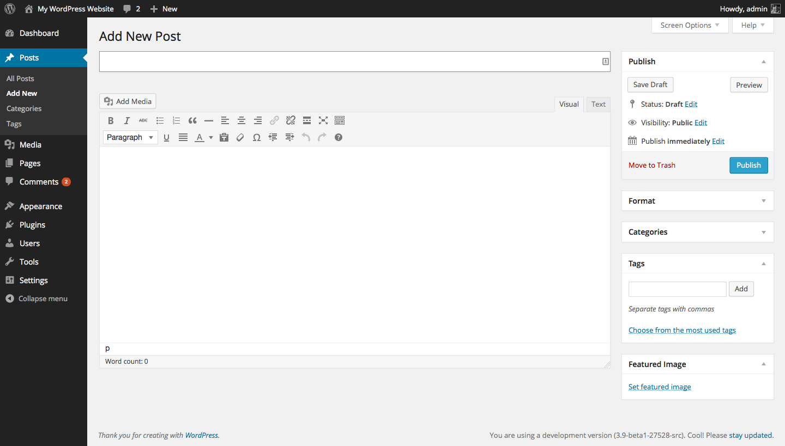

## 45. MP6

By 2013, the WordPress admin had seen little change since the Crazyhorse redesign in 2008. WordPress 3.6 looked the same as WordPress 2.7, apart from some minor color changes. 2013 was the year in which change happened, though this change didn’t only result in a new look for WordPress. The changes influenced the way in which WordPress features were developed, introducing approach of using a plugin for feature design, feedback, iteration, and eventual merge with core. 

In January 2013, [Ben Dunkle proposed new, flat icons](https://core.trac.wordpress.org/ticket/23333). The WordPress admin looked outdated, particularly on retina displays where the icons were pixelated. Flat icons would scale properly and also enable designers to color the icons using CSS. [Andrew Ozz checked in the changes](https://core.trac.wordpress.org/changeset/23369). 

The changes kicked off huge discussions about icons, [a new Trac  ticket](https://core.trac.wordpress.org/ticket/23415), and a [long discussion on the UI P2](http://make.wordpress.org/ui/2013/02/12/discuss-icons/). People were divided on the icons. Some liked them but felt that they didn't fit WordPress' admin design; modern icons only emphasized how dated the rest of the admin had become. Consensus didn't materialize. Mark, who was release lead at the time, decided not to put the changes in WordPress 3.6. Instead designers interested in redesigning the admin could play with the design in a plugin called [MP6](http://wordpress.org/plugins/mp6/). 	

Matt Miklic (MT), the designer who had put the original coat of paint on Crazyhorse, helmed MP6. Via Skype, Matt asked MT and Ben Dunkle to think about how a redesign might work, set parameters, and asked them to reimagine WordPress' admin. MT believed that Crazyhorse's UI research ought to be respected. Instead of iterating the layout and functionality, they would focus on an aesthetic refresh.

Both Matt and MT were keenly aware of the issues and challenges that had arisen in each major WordPress admin redesign. They wanted MP6 to be different. 

Shuttle, for example, had been cut off from the rest of the community, designed by a cloistered group of designers trading comps while slowly losing touch with "the client." Shuttle's issues were compounded by the fact that no one person was responsible for overall vision; there was no accountability. 

By contrast, the Happy Cog team had looked at WordPress with a fresh set of eyes. Their distance allowed them to treat WordPress as a piece of software, not as something that they were devoted to. They stayed in touch with their client -- Matt -- but were removed from the community's thoughts and opinions. MP6 solicited feedback from all of the people with a stake in the project. That brought its own challenges -- whose feedback was the most legitimate? What should be integrated? When was someone just complaining for the sake of it?

Crazyhorse emphasized the importance of in-depth user testing. The interface has to be both aesthetically pleasing and something users can interact with. With all of the testing that had gone into Crazyhorse, MT knew that he didn't want to carry out a structural overhaul and the extensive testing and data gathering needed to prove improvement. 

The MP6 project took a different approach. Like Shuttle, a group of designers worked alongside the free software project. Instead of a mailing list, they had a Skype channel so that they could talk in private, but anyone was allowed to join in. "Even though the group worked in private," [says MT](http://archive.wordpress.org/interviews/2014_02_04_Thomas.html#L76), "the door into the group we were working on was open, so if anyone said they were interested they could just walk in." This provided an opportunity for people to participate who were perhaps less comfortable with WordPress' chaotic bazaar. Designers traded ideas and feedback -- without the danger of someone coming out of nowhere and tearing an idea down before it was even fully formed. 

The MP6 project took advantage of WordPress’ plugin architecture. The work was carried out in a plugin hosted on the WordPress plugin directory. Anyone could install the plugin and see the changes in their admin. Every week, the group shared a release and a report open to public feedback. This open process meant that community members could be involved on different levels. It also meant that the group could never steer too far off course. The Core team were always aware of what was going on with MP6 and could provide feedback. More designers were involved than with Shuttle: the group grew to fifteen members. With MT as lead, they avoided the "too many cooks" problem. The designers and the community accepted that MT had the final say on the design.

The MP6 project was [announced in March 2013](http://make.wordpress.org/ui/2013/03/09/as-a-continuation-of-the-work-begun-in/). The design process began with MT playing around with the CSS. He started out with a unified black L-shaped bar around the top and the side of the admin screen: "the idea," [he says now](http://archive.wordpress.org/interviews/2014_02_04_Thomas.html#L104), "was that the black would feel like a background and the white would feel like the sheet of paper lying on top of it, so it would unify these disparate things." Once MT assembled the basic visual, the contributors refined the design. These changes happened iteratively. The community saw a report and a new plugin release each week, on which they could offer feedback. 

Challenges arose. [Google web fonts](http://make.wordpress.org/core/2013/11/11/open-sans-bundling-vs-linking/) caused heated discussion. Web fonts are designed specifically for the web. They’re often hosted in a font repository. A designer uses a CSS declaration to connect to the repository and the font is delivered to a website or app. MP6 uses the Open Sans font, which means that the font in WordPress' admin screens is hosted on Google's servers. Whenever a user logs into their admin the fonts are served from Google. Some don't want to connect to Google from their website; this also causes problems for people in whose countries Google is blocked. Bundling the fonts with WordPress, however, requires a huge amount of specialized work to ensure that they work across platforms, browsers, and in different languages. In the end, they decided to use Google web fonts. A plugin was created to allow users to shut them off. 

Despite minor hitches, the MP6 project went smoothly. Joen Asmussen, who'd been a part of the Shuttle project eight years earlier [says](http://archive.wordpress.org/interviews/2013_11_05_Asmussen.html#L73) "I would say that MP6 did everything right that Shuttle did wrong." Over the eight years since the first attempt to redesign WordPress’ admin, WordPress had matured. There was more sensitivity to what it takes to run projects within a free software environment. When things are done behind closed doors people feel disenfranchised, and yet the bazaar style model doesn’t suit every single aspect of software development. It’s within this tension that a balance needs to be struck, with space for ideas to flourish.

The MP6 plugin was merged with WordPress 3.8, released in December 2013, demonstrating that, while it may take a while to get there, harmonious design in a free software project is possible. 

All of this happened as 3.6 rumbled on. Development continued on the core product, development of the MP6 feature happened separately. It wasn’t constrained by WordPress' release timeline. MT and the desingers iterated quickly; users installed the plugin to test it and offer feedback. This was a new process that hadn't been possible before. In order to test out new features in the past, a person would have to be running trunk. By developing the feature as a plugin, a community member could just focus on helping with the sole plugin that they were interested in.

MP6 was proving to be a success, and in the summer of 2013, it was decided, for the first time, to develop two versions of WordPress simultaneously -- 3.7 and 3.8. WordPress 3.7 was a two-month, platform-focused, stability and security release lead by Andrew Nacin and John Cave. For 3.8 potential new features would be developed as a plugin.	

[Nacin wrote](https://make.wordpress.org/core/2013/08/07/wordpress-3-8-meeting-thursday-august-8/):	

> This “features as plugins” method* will allow teams to conceptualize, design, and fully develop features before landing them in core. This removes a lot of the risk of a particular feature introducing uncertainty into a release (see also 3.6, 3.5, 3.4 …) and provides ample room for experimentation, testing, and failure. As we’ve seen with MP6, the autonomy given to a feature team can also allow for more rapid development. And in a way, 3.7 provides a bit of a buffer while we get this new process off the ground.

While the project prepared itself to merge the first feature-plugin with MP6 in WordPress 3.8, there was an opportunity to do something talked about for years in WordPress -- automatic updates. This was the culmination of years of work. Automatic updates had long been a goal, previously unachievable. Automatic updates needed the proper code structure to be in place on WordPress.org, as well as community trust. Community members needed to be okay with WordPress changing their site automatically. 

The data collected by WordPress ever since WordPress 2.3 allows WordPress.org to create personalized automatic updates. WordPress uses the data to make sure that a site only receives an update that is compatible with its PHP version, for example, and to make sure that each WordPress site receives an update that works with their settings. In the small number of cases in which there is a failure, the user gets an error message with an email address that they can use to email the Core developers who will fix their website. As of late 2014, automatic updates are for point releases only. So while major releases of WordPress are not automatic (3.7, 3.8, etc) point releases are (3.7.1, 3.8.1, for example). This means that security updates and bug fixes can easily be pushed out to all WordPress users. 

Within the space of just two short releases -- 3.7 and 3.8 -- big changes transformed the software and the development process. Automatic updates means that WordPress users are safer than ever. WordPress 3.8 saw the first release in which a feature developed as a plugin was successfully merged with core. This finally decoupled core development from feature development. So many past delays and setbacks were because a specific feature had held up a release. Now, a feature would only be slated for a release if the bulk of the work was already done. It also gave developers more scope for experimentation, and created safe spaces for contributors who were nervous of getting involved with core development. A feature-plugin group is a good introduction to the project. It allows contributors to work together in a small, controlled environment. While the MP6 admin redesign was [the first plugin integrated under this model](http://make.wordpress.org/core/2013/10/23/mp6-3-8-proposal/), since then, feature-plugins have brought in a new widget customizer, a new theme experience, and widget functionality changes. Experiments are ongoing in image editing, front-end editing, user session management, and menus.
