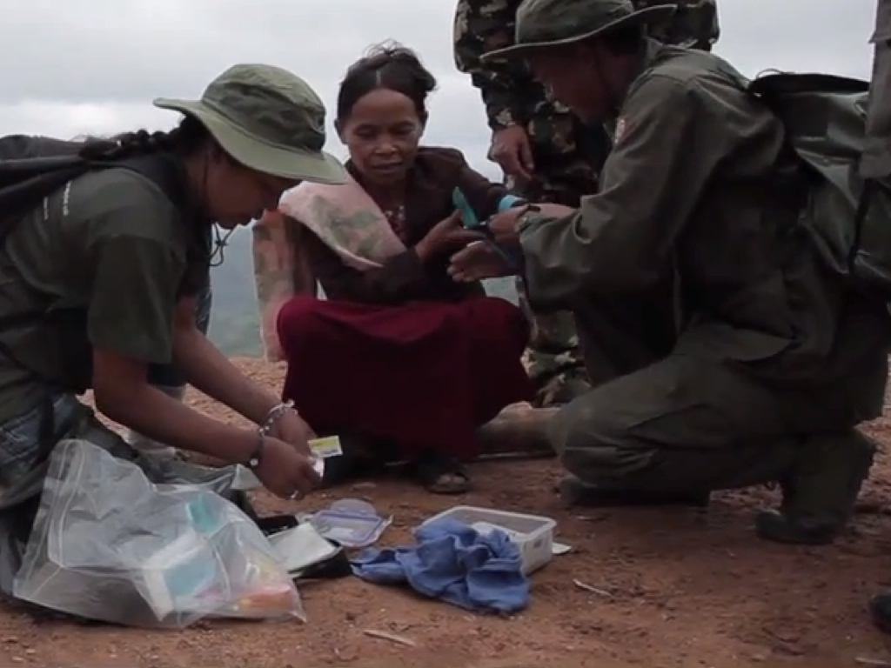
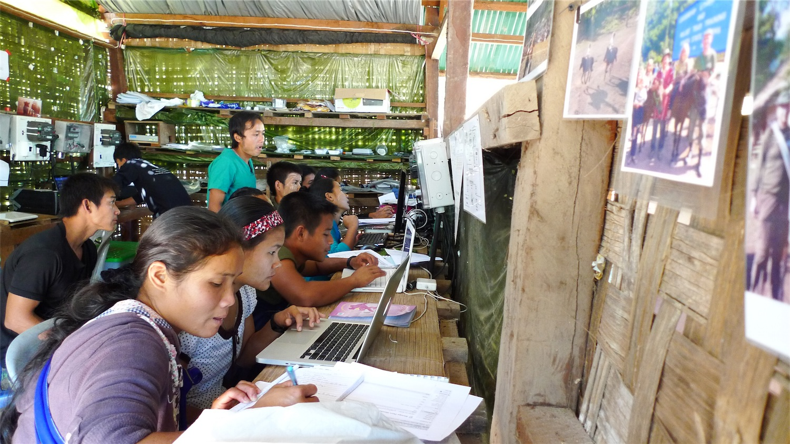
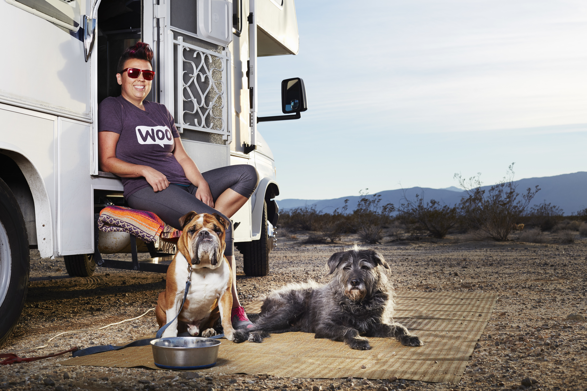
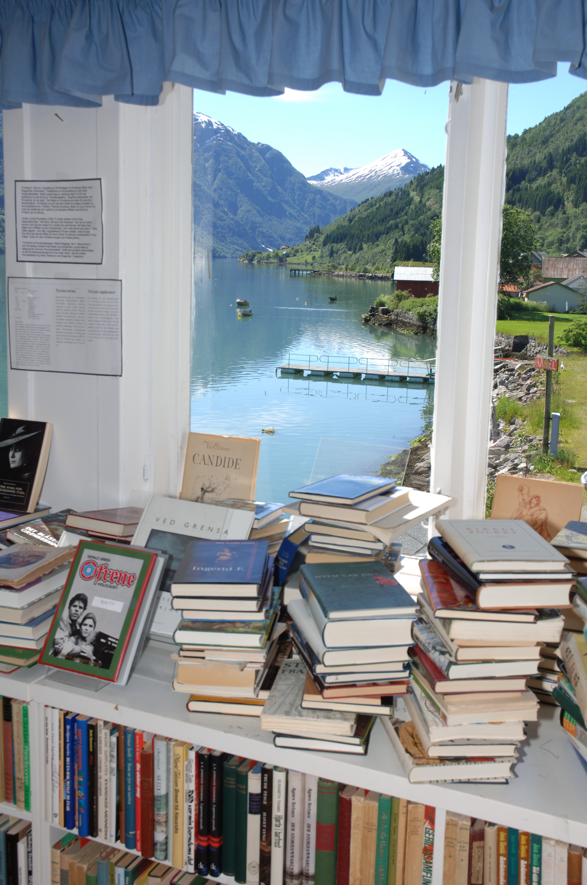
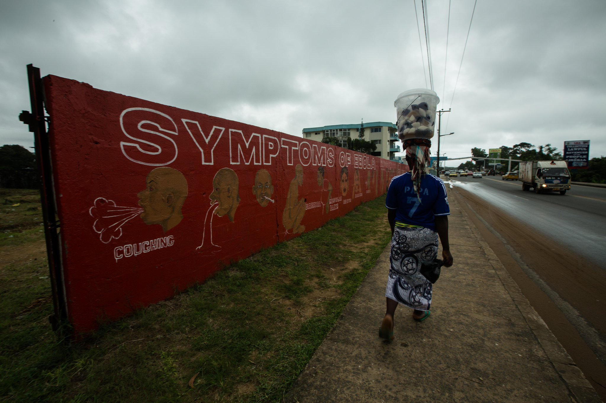
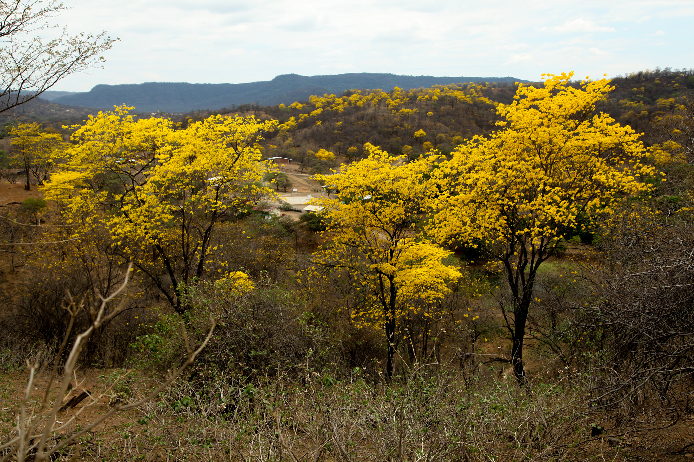

We live in a highly networked world where billions of people engage and interact with one another online. Global communication is instantaneous. We can converse across the world, learn about other cultures, and meet new people without leaving our own home. The ways in which people get online are as varied as the people who populate the internet. People connect on social media, communicate using applications, and build websites using everything from hand-coded CSS and HTML to content management systems.

The web is built on free and open source software: server-side software like Apache and Nginx, application frameworks like Ruby on Rails, databases like MySQL, and security cryptographic protocols like OpenSSL. This software is often built by hackers and hobbyists, who distribute it freely, hack on it, patch it, and share it with one another. But free software isn't just the domain of hardcore coders -- those who build the underlying fabric of the web. Millions of people, for example, use tools like the open source browser Firefox to browse the web.

And then there's WordPress, the user-focused publishing platform built to make it easy for anyone to publish online. At the time of this writing, it powered almost 25% of all websites, and is used by millions of people worldwide. Users vary from casual bloggers to international news sites, small businesses to big businesses, non-profits, networks, and personal portfolios. What started out as a blogging platform is now the most widely-used content management system on the internet and is even used by some developers as an application framework.

With so much of the internet powered by WordPress, it's no surprise that the people who use it are as diverse as those who use the internet itself. Each website represents a different story -- a different individual or organization who has a stake in being online and providing a window into their world. This book tells the story of WordPress, a tool created by a couple of hackers and developed by volunteers from all over the world. But before that story begins, it's worth looking at the stories of just a few of those who have been empowered by the software.

**Fighting Human Rights Abuse**
_Thailand, near the Burmese Border_ 

Burma is the stage for one of the longest-running civil wars in history. Since 1948, different ethnic minorities have struggled for independence. The military junta has committed innumerable atrocoties against the people of Burma, particularly in ethnic areas: torture and executions, rape, kidnapping, and chemical attacks on citizens. It has left millions of people living like refugees in their own country, displaced from their homes and under attack from their government.

Since 1997, the Free Burma Rangers (FBR) have delivered humanitarian relief to internally displaced persons (IDPs). Operating from regions around Burma's borders, relief teams of up to six people enter Burma's jungles to provide emergency medical relief, humanitarian assistance, and counseling to IDPs. The teams are made up of Burmese nationals, many of whom have themselves been displaced and been victims of the government's military rule.

*Medics from the Free Burma Rangers in the field*

In addition to humanitarian relief, the teams gather documentary evidence about atrocities and human rights abuses in Burma. Every team has a member whose job it is to document atrocities using photography, video, and interviews. This evidence is trekked out of the jungle and over the border, and forms an archive of the human rights abuses committed by the junta.

For many years, these documents were simply stored on paper. Offices full of paper held evidence of years of abuse. The information was tabulated into spreadsheets and documents. Photographs and videos were stored on stacks of hard drives. To find information, a person had to spend hours looking for it; there was no way to look at the data in aggregate, to find patterns and trends.

With the help of a team of volunteers, the FBR's hundreds of thousands of records were converted into a digital database that allowed rangers to quickly upload and disseminate information. The system needed to be usable by the rangers, many of whom had little computing experience and speak different languages and dialects. When the project got to the point of user testing, the site was tested with a satellite internet connection in a hut in the jungle on a laptop plugged into a solar cell.

*User testing in a hut in the jungle*

Reports are stored on two sites: an internal site for storing and tracking all of the reports, and a [public-facing website](http://www.freeburmarangers.org) that's used to disseminate information to the public. Both of these websites are built using WordPress. While on a relief mission, a team takes notes on human rights violations by documenting the location, taking photos, and recording interviews. They do the same thing for any patients they see, recording everything in a paper journal. When the relief mission is complete, the journal and SD card are trekked out of the jungle, and the information is added to the website.
 
The digitization of these reports has meant that volunteers can spend less time digging for information and more time improving relief, training, and providing aid. It's made analysis more efficient and effective, allowing training teams to look for patterns that will improve aid.
 
But it's also helped the FBR to easily disseminate information about atrocities to the world. In December 2012, one of the IDPs working with the Free Burma Rangers hiked through the jungle to deliver video and photographs of the Burmese military using attack helicopters and jet fighters in air strikes against ethnic rebels in the northern Kachin state. The images were [published on the blog](http://www.freeburmarangers.org/2013/01/01/photos-of-burma-air-force-jets-and-mi24-attack-helicopters-bombing-rocketing-and-strafing-the-kachin-in-kachin-state-northern-burma/). The next day, the [BBC picked up the images](http://www.bbc.co.uk/news/world-asia-20886377), broadcasting them around the world. These images increased international pressure on the Burmese military and played a significant role in the 2013 ceasefire.
 
**Charting a dream journey**
 _On the road, USA_ 

For nearly five years, Maria Scarpello has been traveling the highways and byways of America, sampling beer, in search of that perfect pint. She travels in an RV she calls Stanley, a 1999 Class C Ford Jayco. Stanley isn't just an RV; it's her home. "Home is where my wheels are," Maria says. She parks the RV wherever she can: campgrounds, street corners, parking lots, and friends' driveways. Stanley has been adapted to her life on the road. The bed has been removed from the back of the RV, replaced with a couch to give additional space to work, relax, and hang out with her two dogs Ernie and Buddha.

Her first blog, [TrippingWithStanley.com](http://trippinwithstanley.com) charted the first year-and-a-half of her journey across America, which included zip lines in Las Vegas, golfing in Phoenix, barren deserts in Arizona, and the rocky cliffs of the Oregon coast. When Maria left home, she had planned to travel for only six months, but the five years she has lived in her RV are a testament to how deeply she has fallen in love with life on the road.

*Maria Scarpello at Golden Canyon in Death Valley National Park*

Her current website, [The Roaming Pint](http://theroamingpint.com) is a travelog of all of the breweries that she has visited in the U.S. Beer lovers can vicariously visit America's breweries through her site and search the website to get information about the hundreds of breweries she's visited.

To support her trip, Maria had to find work that would accommodate her fluid lifestyle. First, she planned to make money through her blog; plenty of people fund their travels by blogging, so why not? But making money from a blog is no easy task, and, after a year on the road, Maria decided that monetizing her blog would not be sustainable enough to support her nomadic lifestyle. For the past three years, Maria has worked as an Internal Community Manager at WooThemes, a WordPress company that's now part of the the Automattic family. Armed with a mobile hotspot and her laptop, she has everything she needs to make money while she is on the road. Her office is in her RV and has been completely renovated to make it feel like home: The walls are painted bright green and are decorated with stickers, coasters, pictures, and other souvenirs from her travels. The view from her office is always changing. "Next month, my office will be overlooking the beautiful white capped Rockies in one of my favorite states, Colorado," Maria says. "The following month we will be venturing even further west, eventually making our way back to the coast. There is no better office view for me than overlooking vast bodies of water, preferably with palm trees or mountain side cliffs and sandy beaches begging me to put my MacBook Air away and let the dogs play!"

*Maria Scarpello hanging out with her dogs and Stanley (by [sethkhughes.com](http://sethkhughes.com))*

**Running a Small Business**
 _Fjærland, Norway_ 
 
Eivind Ødegård arrives at his office and heads straight for his coffee machine. Coffee in hand, he sits down at his computer and starts reading email. He is surrounded by books: they fill the shelves that line the walls of his room, and are stacked all over the floor. Much of his day is spent in front of the computer, handling money and bills, dealing with correspondence, and processing orders. It sounds like a job that could be done in any office, but his view is quite different from the normal 9-to-5. From his window he can see the ferries that bring tourists in and out to the tiny town of Fjærland. They come to Fjærland for the glacier, the majestic scenery, and [Norway's booktown](http://bokbyen.no/), where Eivind is the manager.

Fjærland is a rural community with less than 300 inhabitants. Is is ringed by mountains and glaciers. Waterfalls run down the mountainsides along the fjords where dolphins and seal hunt for fish. In the summer, it is hot and sunny and busy with tourists; in the winter, the weather turns cold and the local inhabitants -- cut off from the rest of the world -- plan for the coming summer. 

*The booktown at Fjærland (photo credit: Trond J. Hansen.)*

A [booktown is](http://booktown.net/) "a small rural town or village in which second-hand and antiquarian bookshops are concentrated. Most booktowns have developed in villages of historic interest or of scenic beauty." The first was in Hay-on-Wye in Wales, but there are now booktowns all over the world. In Fjærland, the booktown that Eivind manages was established in 1995 to solve a specific problem: Buildings in the town were derelict and falling into disrepair, and rather than watch themn fall into ruin, the townspeople filled the buildings with books. Second-hand books fill stables, boathouses, a bank and a post office, a grocery shop, and a ferry waiting room. Each shop has its speciality, one even doubles as the tourist information office. Some bookshops are staffed, others operate by an honor system; customers leave money in an honesty book whenever they take a title.

*A customer browses the books (photo credit: Trond J. Hansen.)*

Some of Eivind's daily routine is spent managing and updating the [booktown's website](http://bokbyen.no/), which also acts as a window into this secluded community. The site provides information about the booktown, while the blog has news from Fjærland. There is also an online store that distributes publications from Sjørettsfondet, the [Norwegian Maritime Law Foundation](http://www.sjorettsfondet.no/English.htm). The website, maintained in both Norwegian and English, is built on WordPress.

**Building the Web**
_New York, New York_ 

Some blogs have been around long before blog software even existed -- long before WordPress or Movable Type or Livejournal. People shared their thoughts and links from around the web on these hand-coded websites, which chart not just the evolution of a person, but the evolution of the web.

Jeffrey Zeldman's blog is one such example. It's a record of many of the important trends and changes in technology and design that have happened since the mid-1990s, complemented by asides and personal reflections that illustrate the world as it has changed with the web.

Before the advent of blogging as its own form, Jeffrey used his website to entertain and create. His archives are a treasure-trove of '90s design artifacts: [banners from zeldman.com](http://www.zeldman.com/zlink.html), [desktop backgrounds](http://www.zeldman.com/desktops/), and 8-bit [pixel art icons](http://www.zeldman.com/icon1.html). 

Reading through the blog archives is like touring the history of the modern web through Jeffrey’s perspective. It chronicles the early days of web standards -- when many designers were building beautiful sites with Flash and others were crafting web pages with CSS -- through the popularization of the semantic web, the growth of social networks and the skepticism around them, and to the introduction of responsive web design.

But there's more to Jeffrey's blog than musings about the web. While he was still hand-coding his website, Jeffrey started a section called “My Glamorous Life,” where he [wrote about himself](http://www.zeldman.com/glamorous/glamorous.html). The tag “glamorous” is still what he uses to tag posts that are about him, rather than about someone else. As with all diarists, there's a lot we can learn about Jeffrey: He’s a web designer who cares passionately about web standards. He’s a publisher and an event organizer. He hosts a regular podcast called “The Big Web Show.” But there’s more than just what he _does_. He has a daughter named Ava. He's long been divorced, but still looks after his ex's two small dogs when she is ill (much to the annoyance of his neighbors). He has family secrets that, now and again, come out of the closet. He’s a fan of Edward Hopper and John Coltrane. He surrounds himself by smart people he respects. He loves what he does and he wants you to like it too.

This blending of the personal and the professional is the mark of many blogs. After all, for the writer, these things are just different aspects of who they are. "I don't really see a big difference between sharing what's personal and sharing opinions about web design and sharing information about web design," Jeffrey says. "It's all the same." He continues in the same fashion today, blogging on WordPress about the web, sharing news about his different projects, and telling stories from his glamourous life.

**Giving People a Voice**
_Worldwide_ 

Citizen journalists all over the world tell their stories on the web. The past 15 years have seen publishing tools go from the hands of a few media outlets and into the hands of the many. Those who traditionally formed the audience are now able to participate in the process of reporting the news. Individuals share their stories and unique perspectives from across the globe. 

Global Voices Online is one of the largest international networks of bloggers and citizen journalists. Using WordPress, the team of writers reports from 167 countries, and their stories are translated into more than 30 languages. Founded in 2004 by Ethan Zuckerman and Rebecca MacKinnon with the aim of highlighting bloggers who build bridges between languages and cultures, its mission has evolved to "find the most compelling and important stories coming from marginalized and misrepresented communities," as well as speaking out against online censorship and helping people find new ways to gain access to the internet.

"People no longer only get their news from governments and the media, but have a wider variety of sources to enjoy," says [Solana Larsen](http://globalvoicesonline.org/author/solana-larsen/), the site's former managing editor. "Especially when it comes to societies that have limited freedom of expression that's hugely important. Ordinary citizens can help change the way current events are perceived and remembered in history."

Since its launch, bloggers on Global Voices Online have written about some of the most significant events happening in the world. In March 2011, bloggers in Japan [wrote with horror](http://globalvoicesonline.org/specialcoverage/2011-special-coverage/japan-earthquake-tsunami-2011/) about the 8.9 magnitude earthquake that resulted in over 10,000 deaths and damaged the Fukushima powerplant. The same year, [bloggers at Global Voices Online](http://globalvoicesonline.org/specialcoverage/2011-special-coverage/tunisia-uprising-201011/) were among those in Tunisia who provided eyewitness accounts of the revolution that toppled the government. In Egypt [bloggers wrote about the revolution](http://globalvoicesonline.org/specialcoverage/2011-special-coverage/egypt-protests-2011/#timeline) that led to the downfall of Hosni Mubarak. In 2014, bloggers from West Africa wrote about the Ebola crises that swept Liberia, Guinea, and Sierra Leone. Bloggers write to remind [the world that they are more than just a virus](http://globalvoicesonline.org/2014/10/24/west-africans-keep-calm-despite-ebola-and-remind-the-world-who-they-are/), to [highlight the work of scientists and medics](http://globalvoicesonline.org/2014/08/23/the-heroic-everyday-work-of-lab-technicians-in-the-fight-against-ebola-in-liberia/), and to share [successes in the fight against the disease](http://globalvoicesonline.org/2014/08/27/nigeria-successfully-curtails-ebola-to-one-patient/).

*A resident walks past a mural about the dangers of the Ebola Virus painted on a wall off Tubman Boulevard in Monrovia (photo credit: [Morgana Wingard/ UNDP](https://www.flickr.com/photos/unitednationsdevelopmentprogramme/15514434146/in/set-72157648119364049) [cc-by-nc-nd](https://creativecommons.org/licenses/by-nc-nd/2.0/))*

But it's not just the world-shaking events that get written about. Bloggers write about what it's like to live in their countries, sometimes from repressive regimes where voices are so easily silenced. In Russia, a blogger writes about how the internet has [become a battleground for LGBT rights](http://globalvoicesonline.org/2015/01/31/grindr-in-the-kremlin-gay-and-online-in-putins-russia/). In Skopje, Macdeonia, shoppers protest against [government plans to makeover buildings in a neoclassical or baroque style](http://globalvoicesonline.org/2014/12/30/macedonians-hug-skopje-shopping-centre-to-protect-it-from-baroque-isation/). [Syria prepares for its first TEDx conference](http://globalvoicesonline.org/2015/01/14/is-syria-ready-for-tedx-damascus-with-its-free-thinkers-dead-in-jail-or-exile/). In Ecuador, the guayacan trees come into bloom, [flooding the world with the color yellow](http://globalvoicesonline.org/2015/02/01/a-marvelous-display-of-yellow-in-ecuador/). Each of these stories is a window onto another part of the world, giving the reader a glimpse of what it is like to live somewhere else, in a different set of circumstances.

*The guayacan trees bloom in Ecuador (photo credit: [amalavida.tv](https://www.flickr.com/photos/amalavidatv/16295971080/) [cc-by-sa](https://creativecommons.org/licenses/by-sa/2.0/))*

---

These are just a few of the stories of those who use WordPress -- people who have been able to tell their stories and share their own unique perspectives on the web. But the software itself has a story, one that stretches back even before WordPress was launched. Like so many pieces of free software, it didn't start out with financial backing, nor was it built by a company with clear aims and objectives. It was originally a small discarded blogging script that was picked up by two hackers who wanted to use it to power their blogs. So how did it come to dominate the web? Why is it so popular? And who are the people who made the software what it is today? This book charts the story of WordPress, from its humble beginnings as a few lines of code written in an apartment above a bar in Corsica, to the dominant web platform that it is today.

